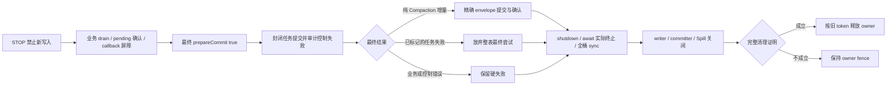

# Paimon Connector for Tapdata

## Overview

This connector enables Tapdata to write data to Apache Paimon tables. Paimon is a streaming data lake platform that supports high-speed data ingestion, change data capture, and efficient data query.

## Features

### Implemented Features

- ✅ **Connection Test**: Test warehouse accessibility and write permissions
- ✅ **Schema Discovery**: Load table definitions from Paimon
- ✅ **Create Table**: Create new Paimon tables with schema
- ✅ **Drop Table**: Delete Paimon tables
- ✅ **Clear Table**: Remove all data from a table
- ✅ **Create Index**: Handle index creation requests (no-op as Paimon doesn't support traditional indexes)
- ✅ **Write Records**: Insert, update, and delete records

### Not Implemented (Write-Only Connector)

- ❌ **Read Operations**: Batch read, stream read
- ❌ **CDC**: Change data capture from Paimon
- ❌ **Query Operations**: Query by filter, advance filter

## Architecture

### Main Components

1. **PaimonConnector**: Main connector class that implements the Tapdata PDK interface
2. **PaimonConfig**: Configuration class for connection and storage settings
3. **PaimonService**: Service class that handles all Paimon operations using Paimon Java API

### Storage Support

The connector supports multiple storage backends:

- **Local**: Local file system (for development/testing)
- **HDFS**: Hadoop Distributed File System
- **S3**: Amazon S3 and S3-compatible storage (MinIO, etc.)
- **OSS**: Aliyun Object Storage Service

## Configuration

### Connection Configuration

```json
{
  "warehouse": "/path/to/warehouse",
  "storageType": "local|hdfs|s3|oss",
  
  // S3 Configuration (when storageType = "s3")
  "s3Endpoint": "https://s3.amazonaws.com",
  "s3AccessKey": "your-access-key",
  "s3SecretKey": "your-secret-key",
  "s3Region": "us-east-1",
  
  // HDFS Configuration (when storageType = "hdfs")
  "hdfsHost": "namenode.example.com",
  "hdfsPort": 9000,
  "hdfsUser": "hadoop",
  
  // OSS Configuration (when storageType = "oss")
  "ossEndpoint": "https://oss-cn-hangzhou.aliyuncs.com",
  "ossAccessKey": "your-access-key",
  "ossSecretKey": "your-secret-key"
}
```

### Node Configuration

```json
{
  "database": "default"
}
```

## Data Type Mapping

### Basic Types

| Tapdata Type | Paimon Type | Notes |
|--------------|-------------|-------|
| TapBoolean | BOOLEAN | Boolean values |
| TapNumber (bit=8) | TINYINT | -128 to 127 |
| TapNumber (bit=16) | SMALLINT | -32,768 to 32,767 |
| TapNumber (bit=32) | INT | -2,147,483,648 to 2,147,483,647 |
| TapNumber (bit=64) | BIGINT | -9,223,372,036,854,775,808 to 9,223,372,036,854,775,807 |
| TapNumber (float) | FLOAT | 32-bit floating point |
| TapNumber (double) | DOUBLE | 64-bit floating point |
| TapNumber (decimal) | DECIMAL(precision, scale) | Precision: 1-38, Scale: 0-38 |
| TapString | STRING/VARCHAR | Variable-length string |
| TapBinary | BINARY/VARBINARY | Binary data |
| TapDate | DATE | Date without time |
| TapTime | TIME(0-3) | Milliseconds since midnight; sub-millisecond input is rejected |
| TapDateTime | TIMESTAMP | Timestamp with microsecond precision |

### Complex Types

| Tapdata Type | Paimon Type | Storage Format | Notes |
|--------------|-------------|----------------|-------|
| TapArray | STRING | JSON string | Arrays are serialized to JSON strings for storage |
| TapMap | STRING | JSON string | Maps are serialized to JSON strings for storage |
| TapRow/TapRaw | STRING | JSON string | Row and raw objects are serialized to JSON strings |

**Note on Complex Types**:
- Complex types (ARRAY, MAP, ROW, MULTISET, VARIANT) are stored as JSON strings in Paimon STRING fields
- This approach ensures compatibility and avoids the complexity of nested type specifications
- When reading data, you'll need to deserialize the JSON strings back to their original structures
- Existing native Paimon complex columns are not migrated automatically and are rejected by the writer; use a STRING target column instead

**Precision and compatibility notes**:
- `INT` and `INTEGER` both create Paimon `INT` columns. Existing columns previously created as STRING remain unchanged and numeric CDC values continue to be stringified against the physical target schema.
- Integer writes are exact: fractional and out-of-range values fail instead of being truncated.
- Bare `DECIMAL` keeps the connector default `DECIMAL(38,10)`. Paimon applies `HALF_UP` when scaling decimal values and precision overflow fails the write.
- Bare `TIME` creates `TIME(3)`. `TIME(0)` through `TIME(3)` are supported; higher declared or incoming precision is rejected to prevent silent loss.

## Building

```bash
cd connectors/paimon-plus-connector
mvn clean package
```

The connector JAR will be generated in `target/` and copied to `../dist/`.

## Dependencies

- Apache Paimon 1.3.2
- Hadoop Client 3.3.6
- Tapdata PDK API 2.0.8-SNAPSHOT

### Spill 生命周期与升级验收

当前关闭与目录删除屏障以[同步优雅停止主 Spec](/Users/SL/javaProject/tapdata-connectors/connectors/paimon-plus-connector/src/doc/specs/SPEC-paimon-spill-sync-graceful-stop.md)为准，执行记录见 [最终修复对比与生命周期总览](src/doc/reviews/SPILL-修复前后对比与生命周期总览.md)。过程 Plan/Todo 已清理；保留各份 Spec 与最终总览。

仅支持有效 `snapshot.expire.execution-mode=SYNC`。已有 ASYNC 表在创建写入资源前拒绝，连接器不会静默修改表属性。STOP 先确认业务数据和 callback，再执行 `prepareCommit(true, identifier)` 收集最终 Compaction；即使没有新业务记录也会执行。只有来源已确认的最终 Compaction 任务失败可以放弃该表本次最终提交，业务或提交结果不确定的错误仍返回失败。

关闭会持续等待真实 Compaction 终止，每 5 秒输出 `[paimon-stop]` INFO；5 秒是观察间隔，没有 30 秒提前返回。完整关闭 writer、committer、IOManager 和目录后才允许同 JVM 新代接管；无法证明资源关闭时保留 owner。等待、弃提交、目录关闭和唯一终态日志均可按 owner/table 关联。任务可迁移至另一 Engine，但 JVM 内 owner 不能阻止其他进程提交；宿主必须保证旧实例先停止或提供分布式 fencing。目录文件锁只负责保护共享可见磁盘上的 Spill 删除，具体 A/B 边界见主 Spec P17。



Paimon/Hadoop/RocksDB 版本及共享 FileIO 语义保持原基线。较早的默认值与 S3A 说明见 [最终修复对比与生命周期总览](src/doc/reviews/SPILL-修复前后对比与生命周期总览.md)，其中旧关闭协议以本轮主 Spec 为准。

## Usage Example

### 1. Configure Connection

In Tapdata UI, create a new Paimon connection with:
- Warehouse path
- Storage type and credentials
- Database name

### 2. Test Connection

The connector will:
- Verify warehouse accessibility
- Test write permissions
- Create database if needed

### 3. Create Task

Use Paimon as a target in your data pipeline:
- Source: Any supported Tapdata source
- Target: Paimon connector
- The connector will automatically create tables and write data

## Implementation Notes

### Write Strategy

- **Insert**: Uses Paimon's batch write API
- **Update**: Writes new version of the row (Paimon handles versioning)
- **Delete**: Writes delete marker using Paimon's RowKind.DELETE

### Batch Processing

- Records are batched and committed together for better performance
- Writers and commits are cached per table for efficiency
- Proper cleanup on connector shutdown

### Error Handling

- Connection errors are caught and reported during connection test
- Write errors are collected and returned in WriteListResult
- Proper resource cleanup in all error scenarios

## Limitations

1. **Read Operations**: This is a write-only connector. Reading from Paimon is not supported.
2. **Schema Evolution**: Dynamic schema changes during runtime are not supported.
3. **Indexes**: Paimon doesn't support traditional indexes, only primary keys.
4. **Transactions**: Each batch is committed as a separate transaction.

## Future Enhancements

Potential improvements for future versions:

1. **Read Support**: Implement batch read and stream read operations
2. **CDC Support**: Support reading Paimon changelog for incremental sync
3. **Schema Evolution**: Support dynamic schema changes
4. **Partitioning**: Better support for Paimon's partitioning features
5. **Compaction**: Expose Paimon's compaction configuration
6. **Metrics**: Add detailed metrics for monitoring

## Troubleshooting

### Connection Issues

**Problem**: Cannot connect to warehouse

**Solutions**:
- Verify warehouse path is correct and accessible
- Check storage credentials (S3/OSS access keys, HDFS permissions)
- Ensure network connectivity to storage backend
- Check firewall rules

### Write Failures

**Problem**: Records fail to write

**Solutions**:
- Verify table schema matches source data
- Check write permissions on warehouse
- Review Paimon logs for detailed errors
- Ensure primary keys are defined for update/delete operations

### Performance Issues

**Problem**: Slow write performance

**Solutions**:
- Increase batch size in Tapdata task configuration
- Use appropriate storage backend (S3 for cloud, HDFS for on-premise)
- Enable Paimon compaction for better query performance
- Consider partitioning large tables

## References

- [Apache Paimon Documentation](https://paimon.apache.org/)
- [Paimon GitHub](https://github.com/apache/paimon)
- [Tapdata PDK Documentation](https://docs.tapdata.io/)

## License

This connector is part of Tapdata and follows the same license.

## Support

For issues and questions:
- Tapdata Support: support@tapdata.io
- Paimon Community: https://paimon.apache.org/community/
