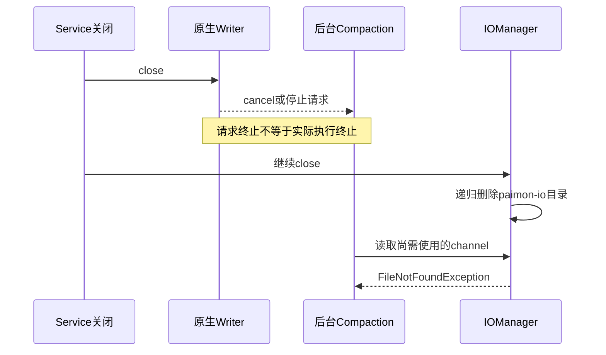
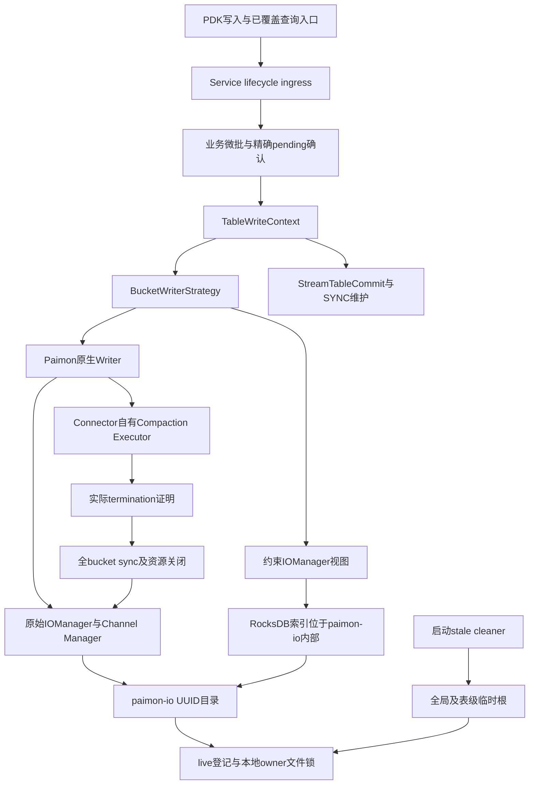
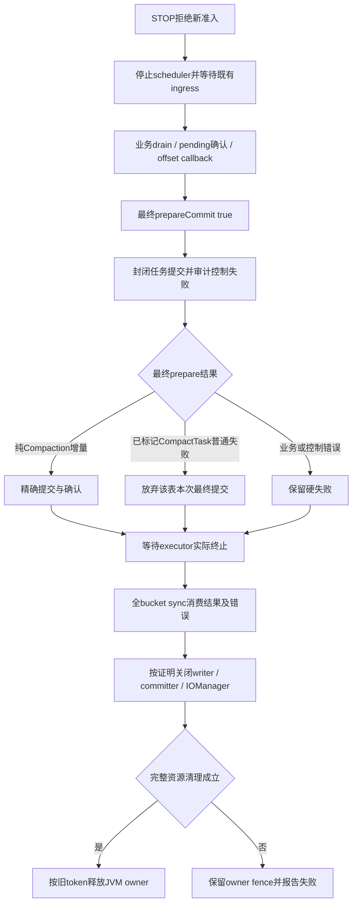

# Paimon Spill 修复前后对比与生命周期总览

> 日期：2026-09-06。模块：paimon-plus-connector。本文描述合并提交的最终行为，不把历史中间协议当作当前实现。
> 比较基线：162b7d1f95d3fa00f7ffd073c25ea0429d861bf3（953eaad51d7d84b6236a9ad120685fe90cda121a 的父提交）。
> 合并范围：953eaad51d7d84b6236a9ad120685fe90cda121a 至 9050b8e3，包含起点，共 21 个提交。代码保持 9050b8e3 的最终树，本次仅补充本文并压缩历史。
> 固定依赖：Paimon 1.3.2、Hadoop 3.3.6。当前主契约见 [SYNC 优雅停止 Spec](../specs/SPEC-paimon-spill-sync-graceful-stop.md)；本文第 7 节集中保留验证结果。

## 1. 问题与结论

原始故障表现为写入读取本地 `.channel` 文件时发生 FileNotFoundException，重试后写服务被 fence。异常说明需要访问的本地文件已经不存在；单靠堆栈不能断言生产环境由谁删除。固定内核调用链和本地回归确认了需要防止的竞态：后台 Compaction 尚未实际退出，关闭流程已继续删除 IOManager 所属目录。

本次修复建立正向终止证明：关闭 Future、请求 cancel 或 shutdown 均不等于执行线程已经退出。只有 Compaction executor 实际终止、原生 bucket 结果已消费，且资源关闭条件成立，才能关闭 IOManager、释放目录保护与本 JVM 写入 owner。

另外修复两条崩溃回收缺口：KEY_DYNAMIC 与动态桶 preflight 的 RocksDB 索引原先位于 paimon-io-* 之外；启动清理原先只扫描全局 diskTmpDir，漏掉表级覆盖根。正常关闭安全与崩溃残留回收是两个独立问题，均需覆盖。

**仍存在有限读入口准入遗漏和跨机器写入互斥边界，见第 8 节。不能把本提交表述为所有读写生命周期问题全部消除。**

## 2. 修复前后对比

| 维度 | 修复前：162b7d1f | 修复后：最终合并内容 |
| --- | --- | --- |
| Context close | 顺序关闭 writer、committer、IOManager，收集异常后再抛；此前一步失败仍可继续 IO 删除 | 先取得实际 Compaction 终止与资源清理证明，再进入对应关闭阶段；终态错误与 cleanupComplete 分开 |
| Service close 等待 | 调用者受 deadline 限制，到期可退出等待，后台继续收尾 | 持续等待同一次 closeOperation 完成；没有写侧 30 秒提前返回 |
| 执行器所有权 | 没有本次引入的 connector 专属 Compaction 终止屏障 | 创建 writer 时注入 connector 自有 executor，关闭与 termination 证明由 connector 控制 |
| 快照过期 | 未具备当前统一 SYNC 准入限制 | 只支持有效 snapshot.expire.execution-mode=SYNC；已有 ASYNC 表拒绝，不自动 ALTER |
| 最终 Compaction | 没有当前 STOP 专用最终 prepare、审计和弃提交契约 | 业务确认后 prepareCommit(true,id)，无新业务也执行；只有已确认来源的最终 CompactTask 普通失败允许放弃该表本次最终提交 |
| 本地 RocksDB 索引 | tempDirs 返回原始根，rocksdb-* 与 paimon-io-* 为兄弟目录 | writer/preflight 使用约束视图，将 rocksdb-* 放入已登记的 paimon-io-* |
| stale 扫描范围 | 仅全局临时根 | 全局根与当前表级覆盖根并集，继续检查 live/owner lock/grace/symlink |
| marker 释放 | IO close 后存在无条件注销入口 | 根据删除结果释放；删除失败保留 marker 供后续重试；移除仅测试使用的快捷入口 |
| FileSystem 清理 | 存在 fsMap 反射并直接关闭底层缓存 FS 的路径 | 移除该反射路径，保持共享 FS 所有权；S3A 初始化隔离线程组并保留 UGI/TCCL |
| 查询准入 | queryByAdvanceFilter 未进入生命周期计数 | 完整查询、reader 清理和结果回调持有 ingress |
| 可观测性 | 无当前完整的 STOP 阶段 INFO 契约 | 约 5 秒等待进度、阶段切换 INFO、唯一正常或失败终态 |

历史提交曾引入 RETAINED/reaper/maintenance 捕获及超时协议，随后在 SYNC 简化中移除。它们不是当前可选模式。旧 Spec 保留用于溯源，不能按其旧状态机操作当前版本。

## 3. 修复前的失效路径



该图描述源码允许且回归需要排除的时序，不声称已从生产日志证明每一次缺失文件均由此路径造成。

## 4. 修复后的组件架构



- **Service owner**：同一 JVM 内物理表的写入代次互斥，不能保护不同机器上的另一个 Engine。
- **目录 owner lock**：同一可见本地文件系统上的删除互斥，防止其他进程的 stale cleaner 删除仍使用中的目录；不是分布式表锁。
- **IOManager 视图**：仅重写 tempDirs，channel/enumerator/reader/writer/close 委托原实例；不增加另一个 executor 或清理线程。

## 5. Spill 全生命周期

### 5.1 创建、运行与落盘

1. 校验有效 SYNC 模式，取得 JVM 内物理表 owner。
2. Factory 创建 writer 并注入专属 Compaction executor；创建、物化并登记 Spill 目录，取得 owner 文件锁。
3. writer 使用原始 IOManager 创建 Spill channel；GlobalIndexAssigner 通过约束 tempDirs 在该目录内建立 RocksDB 索引。动态桶 preflight 使用相同约束方式。
4. 运行态普通 prepareCommit 继续使用 false；本次不把所有提交变为强制等待 Compaction。
5. 写入与提交失败沿原业务恢复协议处理：保留精确 identifier/messages，结果不确定时不能换一批 messages 当作重试。

```text
配置的临时根
├── paimon-io-UUID/
│   ├── *.channel
│   └── rocksdb-UUID/      ← 全局主键索引也在目录保护范围内
└── .paimon-io-UUID.tapdata-owner.lock
```

### 5.2 STOP 与最终提交



业务屏障失败时不执行可豁免的最终提交路径。仅 STOP 最终阶段已标记的普通 CompactTask 失败允许正常弃提交；Error、中断、取消、未确认业务、commit结果未知、状态保存、callback及资源清理失败仍是硬失败。没有“所有 Compaction 错误都正常退出”的规则。

所有路径都必须维持终止证明；无法取得证明时不能因超过 30 秒清理或解除占用。重复 close 复用同一次操作及结果。只有最终资源安全且无剩余硬失败才输出正常退出。

### 5.3 崩溃残留回收

启动扫描当前全局与表级 diskTmpDir 根。仅处理 paimon-io-* 目录：排除 JVM live 登记、确认 marker 存在并取得排他文件锁、满足宽限期、遵守不跟随危险符号链接的删除规则，再递归回收。嵌套 RocksDB 文件由同一次树删除覆盖。

进程异常退出释放 OS 文件锁后，另一进程须在真实可访问的磁盘上完成上述检查。仅向进程发送 kill 不等于已经确认死亡；测试等待子进程实际退出。

目录部分删除失败保留 marker。裸 rocksdb-*、无 marker 历史目录、已从配置移除的旧根不会自动清理，需要确认旧任务停止后人工处理。本次代码修复不等于已清理生产历史磁盘。

## 6. Paimon 内核依据

以下前三个本地文件已与 Maven paimon-core-1.3.2-sources.jar 逐字节核对一致。当前本地源码仓 HEAD 为 76711fc8e0f3d474e628eb7b7fc7bcdec92d2066，不应把官方链接中的固定提交误称为本地 checkout。

| 内核入口 | 可验证事实 |
| --- | --- |
| [GlobalIndexAssigner.open](https://github.com/apache/paimon/blob/c05f7d1f1b1e5d37e64edab0f2978124d90b64f7/paimon-core/src/main/java/org/apache/paimon/crosspartition/GlobalIndexAssigner.java#L136) | 从 ioManager.tempDirs 选择根建立 rocksdb-UUID；close 在 276 行关闭索引并尝试删除目录 |
| [IOManagerImpl](https://github.com/apache/paimon/blob/c05f7d1f1b1e5d37e64edab0f2978124d90b64f7/paimon-core/src/main/java/org/apache/paimon/disk/IOManagerImpl.java#L74) | close 委托 Channel Manager；91 行 tempDirs 返回原始根 |
| [FileChannelManagerImpl.close](https://github.com/apache/paimon/blob/c05f7d1f1b1e5d37e64edab0f2978124d90b64f7/paimon-core/src/main/java/org/apache/paimon/disk/FileChannelManagerImpl.java#L125) | 关闭时删除其管理的临时目录树 |
| [TableWriteImpl.withCompactExecutor](https://github.com/apache/paimon/blob/c05f7d1f1b1e5d37e64edab0f2978124d90b64f7/paimon-core/src/main/java/org/apache/paimon/table/sink/TableWriteImpl.java#L134) | 提供注入 Compaction executor 的原生接缝；关闭权和结果消费细节见主 Spec P01–P16 |

SYNC maintenance 保持内核自身的异常保存语义，不反射探测隐藏状态，也不通过人为制造空提交探测维护错误。KEY_DYNAMIC 本地全局索引不能被解释为允许多 Engine 并发写入。

## 7. 日志与验证记录

固定日志前缀 `[paimon-stop]`。字段含 table、owner、phase、elapsedMs、phaseElapsedMs；已知时附带任务数。阶段包括 DRAIN、FINAL_PREPARE、FINAL_COMMIT、WAIT_COMPACTION、CLOSE_WRITER、CLOSE_COMMITTER、CLOSE_SPILL、CLOSE_SERVICE。阶段转换输出 phase-changed，等待约每 5 秒输出 waiting；5 秒是观察间隔，不是退出期限。

| 验证批次 | 实际结果 |
| --- | --- |
| 初次 SYNC 完整构建 | 629 项通过；随后独立 S3 localhost 模型测试 3 项通过，不能合称当时执行了一次全量 632 |
| 目录及查询补充修复前 | 3 项回归失败：根目录 RocksDB 逃逸、表级残留未清理、查询 ingress 未登记 |
| 补充修复重点测试 | 71 项通过 |
| 最终 clean package | JDK 17，59 个测试类，636 项、0 失败、0 错误、0 跳过；5 个 reactor 项目成功 |

最终命令：`mvn -o -B -pl connectors/paimon-plus-connector -am -DskipTests=false clean package`。完成时间 2026-09-06 16:26:26 +08:00，耗时 01:57。日志 `/tmp/paimon-gap-full-package.log`。测试 JSON 与过程验收文档已精简删除，保留本节汇总；原始逐类记录仍可从本地 Git 历史追溯。

真实 KEY_DYNAMIC 测试验证 RocksDB 布局；双 JVM 测试验证活跃锁保护和进程死亡后的目录回收，嵌套索引内容使用模型文件；真实 Spill STOP 用例阻塞超过 30 秒并检查日志和目录保护。S3 测试使用 localhost 模型，不证明 MinIO 部署兼容性或跨机器所有权锁已实现。

历史 JAR：paimon-plus-connector-v1.0-SNAPSHOT-202609060824.jar，SHA-256 `851577cebbbd99aa764e4836dc0d603d057e3ebb2c515114bfc62881623f8f18`。本次仅整理文档及重写 Git 历史，不重复运行未变化代码的测试，不声称历史 JAR 已包含本次新增文档。字节码目标 Java 11，验证 JVM 为 JDK 17；不声明 Java 8 兼容。

## 8. 已确认但本次未修复的边界

1. **有限读入口准入遗漏（Required）**：batchRead、batchCount、getTableCount，以及同类 discoverTables、timestampToStreamOffset 尚未持有 lifecycle ingress。STOP 不等待这些操作；getTableCount 只涉及 Catalog 元数据，不创建 reader。queryByAdvanceFilter 已修复，不能外推为所有查询均已覆盖。后续应统一入口准入并补并发关闭测试。
2. **跨机器任务所有权**：P17 的 Engine E01/E02 仍存在；本轮明确不修改 Engine。JVM owner 和本地文件锁不等于 S3 表级分布式 fencing。持久所有权锁仅为候选方案，未实现。
3. **StreamRead 执行器**：仍有 30 秒 awaitTermination 后 shutdownNow 的逻辑，不属于本次写侧 Compaction 屏障，留待读子系统重写。
4. **非阻断项**：根集合按字符串去重可能重复扫描别名；裸 rocksdb-* 缺直接保留测试；正常协作关闭下 marker 检查与加锁竞态可能遗留空 marker；IOManager.close 异常到 Service 终态的完整单条用例仍可加强。
5. **人工恢复前提**：不同机器之间迁移任务不会清理旧机器不可访问的磁盘；不能根据心跳超时、任务状态或目录年龄自动判定旧 writer 已停止。

本次历史压缩不修改这些行为，也不把上述 Required 项改记为通过。

## 9. 合并历史与追溯

起点 953eaad5 本身包含在合并范围内，合并提交的唯一父节点应为 162b7d1f95d3fa00f7ffd073c25ea0429d861bf3。历史提交号继续作为原始验证和设计演进的证据；压缩前 tip 保存在独立本地备份分支中。

独立暂存的 `docs/specs/paimon-stream-read-consumer-spec.md` 不属于本次合并内容，保留原暂存状态。未执行 push 或远端历史重写。


## 10. 升级注意事项与文档保留范围

- `asyncCommitConcurrency` 的配置 JSON 默认值恢复为 4，与 Java 默认值和三语说明一致；显式下发 1 仍为 1。它控制每个 Service 的后台提交并发，不是每表 writer 数或 JVM 总线程上限。旧任务重新保存是否由宿主回填默认值，应核对实际下发配置；没有压测证据证明提高并发对 IO 和内存无影响。
- S3A 初始化保留 UGI/TCCL 与最终缓存配置。旧 JVM 已缓存的 FileSystem 不会因加载新代码自动更换线程工厂；自定义 FS、旧缓存及 shaded s3 插件需单独验证。不能恢复反射关闭共享 fsMap 的做法。
- 保留全部 Spec，包括标明历史状态的旧 Spec；当前实现以 SYNC 主 Spec 和本文为准。保留 README、产品三语帮助及独立 StreamRead Spec。
- 删除历史 Plan/Todo、分阶段审查和验收记录、故障分析附图、重复升级说明及测试结果 JSON。源码证明仍保留在主 Spec，结果、架构、已知缺口集中在本文。历史材料可从 Git 历史及压缩前备份分支追溯。
