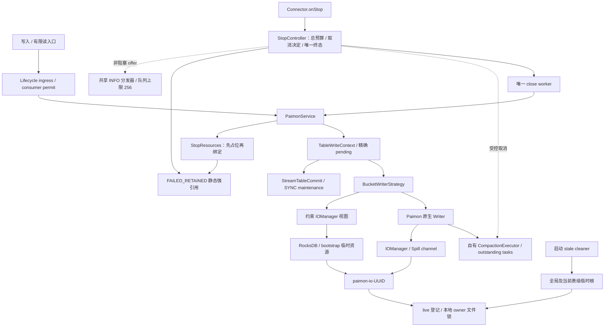
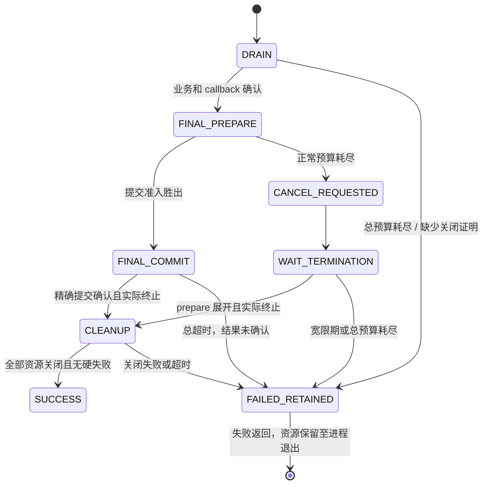

# Paimon Spill 修复前后对比与生命周期总览

> 更新：2026-09-07。本文描述当前 V1.2 工作树实现；基线提交 `962083ff6ae2369a6d85ded223099d09b89bb3f7`，尚未提交。固定依赖 Paimon 1.3.2 / Hadoop 3.3.6。
> 完整构建：62 个测试类、688 项，0 失败、0 错误、0 跳过；`clean package` 成功。当前契约及精确源码位置见 [Spec §14–15](../specs/SPEC-paimon-spill-sync-graceful-stop.md)。

## 1. 修复结果与证据边界

STOP 已改为有总预算的两阶段停止：先允许最终 Compaction 正常完成，超过正常预算后主动取消；只有确认原生 prepare 已展开、Compaction 执行器实际终止，才能关闭资源并删除 Spill。无法证明时返回 `FAILED_RETAINED`，静态强引用保留资源、目录保护及同 JVM 物理表 owner，直至旧进程退出。

原故障表现为本地 `.channel` 不存在，随后任务被 fence。固定 Paimon 源码与真实回归确认了需要阻止的时序：Compaction 尚未退出，IOManager 已递归删除目录。日志和 DDL 本身不能证明生产文件的实际删除者，因此这里不将每次文件缺失都归因于同一原因。

## 2. 三个阶段的实现对比

| 维度 | 原始风险路径 | V1.1 基线 | 当前 V1.2 |
| --- | --- | --- | --- |
| STOP 等待 | 超时/取消状态与后台实际执行混淆 | 持续等待，可能无限阻塞 | Service 总预算 + 每表 final 正常预算 + 取消宽限 |
| Compaction 取消 | 原生 cancel 不保证退出，且可能被吞为空结果 | 不主动取消 | 私有 attempt 授权；ExecutionException 展开 prepare；实际线程仍单独等待 |
| 删除 Spill | 后台仍访问时可能删除 | 实际 termination 屏障 | 保留屏障；超时退出等待但禁止新清理动作 |
| 资源关闭失败 | 继续关闭后续资源可能误删 | 有局部保留，但 service 丢引用后缺完整强引用证明 | Service 资源账本覆盖半构造、reader、writer、IO 和锁；静态强保留 |
| 最终提交 | 缺少 STOP final 专用失败边界 | 业务确认后 final prepare，普通最终任务失败可弃提交 | 提交/取消短锁单胜者；取消后即使 messages 非空也不提交 |
| 未知业务/最终提交 | 不能凭错误推断未提交 | 精确 pending、稳定 commit identity | 保持协议；总超时后禁止新 retry、状态保存和 offset 确认 |
| Snapshot maintenance | ASYNC 可脱离当前提交线程 | 只允许有效 SYNC | 保持 SYNC；已有 ASYNC 表拒绝，不自动 ALTER |
| 有限读 | Catalog close 与 reader 生命周期竞争 | 仅 query 已准入 | 六个有限入口准入，reader 和 outstanding batch 独立记账 |
| KEY_DYNAMIC/RocksDB | 索引可逃逸到原始临时根 | 已约束在 paimon-io 内 | 保持约束，补内部分配/预检准入和失败保留 |
| stale cleaner | 漏表级根，无法保护未知活跃目录 | 全局与当前表级根并集 | 保持根/marker/live/symlink 检查；释放失败不丢锁引用 |
| 日志 | 同步后端可卡住 STOP | INFO 进度，但直接调用后端 | 共享有界队列非阻塞交付，终态不依赖 logger |
| 复杂度 | 多处分散的等待/释放判断 | 简化为无期限等待 | 唯一控制器、唯一资源账本、唯一取消来源；没有 TTL/reaper 或双运行模式 |

V1.2 为有界退出增加了必要的控制代码，不承诺代码行数比 V1.1 少。简化体现在关闭协议集中、失败终态不可逆，以及不再维护后台自动回收状态机。

## 3. 当前组件架构

控制门禁内只做纯内存状态判断与发布。Context/coordinator/executor 可以先持自身锁再取短 gate；监督者持 gate 时不反向获取这些锁，不执行 Paimon、KVMap、callback、await 或日志后端调用。因此被阻塞的业务线程不占用 STOP 的截止判定路径。

## 4. Spill 全生命周期

1. **分配**：校验有效 SYNC；登记物理表 owner。Factory/preflight/reader 创建资源前登记占位，返回后先绑定强引用，再检查是否已经超时。迟到构造结果不能被丢弃。
2. **运行**：原生写缓存与 Compaction 均可能 Spill。KEY_DYNAMIC 与 HASH_DYNAMIC 污染预检的 RocksDB 位于受管理的 paimon-io 目录内。普通业务提交继续使用 prepare(false)。
3. **业务屏障**：首次 STOP 开始总计时，停止新 ingress，等待 scheduler 和有限操作；确认业务 pending、drain 与 callback。此阶段失败不能按“仅最终 Compaction 失败”正常退出。
4. **最终尝试**：预算允许时执行 prepare(true)。正常提交和主动取消通过同一 gate 决定；最终业务增量非空或消息类型不受支持仍为硬失败。
5. **取消**：标识本次 owner/table/identifier，对正在执行和排队的任务登记授权后 cancel(true)，封闭 executor，处理 shutdownNow 返回的队列 Future。Future.done/cancelled 不作为退场证明。
6. **证明与清理**：prepare 展开且 executor 真终止后，消费原生结果，依次关闭 writer → committer → IOManager；只有 IO 正常关闭，才能释放 live/文件锁/marker 与物理表 owner，最终关闭 Catalog。
7. **失败保留**：总预算或取消宽限耗尽，或任何关闭证明缺失，先静态强保留再发布失败终态。迟到调用返回后不开始新的提交、callback、sync 或清理；没有 reaper 和自动释放。
8. **进程退出后的回收**：实际 OS 进程退出释放文件锁；后续本地 cleaner 才能依 marker、目录年龄和 live/lock 规则回收。裸历史 rocksdb 与不再配置的根不盲删。

`SUCCESS` 可带 Compaction discarded 结果。已确认来源的最终普通任务失败/受控取消可以弃提交并成功清理；Error、自中断、独立 IO、未知提交、callback 和资源失败不属于豁免范围。硬失败但资源确已全部关闭时返回普通 FAILED。

## 5. 为什么仍有 30 秒

| Service 配置 | 当前默认值 | 含义 |
| --- | ---: | --- |
| stopTimeoutSeconds | 180 | 整个 STOP 的共享预算，不按表或调用者重置 |
| finalCompactionTimeoutSeconds | 120 | 每表 final prepare 的正常执行预算 |
| compactionCancelGraceSeconds | 30 | 主动取消后确认原生展开和实际终止的宽限 |

30 秒现在是取消后的证明窗口，**不是到期删除文件的授权**。总预算不足以预留宽限时不启动新的 final prepare；一旦 final commit 已准入，就不能再将它改成“正常弃提交”。超时前已准入的原生 IO 可能迟到完成，connector 禁止的是后续新动作，不能撤销已经进入 S3 或 native 方法内部的操作。

INFO 事件包含 owner、表、阶段、耗时及终态。队列满会丢弃事件；日志后端永久阻塞时仍能发布终态和返回 STOP，不承诺此时每条 INFO 都可见。

## 6. 用户 future_inhousedate DDL 的结论

该表 `bucket=-1` 且主键包含 `pt_extractiondate`，属于 **HASH_DYNAMIC**。原 DDL 的 `snapshot.expire.execution-mode=async` 与本 connector 契约冲突，使用当前实现前需将有效选项设为 SYNC；本轮未操作生产表。

`compaction.optimization-interval=60min` 不是“首次至少等 60 分钟”：Paimon 的 FullCompactTrigger 在上次执行时间为空且有多个 sorted run 时可立即合并，优先于普通 20 run 触发判断。[固定 1.3.2 原文](https://github.com/apache/paimon/blob/c05f7d1f1b1e5d37e64edab0f2978124d90b64f7/paimon-core/src/main/java/org/apache/paimon/mergetree/compact/FullCompactTrigger.java#L64)。

生产字段和除 path 外的 28 个表选项已纳入 `FutureInhouseDateFixture`。三项回归验证：原 ASYNC 拒绝；SYNC 复合主键/分区写读；保留 128mb、64mb、spill threshold=10 等原参数的真实 HASH_DYNAMIC Spill 取消。第三项先写 12 个版本并确认首次合并，留下 11 文件，再显式触发 full compact，断言取消后 prepare 展开、线程未退出时目录不删、实际退出后清理且业务 snapshot 未被本次最终提交改变。测试 path 为本地临时 Catalog，未访问生产 S3。

## 7. 验证与剩余边界

2026-09-07 16:34:37 +08:00，JDK 17、离线 Maven reactor `clean package` 成功；module surefire XML 汇总 **62 类、688 项，失败/错误/跳过均为 0**。日志 `/tmp/paimon-review-fixes-full.log`，报告 `connectors/paimon-plus-connector/target/surefire-reports`；关键源码及 B01–B22 实际用例映射见 Spec §14。独立生产源码复核未发现确定性 Critical/Required，Git diff 检查通过。

- 不同机器 A/B Engine 的 writer ownership/fencing 未实现。STOP 失败或目录锁仍在，均不能作为 B 可接管证明；部署方仍需确认 A 实际退出。
- 长期 StreamRead 的 executor 仍属于独立重写范围；六个有限读入口的通过不能外推为 StreamRead 全部修复。
- 未进行真实 S3/MinIO、生产规模负载与实际 Engine 调度验收。本地 FileIO、故障注入与真实子 JVM 测试不替代这些环境。
- 取消可能产生远端未提交孤儿文件；Snapshot expiration 不等于 orphan 治理。本轮不猜测并删除这些远端文件。
- FAILED_RETAINED 资源可能持续占用内存、磁盘和锁；这是缺少终止证明时的明确失败隔离结果，不按时间自动清理。

[实施计划](../../../tasks/plan.md)与[任务完成记录](../../../tasks/todo.md)保留当前实际产物；V1.1 历史规范在主 Spec 末尾折叠保存，不作为当前等待/取消契约。

## 8. 本轮审查收尾

HASH_DYNAMIC 每行登记由 3 次降为 2 次，纯状态检查在 RUNNING 无需进入 gate；原生 assigner 和 writer 的独立准入保留。close worker 在最外层恢复自身中断，异常聚合按对象身份去重。清理根按 canonical path 合并并继续拒绝符号链接根，增加“即使有 marker 也不删裸 rocksdb”负例。

同时补齐六项 STOP 诊断字段、timeout-retained 事件、带阶段和预算的专用超时主因，以及有限读的 read/close 双重异常保留。具体源码位置、固定内核三方校验和 11 项新增回归见 [Spec §16](../specs/SPEC-paimon-spill-sync-graceful-stop.md#16-审查缺口修复2026-09-07)。全部 688 项通过仅证明本地回归，不代表生产吞吐或跨机器 fencing 已验收。
