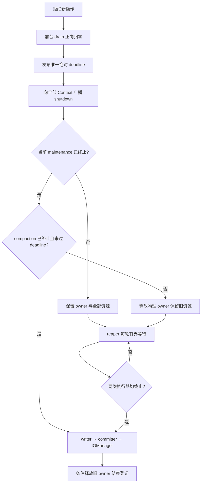

# 历史 Spec（已被替代）：Paimon Spill 生命周期与依赖升级门禁

> **历史文档：停止与执行器生命周期现由[同步优雅停止主 Spec](/Users/SL/javaProject/tapdata-connectors/connectors/paimon-plus-connector/src/doc/specs/SPEC-paimon-spill-sync-graceful-stop.md)替代。** 下文的 deadline、retained/reaper、maintenance 捕获与阶段测试成绩仅供追溯，不作为新协议的实现或验收依据；目录保护、业务恢复与 FileIO 契约中未被替代的部分继续有效。

> Spec id：`paimon-spill-lifecycle-current`；版本：V1.0，2026-09-05。
> 适用范围：`connectors/paimon-plus-connector`。本文件仅保存旧协议和旧验收记录，不作为当前实现或排障依据；当前契约以同步优雅停止主 Spec 为准。
> 依赖：模块 `pom.xml` 固定 Apache Paimon `1.3.2`、Hadoop `3.3.6`；本地源码核对仓为 `/Users/SL/javaProject/paimon@76711fc8e0f3d474e628eb7b7fc7bcdec92d2066`。
> 历史状态（不描述当前工作区）：当时修复、源码核对与独立复核完成；完整模块三轮各 533 项通过，补充配置加载回归后最终 package 为 540 项通过，交付 JAR 已核验。详细结果及未覆盖边界见[最终修复对比与生命周期总览](../reviews/SPILL-修复前后对比与生命周期总览.md)。工作区尚未提交或推送，远端 CI 未执行。

## 1. 数据安全与恢复边界

交付语义为 at-least-once，保留现有 write/prepare、pending retry、commit identifier 与 offset callback 顺序。前台操作和提交未归零时，不能用后台关闭超时宣告任务可接管。

需要区分三种所有权：

| 所有权 | 保护对象 | 释放依据 |
| --- | --- | --- |
| Service 物理表 owner token | 同一 JVM 内同一物理表的写入代次 | 前台已归零，且旧 maintenance 已正向终止；按原 token 条件删除 |
| Context 的 writer/committer/IOManager | 旧代后台工作仍会访问的资源 | compaction 与 maintenance 均正向终止后，才进入最终关闭 |
| spill 目录 live 登记与 owner 文件锁 | 本地目录，防止另一次 stale cleanup 误删 | 有界后台证明失败时全部保留；最终关闭处理与 stale cleanup 的细节见 §4 |

`Future.isDone()`、取消成功、`isShutdown()`、收到中断或 writer.close 返回均不替代执行器终止证明。等待使用 `awaitTermination`，deadline 到达时允许读取 `isTerminated()` 作即时判断；缺少证明时保留资源。

旧 maintenance 能沿 `TableCommitImpl.maintain → PartitionExpire → FileStoreCommitImpl.dropPartitions → tryOverwritePartition` 读取最新快照并提交分区 `OVERWRITE`。因此 at-least-once 重放不能补救新代数据被旧维护删除，maintenance fence 必须保留。[Paimon TableCommitImpl](https://github.com/apache/paimon/blob/c05f7d1f1b1e5d37e64edab0f2978124d90b64f7/paimon-core/src/main/java/org/apache/paimon/table/sink/TableCommitImpl.java#L348)、[分区删除提交](https://github.com/apache/paimon/blob/c05f7d1f1b1e5d37e64edab0f2978124d90b64f7/paimon-core/src/main/java/org/apache/paimon/operation/FileStoreCommitImpl.java#L881)。

本 owner 协议不提供跨 JVM/跨 ClassLoader 全局 fencing。永久卡住的维护任务以 Engine 进程退出为最终恢复边界。超时告警只能提升可见性，不能取得删除或接管许可。

## 2. Service 关闭与 Context 状态

关闭先拒绝新的入口，再等待已经准入的 ingress、scheduler、stop flush、pending retry 和 offset callback 收敛。前台 drain 没有超时逃逸。前台结束后创建唯一单调时钟绝对 deadline `CloseOperation.executorDeadlineNanos`；caller 与原 cleanup worker 使用同一个值。

cleanup 先向全部 Context 广播 shutdown，再先处理已有终止证明的 Context，最后等待未证明的 Context。compaction 可 `shutdownNow()`；maintenance 只 `shutdown()`，不能通过中断去打断维护及其下游删除等待。[Paimon writer 关闭](https://github.com/apache/paimon/blob/c05f7d1f1b1e5d37e64edab0f2978124d90b64f7/paimon-core/src/main/java/org/apache/paimon/operation/AbstractFileStoreWrite.java#L303)、[committer 关闭](https://github.com/apache/paimon/blob/c05f7d1f1b1e5d37e64edab0f2978124d90b64f7/paimon-core/src/main/java/org/apache/paimon/table/sink/TableCommitImpl.java#L397)。

| 关闭结果 | 资源处置 | 物理 owner |
| --- | --- | --- |
| `CLOSED` | writer → committer → IOManager 按序尝试一次；close 异常原样返回并保留 suppressed 链 | 可释放；关闭失败不能日志报告删除成功 |
| `RETAINED_COMPACTION` | 保留资源，交由 reaper 后续取得证明并收尾；也涵盖 deadline 后尚未开始的延期收尾 | 前台已归零且 maintenance 已终止，可释放 |
| `RETAINED_MAINTENANCE` | 保留全部资源、目录登记及 owner，交由 reaper 等待 | 必须保留，拒绝同 JVM 新代注册 |
| detached Context 关闭抛错且无安全结果 | 保留 Context 强引用并安排 reaper | 保留，不能因异常或 finally 无条件释放 |

Context 离开 `ACTIVE` 后拒绝新写入。retained 期间的重复 AutoCloseable.close 不重复强关；后台退出后，显式再次 close 可完成收尾。Service 管理的 retained Context 自动交给 reaper。`closeResult()` 是最近一次关闭结果，不等同于进行中的 `RETIRING` 阶段。

绝对 deadline 只限制原 cleanup worker 开始破坏性收尾的许可：deadline 后尚未开始的 Context 必须转交 reaper；已经进入的 Java close 不能被硬中断，也可能阻塞超过 deadline。reaper 使用每轮有界等待持续尝试，不继承一个永久过期的 deadline。

maintenance 在 reaper 等待期间先结束、compaction 仍阻塞时，可以更新为 compaction-only 结果并按原 token 放行 owner。reaper 的去重单位是旧 Context/旧 committer；同表多代 compaction-only retention 可积累多套旧资源，不能表述为整个 JVM 每表最多一个 reaper。

## 3. DDL drain、临时 committer 与异常优先级

`clearTable` 和 `dropTable` 先在既有表锁内 drain。释放 owner 的许可默认关闭。

1. drain 失败：不移除原 Context，不清 pending，不启动 reaper，也不提前 shutdown；DDL action 不执行，返回原异常并保留 sticky failure。后续由调用方执行正常 Service.close。
2. drain 成功且 Context 已移除：只在没有 Context 或拿到 `CLOSED/RETAINED_COMPACTION` 安全结果时允许释放；`RETAINED_MAINTENANCE` 和未知结果保持 owner。安全释放实际在 DDL 结束阶段执行，不在 action 之前执行。
3. 临时 `BatchTableCommit` 也先捕获并证明 maintenance 终止再 close。maintenance retention 撤销释放许可，交由专用 reaper，按原 owner token 完成收尾。
4. action 和 close 各执行一次。普通 close 失败 suppressed 到原 action 失败；maintenance retention 是主异常，原 action 失败 suppressed 到它，供 `runTableDdl` 正确保留 owner。安排 reaper 失败也只能 suppressed 到 retention；首次保留日志的运行时异常不能替换 retention。不能直接换成改变异常优先级的 try-with-resources。

Paimon `1.3.2` 的 `truncateTable()` 本身不调用 `maintain()`；临时 committer 的阻塞 maintenance 用例验证防御性契约，不能写成真实 truncate 必定触发异步维护。[Paimon truncateTable](https://github.com/apache/paimon/blob/c05f7d1f1b1e5d37e64edab0f2978124d90b64f7/paimon-core/src/main/java/org/apache/paimon/table/sink/TableCommitImpl.java#L174)。

## 4. Factory、目录保护与审计

Factory 从同一 StreamWriteBuilder 创建 writer/committer，第一次 write 前注入连接器拥有的 compaction executor，并在 raw committer 上捕获 maintenance executor。类型不是 `TableWriteImpl/TableCommitImpl` 时直接失败，不静默退化。注入后 Paimon 不再自行关闭该 compaction executor。[TableWriteImpl 接缝](https://github.com/apache/paimon/blob/c05f7d1f1b1e5d37e64edab0f2978124d90b64f7/paimon-core/src/main/java/org/apache/paimon/table/sink/TableWriteImpl.java#L134)、[maintenance 捕获接缝](https://github.com/apache/paimon/blob/c05f7d1f1b1e5d37e64edab0f2978124d90b64f7/paimon-core/src/main/java/org/apache/paimon/table/sink/TableCommitImpl.java#L408)。

Factory 失败回滚目前保留原顺序：已创建 strategy 则先关 strategy，再关 committer；没有 strategy 则 committer 后关 raw writer；然后 IOManager/目录登记，最后 `shutdownQuietly`。该路径的安全前提是构造失败前尚未发生首次 write/commit，也未提交需访问 spill 的异步工作。它不是“任何半构造资源都可直接关闭”的一般许可；升级或修改 strategy 构造流程时必须重新证明此条件。

Factory 主动取得并缓存 canonical spill 目录，在首次使用前完成 live 登记与文件锁保护。`IOManager.getSpillingDirectories()` 会懒建目录；审计只读缓存，不能为了日志再次调用该方法。[Paimon IOManager](https://github.com/apache/paimon/blob/c05f7d1f1b1e5d37e64edab0f2978124d90b64f7/paimon-core/src/main/java/org/apache/paimon/disk/IOManagerImpl.java#L60)。

stale cleaner 只有在以下条件全部满足时可删除：匹配 `paimon-io-*`、是真目录且不跟随符号链接、当前 JVM 未登记 live、存在 owner marker、获得独占文件锁、目录及孩子达到 10 分钟 grace、检查过程没有异常。无 marker 的旧版本目录不自动删。删除失败或部分删除保留 marker，只有完整成功才回调并删除 marker。

需要区分 cleaner 与正常最终关闭：当前 Context/Factory 在 IOManager.close 抛出普通异常后仍注销 live 登记与 owner 锁，Context 记录 `close-failed`。不能把 cleaner 的“删除失败保留 marker”描述为所有关闭路径都具备的行为；这类安全但未完全删除的残留可能需要人工收尾。retained 状态则不得注销登记或锁。

所有 Service 管理的 Context（包括 DDL/reaper）在真实边界记录：首次 retained 或保留类别变化写 `[paimon-spill] retained`；取得证明、即将最终关闭写 `close-intent`；成功写 `closed`，资源关闭异常写 `close-failed` 并保留异常链。字段包含 table、原 owner、缓存 dirs、source 和 reason；正常每秒重复等待不重复 retained，重复关闭不重复最终日志。

## 5. 本轮补充修复契约

### 5.1 独立保留告警

增加内部 monitor，以单调时钟记录起点；已安排 reaper 的资源保留超过 5 分钟首次 ERROR，此后每 5 分钟提醒。它独立于 reaper 执行，因此 reaper 内的 writer/committer/IOManager.close 本身阻塞时也能告警。覆盖 retained Context、临时 DDL committer 和 reaper 已经进入最终 closing 的阶段；记录 owner、table、资源种类、保留结果、阶段与持续时长。完成后取消定时记录；reaper 异常退出但资源未完成时继续报告 `reaper-stopped`。初始 close worker 阻塞且尚未安排 reaper 的 Context 不在该告警范围。

每个 Connector ClassLoader 最多常驻一个告警 daemon，不为每表额外创建告警线程；宿主反复创建/卸载 ClassLoader 的行为尚未验证。该 monitor 不改变 owner、shutdown 策略或资源关闭顺序，不新增外部配置；不是超时强制回收器。`retainedContextCount()` 仅统计 Context，不能作为 DDL committer 或所有关闭阻塞的总量指标。

### 5.2 S3A 初始化线程组与缓存

对标准 `org.apache.hadoop.fs.s3a.S3AFileSystem` 的初始化使用连接器稳定线程组，保留调用者 UGI、TCCL 和最终 Hadoop Configuration。需要覆盖每个 authority 的懒初始化；只移动 Catalog 构造线程或 close worker 不足以改变 S3A 内部线程工厂捕获的 group。[Paimon FS 懒创建](https://github.com/apache/paimon/blob/c05f7d1f1b1e5d37e64edab0f2978124d90b64f7/paimon-common/src/main/java/org/apache/paimon/fs/hadoop/HadoopFileIO.java#L173)、[Hadoop S3A 池初始化](https://github.com/apache/hadoop/blob/rel/release-3.3.6/hadoop-tools/hadoop-aws/src/main/java/org/apache/hadoop/fs/s3a/S3AFileSystem.java#L772)、[Hadoop 固定 group 的线程工厂](https://github.com/apache/hadoop/blob/rel/release-3.3.6/hadoop-common-project/hadoop-common/src/main/java/org/apache/hadoop/util/BlockingThreadPoolExecutorService.java#L60)。

**纠正前轮审查**：Service 先给 `fs.s3a.impl.disable.cache=true` 默认值，随后 `s3Properties` 可以覆盖为 `false`；不是固定不可变的 true。修复必须保留最终 cache 选择，并覆盖 true/false 两种路径。

不反射关闭 `HadoopFileIO.fsMap`，不擅自关闭共享底层 FileSystem。自定义 `fs.s3a.impl` 不强制替换；修复不能追溯改变外部预先缓存的旧 FS 内部线程组。Paimon shaded `s3://` 插件、自定义 FS、外部共享缓存和完整 Engine 生命周期必须分别声明验证边界，不能从标准 `s3a://` 单元回归推断全部覆盖。

HDFS 保持原 `DistributedFileSystem` 实现：`DFSClient` 的 RPC Connection 在首次 RPC 时懒创建，只移动 initialize 不等于保护全部内部线程。本轮使用真实 Service、DFSClient 和 localhost NameNode 协议桩，验证旧 Task group 中断/销毁后同一 FS 可继续元数据 RPC；未覆盖真实 DataNode 数据读写或 Kerberos。S3A 使用 localhost HTTP 协议桩覆盖权限表探测及对象读取；`bucket.probe=0` 不等于 Service 初始化完全无网络访问。自定义 SecurityManager 可改变 Hadoop 工厂选择线程组的规则，也不属于本轮已验证范围。

### 5.3 真实 spill 测试收尾

阻塞 fixture 无论断言成功/失败都在 finally 释放 latch，等待 worker 正向退出，再最终关闭 Context，并验证 retained 计数/owner 文件锁归零。测试使用 canonical spill 路径注销登记。移除等待尚未开始 shutdown 的固定 30 秒循环，以真实完成屏障及被测关闭协议证明顺序。中断等待 helper 记录中断、继续等待释放，退出后恢复标记，不在每次 catch 后立即重设造成忙循环。

## 6. Paimon/Hadoop 升级必须重新核查的接缝

类型和方法名仍在，只能证明编译/类型边界；不能证明异步行为没有变化。每次升级需记录旧/新版本、实际 resolved artifacts、对应官方固定 commit 以及本地 fork 与相关文件的差异。

| 接缝 | 必须核查的行为 | 对应验收 |
| --- | --- | --- |
| `TableWriteImpl.withCompactExecutor` / `AbstractFileStoreWrite` | 第一次使用前注入仍有效，全部 bucket mode 均使用该 executor，Paimon 不另建未受控生产者 | lifecycle、Factory、真实 spill |
| `TableCommitImpl.getMaintainExecutor` / `maintain` / `close` | getter 覆盖全部维护工作；graceful 终止仍能证明其 FileIO 使用结束；新增 callback/global child 不能漏审 | maintenance、DDL、owner fencing |
| `PartitionExpire` / `tryOverwritePartition` | 旧维护是否仍可提交/删除，源快照与新代关系 | maintenance 存活期间禁止接管 |
| strategy/Factory 构造及 dynamic preflight | 构造回滚前是否仍无首次 write/commit/异步 spill；类型漂移失败不会留下可运行的生产者 | Factory 失败与动态桶回归 |
| `IOManagerImpl` / `FileChannelManagerImpl` | getter 是否懒创建、close 是否递归删除、关闭失败行为 | 真实 spill/marker/审计 |
| `FileIO` / `HadoopFileIO` / Catalog | close ownership 是否仍安全，局部与 Hadoop 全局 cache 的 identity/生命周期 | Service close 后共享 FS 仍可用 |
| Hadoop S3A/DFS 线程工厂 | 初始化和新 worker 的 ThreadGroup/TCCL/UGI、keepalive 与缓存复用 | 临时 Task group 销毁后再次创建 worker与读写 |
| PDK 配置合并/宿主表单 | 显式值、缺失/null、connection/node 覆盖及旧任务重新保存 | Config/Spec 加载；宿主 E2E 单列 |

官方源码必须针对目标版本重新读取；不能只复用本文件的 1.3.2/3.3.6 链接。当前库未提供覆盖任意外部 callback/任意自定义 FS 的统一终止 API；不得将内部类型检查写成无限范围的安全保证。

## 7. 本轮完成门禁

- 已安排 reaper 的 Context/DDL 保留告警和 reaper closing 阻塞告警有可控时钟测试；5 分钟前不触发，跨阈值触发，再次提醒遵守间隔，完成后注销；告警不释放 owner。
- Service 真实关闭后共享 FS 仍可用；标准 S3A 覆盖 cache 开关、稳定 group、调用者 UGI/TCCL 和 worker 再创建；HDFS 的实际覆盖与外部服务依赖单列。
- 真实 spill timeout 用例在同 JVM 重复运行不积累 retained 计数或 owner 锁；正常关闭、deadline 转交和旧 worker 存活期间目录保留断言维持。
- clearTable action/close 异常组合、maintenance retention 主异常、owner 条件释放回归通过。
- JDK 17 执行受影响关闭/owner/DDL/lifecycle/真实 spill/FS/配置测试，再执行完整模块；连续运行的轮数、耗时、失败/跳过和 CI 证据分别记录。
- 最终独立审查覆盖 Factory、stale cleaner、共享 deadline、DDL、reaper 和 FS 入口；将尚未证明的部署边界写入验收记录，不用测试通过代替端到端证明。
