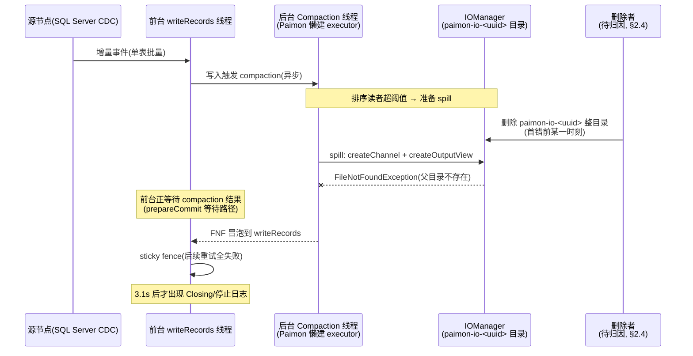
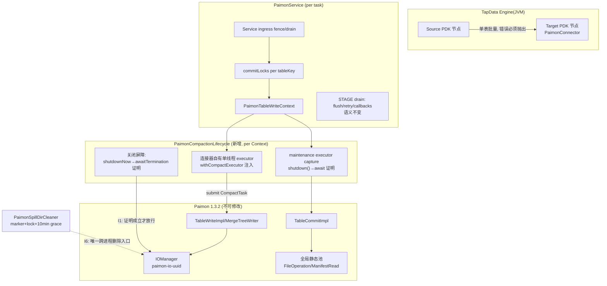
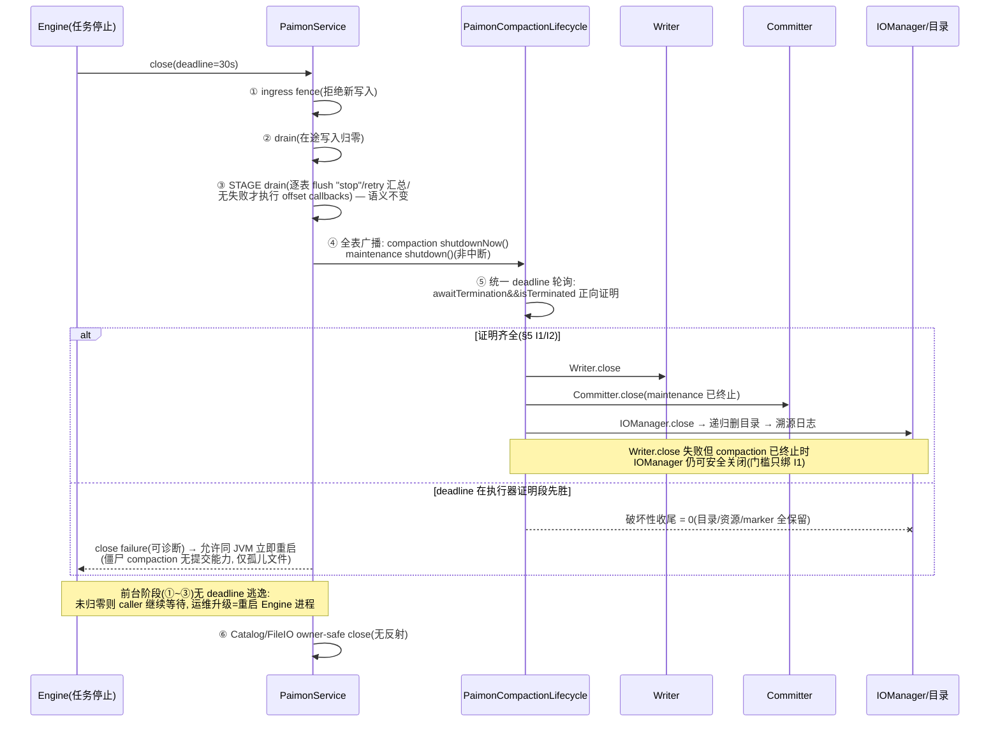

# Spec：Paimon Plus Spill 生命周期 Hotfix（at-least-once 版）

> **历史文档：停止与执行器生命周期现由[同步优雅停止主 Spec](/Users/SL/javaProject/tapdata-connectors/connectors/paimon-plus-connector/src/doc/specs/SPEC-paimon-spill-sync-graceful-stop.md)替代。** 下文的 deadline、retained/reaper、maintenance 捕获与阶段测试成绩仅供追溯，不作为新协议的实现或验收依据；目录保护、业务恢复与 FileIO 契约中未被替代的部分继续有效。

> Spec id：`paimon-spill-lifecycle-hotfix`
> 版本：V1.0
> 状态：**历史 Spec，2026-09-05 标记；保留原事故分析、阶段设计和验证记录。**
> 当前有效契约与升级门禁：[`SPEC-paimon-spill-lifecycle-current.md`](SPEC-paimon-spill-lifecycle-current.md)。
> 下文“任意执行器超时均可同 JVM 立即重启”“旧 worker 不可能提交”等旧推论已被后续 maintenance owner fence 修订，不得作为当前验收标准。旧 maintenance 仍可能执行分区 `OVERWRITE`，必须正向终止后才允许接管；只有 compaction-only retention 可先释放物理 owner。
> Paimon 依赖基线：`1.3.2@c05f7d1f1b1e5d37e64edab0f2978124d90b64f7`（不可修改）
> 本地证据仓：`/Users/SL/javaProject/paimon@5c59e6cb01ed0b29563371f56e14fcade4597a2e`（`release-1.3` fork；
> 本 Spec 引用的全部接缝已逐一比对，与 1.3.2 **同行同义**，行号可直读）
> Connector 基线：`origin/develop@162b7d1f95d3fa00f7ffd073c25ea0429d861bf3`（`paimon.version=1.3.2`，
> `pom.xml:20`）
> 实施分支：`hotfix-spill`

## 1. Objective

**快速修复 2026-09-01 生产事故**：paimon-plus 增量写入中，后台 Compaction 线程在使用 IOManager
Spill 目录时目录已被删除，抛出 `FileNotFoundException .../paimon-io-<uuid>/....channel (No such
file or directory)`；受影响任务由 1 个扩散至 4 个。

修复目标一句话：**把"删除 Spill 目录"这个动作置于两个可证明的后台终止条件之后；后台执行器证明超时时宁可泄漏资源也绝不删除；前台阶段（写入/提交/回调）无超时逃逸，归零前不得宣告可重启。**

交付语义与恢复策略（用户确认）：

- 连接器只需 **at-least-once**：offset 仅在批量写完成后推进；任务失败重启后从最后已提交
  offset 重放，允许重复、不丢数据；
- 恢复分两段（修订 P0-2）：**后台执行器证明超时 → 泄漏（不删目录、不强关资源）→ 允许同 JVM
  立即重启**（僵尸 compaction 不具备提交能力，仅产出孤儿数据文件）；**前台阶段超时 → 不返回、
  继续等待**（运维升级手段 = 重启 Engine 进程；进程级重启安全，Paimon manifest 提交原子）；
- **不丢数据**是底线：任何路径不得破坏 STOP drain 的 flush/pending-retry/offset-callback 顺序，
  也不得让旧代在前台归零后仍持有提交能力（§5.1 I7）。

成功判定：

1. 三个真实 Paimon 1.3.2 集成回归全绿（§7.1）；
2. STOP 语义回归通过（§7.2）；
3. 生产代码中 `HadoopFileIO.fsMap` 反射关闭调用次数为 0；
4. 不新增任何配置项，不修改写入/commit identifier/pending retry/offset callback 语义。

### 1.1 非目标（显式排除）

- scope fence、MBean anchor、tombstone、FileIO sticky ledger、ThreadGroup fail-closed probe、
  callback option gate 等重型机制**全部不做**（完整版 Spec 的对应章节仅存档）；
- `PaimonConnector.onStart/onStop` 小修补（init 前发布 Service、close 失败 finally 置 null）不在
  本 hotfix 范围，记为后续卫生任务；
- 外部删除者（systemd-tmpfiles/cron/挂载替换）归因与治理不在代码修复范围（§2.4）；
- 不回植 1.3.1 事故包（`496a4d7a`）基线。

## 2. 事故报告（Incident Report）

### 2.1 现场信息

| 项 | 值 |
|---|---|
| 事发时间 | 2026-09-01 00:46:19 首错；同日 12:34 复发一轮 |
| 任务 | `drs_DRSRedemptionCoupons_2_dl_ods_paimon_plus`（SQL Server → 增量 → paimon-plus） |
| 影响面 | 用户反馈报错任务由 1 个增长到 4 个；附件含两个不同 IOManager UUID 目录 |
| 现场包 | 2026-07-30 构建，推定 Connector `496a4d7a` + Paimon 1.3.1（栈 `PaimonService.java:1293` 与该提交一致） |
| 现象 | 增量写入突然报 FNF；上服务器确认 `paimon-io-*` 目录确实不存在 |

两个独立 Spill 目录均出现同形错误（排除单文件偶发损坏）：

| 表/上下文 | Spill 路径 |
|---|---|
| `pr_operators` | `/tapdata_cache/paimon-io-d042cd0e-f828-411f-982c-ca44519574a5/18ae0c3b….channel` |
| `DRSRedemptionCoupons` | `/tapdata_cache/paimon-io-d97c5153-0c75-4f98-b9d3-550bd04a0eda/cd04bf91….channel` |

### 2.2 日志时间线（DRSRedemptionCoupons）

| 时间 | 事件 | 含义 |
|---|---|---|
| 00:46:19.229 | 首次 FNF（`writeRecords` 重试 1/15） | Spill 目录此前已被删 |
| 00:46:19.321 | 源节点停止 | 晚于首错，非起因 |
| 00:46:22.793 | 第二次写入命中同一错误，服务已 sticky fence（`Error code 15019`） | 自动重试无法救活已损坏的上下文 |
| 00:46:23.328 | `Error closing Paimon service: Paimon write service is fenced…` | 关闭期 flush 命中 fence，是下游处置 |
| 00:46:29.422 | `Resume task` | 自动恢复 |
| 00:46:32.939 | 新实例 `Paimon connector started successfully` | 重启后恢复，佐证"重启重放"有效 |

日志↔代码对应（develop 基线行号）：fenced 文案 = `service/PaimonService.java:2420`；
`Error closing Paimon service` = `PaimonConnector.java:92`。

**关键排除**：现场 grep 到的 `Closing`/停止日志均晚于首错 3.1 秒以上——**同任务的关闭是故障处置
结果，不是首次删除的证据**；删除动作发生在首错之前，删除者归因见 §2.4。

### 2.3 事故时序图



### 2.4 删除者归因（2026-09-04 用户运维事实收窄）

**运维事实（用户确认，2026-09-04）**：生产环境**不存在外部线程/进程**操作 `/tapdata_cache`
（无 systemd-tmpfiles、cron、运维脚本、人工清理或挂载替换）。据此外部候选全部排除，
删除者收敛到连接器内部：

| 候选（均为连接器内部） | 代码可删整目录 | 判定 |
|---|---|---|
| 本任务/本 JVM 关闭路径（IOManager.close 竞态） | 是 | 机制已源码级确认（§3），由 I1~I3 封堵 |
| 同 JVM 其他任务启动时的 stale-cleaner | 是 | owner-lock/LIVE_DIRS 门禁防护（I6）；7-30 包的"跳过删除仍删 marker"缺陷已在 develop 修复（仅成功删除才删 marker） |

因此本 Spec 的内部机制封堵即视为对本次事故的完整修复；H4 的删除溯源日志保留，
用于未来任何复发场景的第一时间归因。原"运维补证清单"（同机全任务日志 grep、auditd）
降级为可选巡检项，不作为发布门禁。

## 3. 事故原因分析（Root Cause Analysis）

### 3.1 机制链（每环均有源码证据，锚点见 §4）

```text
① Compaction 由 AbstractFileStoreWrite 懒建的单线程 executor 异步执行
② Writer.close() 对 Compaction 仅 Future.cancel(true)（协作式中断）+ executor.shutdownNow()，
   全文件无 awaitTermination —— "close 正常返回"≠"线程已终止"
③ 连接器从不注入外部 executor（grep withCompactExecutor = 0），无从等待
④ 连接器 close 顺序 = Writer → Committer → IOManager，IOManager.close() 递归删除整个
   paimon-io-<uuid> 目录
⑤ 连接器调用 getSpillingDirectories()（stale-cleaner 注册）会强制 IOManager 懒初始化，
   因此事故路径的 close 必然进入目录删除分支
⑥ 存活的 Compaction 线程在 MergeSorter.spill 中 createChannel + createOutputView：
   RandomAccessFile(path,"rw") 能创建文件，不能创建已消失的父目录 → ENOENT
⑦ 前台恰在等待 compaction 结果（commit.force-compact / shouldWaitForPreparingCheckpoint
   成立时 prepareCommit 等待），FNF 冒泡到进行中的 writeRecords → 任务报错
```

现场完整栈 18 帧（`CompactTask.call → MergeTreeCompactTask.doCompact → … → MergeSorter.spill:171
→ FileChannelUtil:53 → IOManagerImpl:145 → AbstractFileIOChannel:58 → RandomAccessFile.open0`）已在
1.3.2 固定基线逐帧对照：**17 帧同行同义**；唯一偏差 `CompactTask.java:34` 属 1.3.1→1.3.2 行号漂移
（1.3.2 中该行是类声明），无实质影响。两份日志中 `AbstractFileIOChannel` 行号差异（:58 FNF 链 /
:61-63 IOException 包装链）由同一构造器的两个语句解释。

**为什么升级到 1.3.2 不解决**：§3.1 ②④⑥ 涉及的六个关键文件在 1.3.1 与 1.3.2 语义一致（本地
fork `5c59e6cb01` 与 1.3.2 sources jar 逐文件比对确认）。

**为什么不采用这些"修复"**：目录丢失后 `mkdir -p` 续跑（旧 spill 数据已丢，把确定失败变成隐蔽
排序/数据错误）；仅加重试（上下文已 fence，不可恢复）；关闭 spill（转嫁为 OOM）；仅延长等待
（sleep 不是终止证明）。

### 3.2 组件架构图（修复后）



### 3.3 修复后关闭时序图



### 3.4 原故障窗口为何不可达

| 原窗口 | 被哪个不变量关闭 |
|---|---|
| Writer.close 返回 ≠ 线程终止（②） | I1：`awaitTermination()==true && isTerminated()==true` 是删目录唯一放行条件 |
| IOManager.close 无前置（④⑤） | I1/I2：两个执行器终止证明齐备后才进入有序关闭 |
| 超时后后台 worker 仍继续破坏性收尾 | I3：deadline 先胜 ⇒ 破坏性动作计数为 0，泄漏代替删除 |
| 共享 Hadoop FileSystem 被单 Service 反射关闭 | I5：反射路径删除 |

## 4. Source Notes（证据表，2026-09-03 实证）

通用说明：`P:` = Paimon 1.3.2 固定基线（`paimon-core/src/main/java/org/apache/paimon/`，审计
checkout `c05f7d1f`，sources jar SHA-256 `f8c6d7b5…dae63`）；`L:` = 本地 fork
`/Users/SL/javaProject/paimon@5c59e6cb01`（`release-1.3`，引用接缝**同行同义**，行号可直读）；
`C:` = Connector `origin/develop@162b7d1f`（`connectors/paimon-plus-connector/src/main/java/io/tapdata/connector/paimon/`）。

| id | 事实 | 锚点 |
|---|---|---|
| S-01 | `withCompactExecutor` 注入后 Paimon 置 `closeCompactExecutorWhenLeaving=false`，不再自关该 executor（修复注入接缝） | P: `table/sink/TableWriteImpl.java:134-137`、`operation/AbstractFileStoreWrite.java:147-150`；L: 同行 |
| S-02 | Writer close 顺序：bucket writers → 条件 `shutdownNow()`（仅当 Paimon 持关闭权）→ 无任何 `awaitTermination`（全文件 grep 证实） | P: `operation/AbstractFileStoreWrite.java:303-317`、懒建 `:509-517` |
| S-03 | `cancelCompaction` 仅 `taskFuture.cancel(true)`；已取消 Future 的 `get()` 立即抛 `CancellationException` 返回，不等线程退出；`MergeTreeWriter.close` = cancel → sync → compactManager.close | P: `compact/CompactFutureManager.java:34-40,47-63`；`mergetree/MergeTreeWriter.java:342-350`；L: `:345` 同行 |
| S-04 | `IOManager.close()` 仅当 `lazyChannelManager != null` 才委托 `FileChannelManagerImpl.close()`；后者对每个存在目录 `FileIOUtils.deleteDirectory` 递归删除并打日志 `FileChannelManager removed spill file directory` | P: `disk/IOManagerImpl.java:73-78`（L 同行）、`disk/FileChannelManagerImpl.java:124-154`（L:142 同行） |
| S-05 | `getSpillingDirectories()` 非纯 getter，触发 channel manager 懒初始化并物化 `paimon-io-<UUID>` 目录 | P: `disk/IOManagerImpl.java:60-70,119-121`、`disk/FileChannelManagerImpl.java:76` |
| S-06 | spill 条件 `ioManager != null && lazyReaders.size() > spillThreshold`；spill 先 `createChannel()` 再 `createOutputView`；`RandomAccessFile(path, writeEnabled?"rw":"r")`，写侧恒 "rw" | P: `mergetree/MergeSorter.java:110,159-190`；`disk/AbstractFileIOChannel.java:56-63`（L:58 同行） |
| S-07 | spill 触发栈与现场 18 帧对照：17 帧同行同义（含 `MergeSorter:111/153/171`、`IOManagerImpl:145`、`FileChannelUtil:53`、`BufferFileWriterImpl:31`） | P: 审计 checkout 逐帧核对；L: 关键帧同行 |
| S-08 | Committer：SYNC(默认) 用 direct executor，ASYNC 每 Committer 独立单线程懒建（`snapshot.expire.execution-mode`）；maintenance 在 commit 返回后异步访问 FileIO；close = `commit.close()` → `shutdownNow()` 无 await；`getMaintainExecutor()` public + `@VisibleForTesting`（捕获接缝） | P: `table/sink/TableCommitImpl.java:118-128,348-389,397-401,408-411`；L:399/409 同行 |
| S-09 | `prepareCommit(waitCompaction)`：`commit.force-compact=true` 或 `shouldWaitForPreparingCheckpoint()`（sorted runs > stop-trigger+1）成立时前台等待 Compaction——FNF 冒泡到 writeRecords 的路径 | P: `mergetree/MergeTreeWriter.java:252-267` |
| S-10 | `HadoopFileIO` 按 scheme/authority 缓存 `path.getFileSystem(conf)`（fsMap），不 override `FileIO.close()` 默认 no-op——反射关 fsMap 会击垮同 JVM 共享该 FileSystem 的其他任务 | P: `paimon-common/.../fs/hadoop/HadoopFileIO.java:173-209`、`fs/FileIO.java:229-234` |
| S-11 | 连接器 close 顺序 Writer→Committer→IOManager；`write()` 仅一次状态检查可与 close 竞态；无 withCompactExecutor 调用；`awaitTermination` 仅 2 处且均为连接器自建池 | C: `write/PaimonTableWriteContext.java:301-333`、`commit/PaimonAsyncCommitScheduler.java:302`、`service/PaimonService.java:2842` |
| S-12 | Service close：30s deadline（`:115`）；caller 超时仅 break 记 sticky failure（`:3347-3365`、`:3510-3526`）；后台 worker 仍继续 `cleanupAllResources` 并 publishClosed（`:3376-3475`）；cleanup 先清全部 Context/locks 再关共享 Catalog/FileIO（`:1588-1687`） | C: `service/PaimonService.java` |
| S-13 | STOP drain 现有语义（必须原样保留）：逐表 `flushTableInternal(tableKey,"stop",true)`（`:2373-2379` 实现）、pending-retry interruption 汇总、仅无失败时执行 reserved/ready offset callbacks | C: `service/PaimonService.java:3429-3454` |
| S-14 | `clearTable` 在 DDL 线程构造临时 BatchTableCommit 并 try-with-resources 关闭，未管理其 maintenance executor | C: `service/PaimonService.java:912-929` |
| S-15 | 反射关闭 `HadoopFileIO.fsMap` 存在于 `closeHadoopFileIOCachedFileSystems`（`:1696-1736`），调用点 `:1652`——本 Spec 删除 | C: `service/PaimonService.java` |
| S-16 | stale cleaner 门禁（保留+加日志）：LIVE_DIRS（`:46`）+ owner marker `.<dir>.tapdata-owner.lock`（`:312-316`）+ `RandomAccessFile+tryLock` 跨进程锁（`:398-418`）+ 10min mtime grace + NOFOLLOW；IOManager 唯一创建入口 `:99-104`，spill 目录读取 `:176` | C: `util/PaimonSpillDirCleaner.java` |
| S-17 | spill 相关 option：`sort-spill-threshold`（无默认时取 stop-trigger+1，`checkArgument > 1`，`CoreOptions.java:2337-2344`）、`spill-compression` 默认 zstd（`:507-533`）——回归 fixture 参数依据 | P: `paimon-api/.../CoreOptions.java` |
| S-18 | `tryCommitOnce` 的"已完成提交"判定只比较 `commitUser + commitIdentifier + commitKind`，**不比较 CommitMessages**——不受控跨代 `commit()` 会静默吞掉同 identifier 的新消息集（I7 依据，2026-09-04 复核） | P: `operation/FileStoreCommitImpl.java:967`；L: `:960-975`（同行同义） |
| S-19 | `commit()` javadoc 要求调用者保证 identifier 从未提交、重试必须走 `filterAndCommit()`——identifier 幂等是受控重试协议，不是任意重放去重 | P: `table/sink/StreamTableCommit.java:54`；L: `:52-72` |

## 5. 修复设计

### 5.1 不变量（实施与验收的判定标准）

- **I1**：`IOManager.close()`（含目录删除）当且仅当该 Context 的 compaction executor 取得
  `awaitTermination()==true && isTerminated()==true` 后才允许执行；`Future cancelled/done`、
  `isShutdown`、interrupt、`Writer.close()` 正常返回均不构成证明。
- **I2**：`Committer.close()` 前置为 maintenance executor graceful `shutdown()`（禁止
  `shutdownNow()`：其后台任务经全局池删除文件，child-future 不可取消）+ 同样终止证明。
- **I3（修订 P0-2，deadline 只约束后台证明）**：30s 统一 deadline **仅作用于执行器终止证明
  阶段**。前台阶段（ingress fence → drain → scheduler 停止 → 逐表 flush/commit → offset
  callbacks）**无 deadline 逃逸**：caller 在前台工作正向归零前不得返回可重启结论；deadline
  在前台阶段到达只记录告警并继续等待（心跳日志），运维升级手段为重启 Engine 进程。deadline
  在执行器证明阶段先胜 ⇒ 该 Context 破坏性收尾动作计数为 0（不关 Writer/Committer/IOManager、
  不删目录/marker），聚合失败上报，**此时**才允许同 JVM 立即重启。
- **I7（修订 P0-2，跨代提交安全）**：旧代在前台归零后不得再持有任何提交能力——僵尸
  compaction 线程只产出孤儿数据文件（不进入 snapshot、不触 manifest）。依据：Paimon 1.3.2
  `FileStoreCommitImpl.tryCommitOnce` 的"已完成提交"判定**只比较 `commitUser + commitIdentifier
  + commitKind`，不比较 CommitMessages**（1.3.2 sources `:967`；本地 fork `:960-975`）——
  不受控的跨代 `commit()` 会把与旧代同 identifier 的新代重放集静默判为已提交成功，构成
  丢数据向量，at-least-once 语义无法自动兜底；受控重试只能经既有
  `filterAndCommit`/pending-retry 契约（`StreamTableCommit` javadoc，1.3.2 `:54`、本地 fork
  `:52-72`：`commit()` 要求调用者保证 identifier 从未提交）。
- **I4**：STOP drain 语义逐条保留（S-13），重放边界不变。
- **I5**：删除 fsMap 反射路径；Catalog/FileIO 只走公开 owner-safe close；共享 Hadoop FileSystem
  永不由单 Service 关闭。
- **I6**：跨进程目录删除唯一入口仍是 stale cleaner（S-16 门禁不变）。

### 5.2 `PaimonCompactionLifecycle`（唯一新增生产类）

职责（约 150-250 行）：

1. `createExecutor()`：每 Context 单线程 daemon executor，Factory 在 Writer 首次使用前经
   S-01 接缝注入；类型校验失败（非 `TableWriteImpl`）fail-closed。
2. `captureMaintenance(committer)`：经 S-08 `getMaintainExecutor()` 捕获。
3. `shutdownAndProve(deadline)`：广播 `shutdownNow()`（compaction）+ `shutdown()`（maintenance），
   统一绝对 deadline 分片轮询两类证明。
4. 有序关闭：证明齐备 → Writer.close → Committer.close → IOManager.close +
   `unregisterLiveDirs`/marker 清理（走既有 cleaner 路径）；**IOManager 门槛只绑 I1，与
   Writer.close 成败解耦**（computation future 异常导致 Writer.close 抛 `ExecutionException` 时，
   执行器已终止则 IO 仍可安全关闭）。
5. `clearTable` 临时 Committer 复用同一工具（默认 SYNC 模式下 maintenance 为 direct executor，
   等待退化近零成本）。
6. **构造失败回滚（审查修订 R-A）**：Factory 异常回滚路径（S-11 引用的 catch 补关闭）在关闭
   已构造资源的同时，对已注入的 compaction executor 执行屏障的有界版本（`shutdownNow()` +
   有界 `awaitTermination`，超时同样放弃强收并保留目录），禁止创建失败泄漏线程。
7. **降级路径修正（修订 P1-3，取代原 R-B）**：生产路径 **Factory 创建的 Context 强制
   lifecycle 非空**——executor 注入失败或 Writer 类型漂移均 fail-closed，不创建半成品
   Context；`PaimonTableWriteContext.close()` 在 `ioManager != null` 而 lifecycle 缺位时同样
   fail-closed 抛出明确错误，**不得回退旧关闭顺序**（I1 不因测试兼容而削弱）。既有直接构造
   Context 的单元测试通过显式哨兵 `PaimonCompactionLifecycle.noAsyncProducers()` 注入"无异步
   生产者、立即证明终止"的 lifecycle，而不是隐式依赖危险旧路径；
   `PaimonDynamicBucketPreflight` 的局部 IOManager（仅有 `GlobalIndexAssigner` 读使用、无
   Compaction 提交者）不在屏障范围，维持现状 finally 关闭。

### 5.3 Service 层接入

- `PaimonTableWriteContext.close()`：改造为经 `PaimonCompactionLifecycle` 执行（S-11 顺序不变，
  增加证明前置）；
- `cleanupAllResources` / close worker：**caller 等待分两段（修订 P0-2）**——前台段
  （scheduler 停止、ingress/drain、逐表 flush/commit、callbacks）以无超时 latch 等待（心跳
  日志，取代现状 `:3347-3365` 的 30s break 逃逸）；执行器证明段以统一 30s deadline 分片
  轮询。全表广播证明后再有序关闭（不逐表串行等待）；执行器段超时的表跳过关闭（I3），
  失败聚合进现有 `recordCloseFailure`/`publishClosed` 通道；
- **顺序约束（审查修订 N-B）**：maintenance 的 `shutdown()` 广播严格发生在步骤 ③ 全表 flush
  完成之后——`shutdown()` 后的任何 commit 都会向已关闭 executor 提交 maintenance 任务而触发
  `RejectedExecutionException`；
- 删除 `closeHadoopFileIOCachedFileSystems` 及调用（I5）；
- 溯源日志：删目录前后各一条结构化日志（table/task/UUID/reason/executor 终止状态/结果），
  复用 stale cleaner 既有日志风格。

### 5.4 at-least-once 论证（修订 P1-4）

**语义边界（精确表述）**：at-least-once 的保证目标是**不丢数据，允许重复**——

- manifest 乐观并发解决的是 snapshot 提交冲突，**不做行级重放去重**；
- append-only 表重放会产生重复行；主键表是否逻辑收敛取决于主键与 merge engine
  （`deduplicate` 收敛，partial-update 等按其语义合并）；
- commit identifier 幂等只覆盖**受控重试路径**（`PaimonCommitStateStore` 托管的 pending
  retry，经 `filterAndCommit` 契约），**不保证任意重放去重**（`StreamTableCommit` javadoc
  明确 `commit()` 要求调用者保证 identifier 从未提交）。

重启链路：任一写入/关闭失败 → sticky fence 拒绝旧上下文重试（现状行为，正确）→ 任务
Resume → 新 Service/Context/IOManager（新 UUID 目录）→ Engine 按最后已提交 offset 重放 →
不丢数据（重复按上表语义处理）。**跨代提交安全由 I3 前台无逃逸 + I7 保证**，而不是依赖
at-least-once 自动兜底。

泄漏副作用（诚实表述，修订 P1-4）：执行器段超时泄漏的旧代僵尸 compaction 线程会继续写出
远端孤儿数据文件（不进入 snapshot）——这是**有界的存储副作用**，由 Paimon snapshot
expire/孤儿文件治理回收，不宣称"无副作用"；其余对象（Writer/Committer）无前台路径可达，
仅占内存直至进程退出。`HadoopFileIO.close()` 为 no-op（S-10）且 I5 禁止关闭共享
FileSystem，孤儿线程的文件 IO 不受 Service 收尾影响；保留的 owner marker 使进程退出后下一次
JVM 启动时 stale cleaner 按 I6（lock 可独占 + 10min grace）安全回收泄漏目录。

## 6. 任务清单（H1-H6，串行实施）

| # | 内容 | 关键文件 | 验收 |
|---|---|---|---|
| H1 | `PaimonCompactionLifecycle` + Factory 注入 + Context.close 屏障接入（含 clearTable 调用点） | 新增 `write/PaimonCompactionLifecycle.java`；改 `PaimonTableWriteContext.java`、`PaimonTableWriteContextFactory.java`、`PaimonService.java`(clearTable) | 注入先于首次使用（全 bucket 模式）；阻塞工人期 IO close=0；证明后恰好删一次；Writer.close 失败但已终止 → IO 仍关闭；Factory 失败回滚不泄漏 executor 线程（R-A）；lifecycle 缺位退化为现状顺序、既有 16+17 条单测不破坏（R-B） |
| H2 | Service 超时泄漏策略 + 前台无逃逸 + 全表广播证明 | 改 `PaimonService.java`(cleanupAllResources/close worker) | 执行器段超时表破坏性动作=0、失败上报、可立即重启；**前台阶段超时不返回**（drain/flush/commit/callback 阻塞场景下 caller 持续等待）；STOP drain 语义回归通过；旧 worker 前台归零后无提交路径（I7）；同 JVM 重启安全（仅执行器段超时路径） |
| H3 | 删除 fsMap 反射关闭 | 改 `PaimonService.java` | grep 无 `fsMap` 反射；双 Service 共享 FileSystem，关 A 后 B 可读写 |
| H4 | 删除溯源日志 | 改 `PaimonCompactionLifecycle`/`PaimonSpillDirCleaner.java` | 删除前后双端日志断言 |
| H5 | 三个真实 Paimon 1.3.2 集成回归 + 超时阶段矩阵（修订 P1-5） | 新增测试 `PaimonCompactionSpillLifecycleIntegrationTest` + `BlockingSpillIOManager` | §7.1 三用例全绿；§7.3 超时阶段矩阵全绿（发布阻断） |
| H6 | 全量验证 + 发布证据 | — | 全模块 test、package、§7 命令全过；基线失败单列 |

每任务四条纪律：测试先行、focused 全绿、单任务单 commit + 显式 pathspec、commit message 含
任务 ID/行为变化/验证结论。review 在最终 PR 一次做。

## 7. Testing Strategy

### 7.1 真实 Paimon 三用例（验收锚点）

Fixture：Primary Key 表（`id` 主键、`bucket=1`、`num-levels=2`、
`num-sorted-run.compaction-trigger=100`、`sort-spill-threshold=2`、`write-buffer-size=1mb`，
默认 zstd；S-17 证实 option key 与阈值约束）。写入同 key `v0/v1/v2` 三轮，每轮
`prepareCommit(false,i)+commit(i,messages)`；compact 前断言 bucket 0 恰有三个 key-range 重叠的
active L0 文件；`BlockingSpillIOManager` 在真实 `MergeSorter.spill → createBufferFileWriter` 前
latch 阻塞，栈中必须同时含 `MergeTreeCompactTask` 与 `MergeSorter.spill`。

1. `rawPaimonCloseCanReturnBeforeExternalWorkerAndProduceFileNotFound`：绕过修复，真实 Spill
   阻塞后 raw Writer.close + IO close 删目录，放行后断言 cause chain 根为 FNF（证明旧机制）；
2. `closeMustDeleteDirectoryOnlyAfterRealSpillWorkerTerminates`：阻塞期断言 Writer/Committer/IO
   close 与目录删除为 0；放行后两类证明成立，资源各恰好关闭一次、目录消失、无 FNF；
3. `closeTimeoutMustRetainDirectoryWhileRealSpillWorkerIsAlive`：worker 忽略 interrupt，deadline
   后断言目录/marker/lock 存在、破坏性动作为 0、返回可诊断失败。

### 7.2 语义保持回归

STOP drain：逐表 flush 顺序、pending-retry interruption 汇总、"仅无失败执行 reserved+ready
callbacks"（S-13）；stale cleaner 既有 11 条用例回归；`PaimonTableWriteContextTest`（16）、
`PaimonTableWriteContextIntegrationTest`（17）经 `noAsyncProducers()` 哨兵适配后通过。

### 7.3 超时阶段矩阵（修订 P1-5，发布阻断）

最危险的超时点不在执行器证明段，而在前台段与跨代边界；以下场景必须逐条有自动化断言：

1. **STOP drain / prepareCommit 阻塞期间 deadline 到达**：caller 不返回、无破坏性动作，
   持续等待并输出心跳；
2. **async scheduler commit 或 offset callback 执行中超时**：同上，不返回；
3. **执行器段超时返回后，同 JVM 对同一物理表立即重启**：新代创建成功、旧 worker 无任何
   提交动作（I7 断言：旧代 commit 路径不可达）；
4. **旧 worker 在前台归零后恢复执行**：只能产出孤儿文件，不得出现 manifest/commit 写入；
5. **DDL clear/drop、Factory 构造失败回滚、init 失败清理**均走同一屏障（无旁路关闭）；
6. **多任务共享 spill root 的删除隔离**：任务 A 的 close/stale-cleaner 不删任务 B 的活跃
   目录（LIVE_DIRS + owner lock 断言）。

### 7.3 命令

```bash
JAVA_HOME=/Library/Java/JavaVirtualMachines/jdk-17.jdk/Contents/Home \
PATH=/Library/Java/JavaVirtualMachines/jdk-17.jdk/Contents/Home/bin:$PATH \
mvn -pl connectors/paimon-plus-connector -Dtest=<focused-tests> test   # 每任务

JAVA_HOME=/Library/Java/JavaVirtualMachines/jdk-17.jdk/Contents/Home \
PATH=/Library/Java/JavaVirtualMachines/jdk-17.jdk/Contents/Home/bin:$PATH \
mvn -pl connectors/paimon-plus-connector test                           # H6 全量

git diff --cached --check; git diff --cached --name-status              # 每任务提交前
```

## 8. Boundaries 与 Success Criteria

**Always**：I1-I6 不变量优先于任何收尾进度；泄漏优于误删；STOP drain 语义零变更；Paimon 接缝
保留固定 commit 与行号注释。

**Never**：为缺失 Spill 目录 mkdir/retry 续跑旧 Writer；用 sleep/Future 状态替代终止证明；
关闭（反射或直接）共享 Hadoop FileSystem；超时后由后台 worker 继续任何破坏性动作；**前台
阶段以 deadline 逃逸返回可重启结论（I3）；在前台未归零时放行同 JVM 新代际（I7）；以测试
兼容为由恢复无屏障的旧关闭顺序（I1）**；修改 Paimon 依赖 artifact；新增配置/依赖。

**Success**：§1 成功判定 4 条全部成立 + H1-H6 各自验收通过 + §7.3 超时阶段矩阵全绿。
删除者归因已按 §2.4 运维事实闭环（无外部操作者），H4 溯源日志保留用于复发归因。
