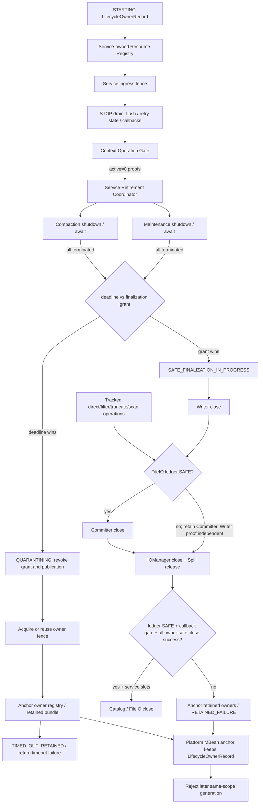
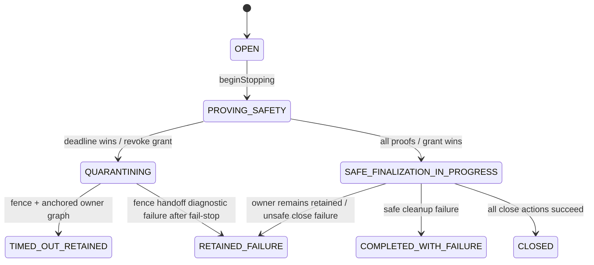

# Spec：Paimon Plus Spill 与资源生命周期安全修正

> **历史文档：停止与执行器生命周期现由[同步优雅停止主 Spec](/Users/SL/javaProject/tapdata-connectors/connectors/paimon-plus-connector/src/doc/specs/SPEC-paimon-spill-sync-graceful-stop.md)替代。** 下文的 deadline、retained/reaper、maintenance 捕获与阶段测试成绩仅供追溯，不作为新协议的实现或验收依据；目录保护、业务恢复与 FileIO 契约中未被替代的部分继续有效。

> Spec id：`paimon-spill-lifecycle-safety`
> 版本：V1.4（固定源码引用、入口矩阵与实施门禁订正版）
> 状态：**历史完整方案，2026-09-05 标记；并非当前实现或验收依据。** 下文 MBean anchor、跨 ClassLoader scope fence、FileIO ledger 等内容为当时的设计，不能据此宣称已实现。
> 当前有效契约与依赖升级门禁：[`SPEC-paimon-spill-lifecycle-current.md`](SPEC-paimon-spill-lifecycle-current.md)。本文仅保留历史分析与来源，不重新执行 T00→T32。
> 文档形式：单一总 Spec；内部能力不得拆成独立发布物
> Paimon 基线：`1.3.2@c05f7d1f1b1e5d37e64edab0f2978124d90b64f7`

## 1. Objective

把前台 operation、Compaction Executor、Commit maintenance Executor 与 Spill lease 组合成一个
端到端退役协议，覆盖 STOP、单表 DDL、Service 初始化失败、Context Factory 回滚、Dynamic
Bucket preflight，以及最外层 `PaimonConnector.onStart/onStop/connectionTest`。

故障证据、事故图片、故障架构图和复现路径统一保留在
[最终修复对比与生命周期总览](../reviews/SPILL-修复前后对比与生命周期总览.md)。

V1 有三条硬不变量：

> 已准入 write/prepare/commit/retry/compact 未归零时，不终止其依赖，也不关闭 Writer、Committer、
> IOManager、Catalog 或 FileIO。

> Compaction Executor 未取得 terminated 证明时，不关闭 Writer/IOManager、不删除 Spill；Commit
> maintenance Executor 未取得 terminated 证明时，不关闭 Committer/Catalog/FileIO。

> 安全证明超时后不再签发任何破坏性收尾许可；Service-owned owner registry 与
> Platform MBean anchor 必须完成强引用交接。Scope fence 可取得时才声明已阻止后续 generation；
> fence 失败时仍不 close，以 `scopeFenceAcquired=false` 返回 retained failure，不伪称跨代隔离已成立。

### 1.1 如何修正

修正不是“找不到 Spill 目录就重新创建”，而是纠正资源关闭顺序：

1. Connector 接管每个 Writer 的 Compaction Executor；关闭时先 fence 新写入，再等待已准入操作
   归零，然后 `shutdownNow()` Compaction 并取得 `isTerminated` 正向证明。
2. Connector 捕获每个 `TableCommitImpl` 的 maintenance Executor；使用非中断式 `shutdown()` 等待
   snapshot/tag/partition maintenance 完成，禁止用 `shutdownNow()` 打断 FileIO 删除的外层等待。
3. 两类 Executor 都已终止后才能签发 grant。Writer 成功 close 后先检查 FileIO ledger：
   ledger SAFE 才可继续 Committer；ledger UNCERTAIN 时保留 Committer/table/Catalog/FileIO，仅按独立
   Writer proof 处理 IOManager/Spill。
4. 30 秒只限制“取得安全证明”。超时后 attempt 先进入 `QUARANTINING`，永久关闭 grant；
   取得/reuse fence、将包含 typed pending handles 的 owner registry 发布到 anchor 后，才进入
   `TIMED_OUT_RETAINED` 并返回失败。旧 worker 后续只能向已注册 handle 发布对象，不能 close、删除
   或发布 Context。
5. 用 Spill lease 区分 active retain、安全但待下次清理、已完整删除三种结果；stale cleaner 只有
   在 marker、非 live、跨进程独占锁、grace 和 NOFOLLOW_LINKS 全部成立时才能清理。
6. Platform MBean anchor 从 STARTING 起强持有同一个 `LifecycleOwnerRecord`；该 record 始终强持有
   Service-owned `InFlightResourceRegistry`，因此 Factory/preflight/DDL 临时资源不依赖局部变量或
   已发布 Context 才可达。
7. Paimon 1.3.2 没有任意 callback/global child 的统一终止 API，因此 V1 在 Committer 创建前拒绝
   自定义 commit/tag callback 与 Iceberg metadata callback；direct commit、`filterAndCommit`、pending retry、
   Batch truncate，以及生产读入口的 `scan.plan()` 全部登记 FileIO ledger。
8. 现有反射关闭 `HadoopFileIO.fsMap` 不具备独占所有权证明，V1 删除该路径；只调用公开、
   owner-safe 的 Catalog/FileIO close，不关闭可能来自 Hadoop 全局 cache 的底层 FileSystem。

### 1.2 能否分步骤修复

可以按下面顺序逐步开发、逐步提交和逐步运行测试，但**不能把中间步骤单独发布到生产**。原因是
只修 Writer、不修 maintenance 或 Service timeout，仍可能从另一条路径提前关闭 IOManager/FileIO。

| 阶段 | 修正内容 | 阶段验收 | 可单独生产发布 |
|---|---|---|---|
| S1 | 建立 owner registry/identity、grant/slot、Spill lease 与真实子 JVM 锁测试 | 只验证能力契约，不接入旧 close | 否 |
| S2 | 注入外部 Compaction Executor，完成 shutdown/await/Writer proof | 所有 bucket/Spill 配置都在首次使用前注入；超时 Writer close=0 | 否 |
| S3 | 捕获 maintenance Executor，闭合 ThreadGroup/TCCL/全局池门禁 | SYNC/ASYNC 均 graceful await；`clearTable` 无旁路；坏池 fail closed | 否 |
| S4 | 接入生产入口矩阵、STOP drain、FileIO ledger 与 DDL/Factory/preflight 退役 | 不改 flush/retry/callback 语义；timeout 后破坏性动作=0 | 否 |
| S5 | 接入 MBean quarantine、scope fence 与 Connector lifecycle state | retained 跨 ClassLoader/同宿主机同 anchor 文件系统 JVM 阻断新 generation；正常 stop 可立即重启 | 否 |
| S6 | 真实 Paimon 1.3.2 集成回归与全模块验证 | 证明旧机制可产生 FNF、新机制超时保留、正常路径安全删除 | 是，且仅整体发布 |

每个小任务必须形成独立、可回滚且保留在当前实现分支上的提交；未经用户明确要求不得 squash。
前一任务完成 §1.4 全部门禁后才可进入下一任务，S6 未完成前不得形成发布包。

### 1.3 单一 Spec 内部能力边界

| 内部能力 | 职责 | 依赖顺序 |
|---|---|---|
| Lifecycle ownership | STARTING owner record、append-only resource registry、typed pending handle | 最先实现 |
| Finalization contract | resource owner identity、retirement grant 与 exactly-once resource slot | 依赖 ownership |
| Spill ownership | Spill lease、live registry、owner lock、marker、stale cleaner | 可与 contract 并行 |
| Compaction barrier | 外部 Executor 注入、shutdown/await、Writer termination proof | 依赖 contract |
| Commit maintenance barrier | Committer bootstrap、graceful shutdown/await、全局池/TCCL 门禁 | 依赖 contract |
| Service retirement | 生产入口矩阵、STOP drain、统一 deadline、DDL/rollback、Catalog/FileIO | 组合以上能力 |
| Connector isolation | MBean quarantine、scope fence、STARTING/STOPPING state | 最后接入 |

这些名称只用于本 Spec 内部任务分组，不再生成独立 Spec 文件。

### 1.4 每个实现任务的强制交付门禁

以下顺序是每个小任务进入下一任务前的强制前置条件，不是最终阶段才补做的汇总动作：

1. **任务前源码核对**：记录当前分支、parent commit、工作区基线和显式 pathspec；逐项核对本 Spec
   对应的 Connector 生产调用链，以及官方 Paimon
   `1.3.2@c05f7d1f1b1e5d37e64edab0f2978124d90b64f7` 源码。若事实与 Source Notes 不一致，停止实现并先
   修订 Spec/Plan；不得凭方法名、测试 mock 或其他 Paimon 版本推断。
   - Spec/Plan 中的每个 Paimon 内部行为必须引用固定 SHA 的 GitHub `blob` URL，并同时记录
     仓库相对路径、类/方法和行号范围；不得仅写 Source Note ID、本地 `/tmp` 路径或可漂移分支 URL。
   - 任何依赖 Paimon 内部类型、`@VisibleForTesting` 接缝、线程池、异常/中断或 close 顺序的生产代码，
     必须在接缝附近保留源码备注：`Paimon 1.3.2` + 完整 SHA + 上游路径 + 类/方法 +
     固定行号 + Source Note ID + 本地安全不变量。只写“参考 Paimon”不算通过。
2. **小步实现与验证**：一个任务只交付一个可独立验证的契约，原则上不超过 5 个文件；先建立能捕获
   回归的测试，再做最小生产改动。运行该任务的 focused tests、受影响既有测试、编译或静态检查；
   baseline failure、skipped/no-tests 和环境阻断必须分别记录，不能写成通过。
3. **提交前独立 Review**：由未承担该任务主要实现的 reviewer 审查最终 staged diff，至少覆盖正确性、
   并发/生命周期、数据安全、架构边界、测试有效性和性能；同时按固定 Paimon commit 回查每个接缝的
   真实类型、调用条件、异常/中断路径、线程池行为和 close 顺序。所有 Critical/Required finding 必须在
   本任务内修正并重新验证；只有 Optional/Nit 可以带明确理由保留。
4. **显式提交到当前分支**：只使用本任务 pathspec stage，执行 cached diff、whitespace、secret 与无关
   文件检查后，形成一个独立 commit；禁止 `git add -A`，禁止夹带用户已有修改。提交说明必须包含任务
   ID、行为变化、源码基线和验证结论。
5. **提交后门禁**：回读 commit tree/diff，确认它与通过 Review 的 staged diff 一致，并在本次任务交付
   记录中立即报告 commit hash、review verdict、源码锚点和实际测试命令/结果；下一 Checkpoint 的证据
   提交再把前一组任务的固定 hash 回填到任务清单；不存在下一 Checkpoint 的最终文档任务以最终交付
   记录和 `git log` 为证。禁止为了把提交自身的 hash 写进该提交而反复 amend，Git commit tree 与交付
   记录是 Checkpoint 回填前的事实来源。发现偏差时保持在当前任务内新增明确的修正提交；不得改写已
   交付历史，也不得在最终 verdict 为 PASS 前开始下一任务。

Checkpoint 只能增加阶段级回归，不能替代上述逐任务门禁。任何任务若无法在单一提交内保持编译和既有
契约可验证，必须先重新拆分任务，不得以“后续任务补齐”为由提交半成品生产行为。

分阶段实现还必须设置一个原子的生产启用边界：T30 之前新增的 owner-aware Service/Factory/Context、
retirement、scope/anchor 和 publisher 能力只能通过显式内部构造参数在测试中启用，现有
`PaimonConnector` 生产构造链保持旧入口；T30 在单一提交中把同一个 `LifecycleOwnerRecord`/registry
从 Connector 贯通到 Service、Factory 与 Context。禁止在 anchor/publisher 尚未可用时先把 retained
路径接入生产，也禁止通过外部配置形成新旧两套可选生命周期。

## 2. 已确认决策

1. 修改范围只限 `connectors/paimon-plus-connector`；Paimon 1.3.x 不修改、不 fork。
2. 第一版不新增 Connector 配置，不修改 table properties、写入、commit identifier、pending retry、
   offset callback、bucket 路由或 DDL 数据语义。
3. 现有 30 秒值改为**安全证明 deadline**：只约束 ingress/operation drain 与两类 Executor
   termination。若 deadline 先胜出，必须保留现场并返回失败。
4. `SafeFinalizationGrant` 一旦在 deadline 前签发，caller 不再按该 deadline 提前返回，而是等待
   已开始的 Writer/Committer/IO/Catalog close 得到真实结果。这样不会出现“caller 已宣告超时，
   后台稍后又删除 Spill”的状态。
5. V1 不实现进程内自动 reaper。Retained bundle 由 JDK Platform MBeanServer 强引用到 JVM
   退出；下一进程只在 owner lock 已
   可独占获取且 grace 已满足时清理 stale marker/Spill。
6. 多个正常任务可并发使用同一 destination；Service-local Writer/Committer/IOManager/Spill 互不共享，
   底层 Hadoop FileSystem 不由单个 Service 关闭。scope fence 只是保守的后续 generation 阻断，不是共享
   FileSystem 的所有权证明，不停止已经 ACTIVE 的其他 owner。
7. 进程强引用与 generation fence 分责：JDK Platform MBeanServer anchor 保持旧对象可达；跨
   ClassLoader 以及“同宿主机、同 `user.home` anchor 文件系统、FileLock 语义可靠”的 JVM 启动检测
   由持久 marker + `FileChannel/FileLock` 完成；不声称覆盖跨宿主机锁定。
8. 生产现场的“首个 Spill 目录删除者”尚未完成归因。Connector close、stale cleaner、
   tmpfiles/cron/人工删除和挂载替换均只是候选；在获得 auditd/journal/挂载与同机任务日志前，
   不得声称已证明外部删除，也不得仅凭“1 个任务扩散到 4 个”判定某一候选最可能。
   本 Spec 只对“Connector 不再制造 use-after-delete”负责；现场删除者补证是并行的运维门禁。
9. at-least-once 允许故障恢复时的重放产生重复，但不允许静默数据丢失、旧/新 generation 共用
   `(commitUser, commitIdentifier)` 却产生不同 CommitMessages，也不允许 retained 旧 Writer 与新 Writer
   并发运行。因此不得以 at-least-once 为由删除 FileIO ledger、弱化 callback/global-pool gate，
   或在资源图 retained 时立即启动新 generation（P-33、C-32）。

## 3. Tech Stack

| 项目 | 约束 |
|---|---|
| Context gate | Java 8 lock/condition；permit 计数和 fence 原子化 |
| FileIO proof | Service 级 sticky quiescence ledger；覆盖 commit/truncate/scan，不关闭 Paimon 全局线程池 |
| Service coordinator | 每 Service 一个 coordinator；每次 STOP/DDL/rollback 一个独立 attempt；锁不跨 await、table lock 或 close |
| Scope fence | Java 8 `FileChannel/FileLock` + marker；`control.lock` 永不删除，退役 owner/fence 文件在 control 锁下安全压缩 |
| Quarantine | JDK Platform MBeanServer anchor；正常关闭注销，retained 时保留到 JVM 退出 |
| 测试 | JUnit Jupiter、Mockito、真实 Paimon 1.3.2、真实线程/子 JVM/隔离 ClassLoader |
| 新依赖/配置 | 不允许 |

模块 POM 同时存在 Java 8 property 与 compiler source/target 11；新代码只使用 Java 8 API。当前
本机 TapData snapshot 依赖为 class file 61，因此本地测试用 JDK 17 启动，不改变运行契约。

## 4. Source Notes

| Source id | 源码 | 已确认事实 |
|---|---|---|
| P-01 | [StreamWriteBuilderImpl.newWrite 委托](https://github.com/apache/paimon/blob/c05f7d1f1b1e5d37e64edab0f2978124d90b64f7/paimon-core/src/main/java/org/apache/paimon/table/sink/StreamWriteBuilderImpl.java#L69-L72)、[FileStoreTable.newWrite 协变返回类型](https://github.com/apache/paimon/blob/c05f7d1f1b1e5d37e64edab0f2978124d90b64f7/paimon-core/src/main/java/org/apache/paimon/table/FileStoreTable.java#L116-L119)、[PrimaryKeyFileStoreTable 构造](https://github.com/apache/paimon/blob/c05f7d1f1b1e5d37e64edab0f2978124d90b64f7/paimon-core/src/main/java/org/apache/paimon/table/PrimaryKeyFileStoreTable.java#L155-L174)、[AppendOnlyFileStoreTable 构造](https://github.com/apache/paimon/blob/c05f7d1f1b1e5d37e64edab0f2978124d90b64f7/paimon-core/src/main/java/org/apache/paimon/table/AppendOnlyFileStoreTable.java#L123-L143) 与 [DelegatedFileStoreTable 透明委托](https://github.com/apache/paimon/blob/c05f7d1f1b1e5d37e64edab0f2978124d90b64f7/paimon-core/src/main/java/org/apache/paimon/table/DelegatedFileStoreTable.java#L303-L309) | Builder 只委托 `table.newWrite`；固定 1.3.2 的直接实现构造并返回 `TableWriteImpl<?>`，包装表可透明委托 |
| P-02 | [withCompactExecutor](https://github.com/apache/paimon/blob/c05f7d1f1b1e5d37e64edab0f2978124d90b64f7/paimon-core/src/main/java/org/apache/paimon/table/sink/TableWriteImpl.java#L128-L137) 与 [close ownership flag](https://github.com/apache/paimon/blob/c05f7d1f1b1e5d37e64edab0f2978124d90b64f7/paimon-core/src/main/java/org/apache/paimon/operation/AbstractFileStoreWrite.java#L146-L150) | 可在首次使用前注入 Connector Executor；注入后 `closeCompactExecutorWhenLeaving=false`，Writer close 不 shutdown 该 Executor；这是固定实现行为，不表述为 Paimon 公开所有权契约 |
| P-03 | [默认 Executor 与 close](https://github.com/apache/paimon/blob/c05f7d1f1b1e5d37e64edab0f2978124d90b64f7/paimon-core/src/main/java/org/apache/paimon/operation/AbstractFileStoreWrite.java#L303-L316) 与 [lazy executor](https://github.com/apache/paimon/blob/c05f7d1f1b1e5d37e64edab0f2978124d90b64f7/paimon-core/src/main/java/org/apache/paimon/operation/AbstractFileStoreWrite.java#L509-L516) | close 先关闭 bucket writers；仅当 lazy executor 存在且由 Paimon 持有关闭权时才 `shutdownNow()`，无 await termination |
| P-04 | [CompactFutureManager](https://github.com/apache/paimon/blob/c05f7d1f1b1e5d37e64edab0f2978124d90b64f7/paimon-core/src/main/java/org/apache/paimon/compact/CompactFutureManager.java#L33-L67) 与 [MergeTreeWriter.close](https://github.com/apache/paimon/blob/c05f7d1f1b1e5d37e64edab0f2978124d90b64f7/paimon-core/src/main/java/org/apache/paimon/mergetree/MergeTreeWriter.java#L342-L350) | Future cancel 是协作式；exceptional Future 可在 Writer close/sync 抛 `ExecutionException` |
| P-09 | [IOManagerImpl.close](https://github.com/apache/paimon/blob/c05f7d1f1b1e5d37e64edab0f2978124d90b64f7/paimon-core/src/main/java/org/apache/paimon/disk/IOManagerImpl.java#L60-L77) 与 [FileChannelManagerImpl.close](https://github.com/apache/paimon/blob/c05f7d1f1b1e5d37e64edab0f2978124d90b64f7/paimon-core/src/main/java/org/apache/paimon/disk/FileChannelManagerImpl.java#L123-L153) | 只有 `lazyChannelManager` 已初始化时 IOManager close 才进入目录删除；本 Connector 读取 Spill 目录会强制该初始化，因此事故路径的 close 会递归删除 `paimon-io-*` |
| P-10 | [IOManagerImpl.getSpillingDirectories](https://github.com/apache/paimon/blob/c05f7d1f1b1e5d37e64edab0f2978124d90b64f7/paimon-core/src/main/java/org/apache/paimon/disk/IOManagerImpl.java#L114-L121) 与 [FileChannelManagerImpl 创建目录](https://github.com/apache/paimon/blob/c05f7d1f1b1e5d37e64edab0f2978124d90b64f7/paimon-core/src/main/java/org/apache/paimon/disk/FileChannelManagerImpl.java#L56-L98) | `getSpillingDirectories()` 不是纯 getter；它会懒初始化 channel manager 并创建 `paimon-io-<UUID>`，然后才能建立 Connector lease |
| C-12 | [PaimonConnector.onStart/onStop](../../main/java/io/tapdata/connector/paimon/PaimonConnector.java#L59-L99) | 当前 init 前发布 Service；close 抛错后 finally 仍置空字段 |
| C-13 | [Context write/close](../../main/java/io/tapdata/connector/paimon/write/PaimonTableWriteContext.java#L301-L333) | write 只做一次状态检查，可与 close 竞态 |
| C-14 | [Service DML per-table lock](../../main/java/io/tapdata/connector/paimon/service/PaimonService.java#L1136-L1215) | Service lock 不等于 Context 自有 operation lease |
| C-15 | [Service DDL](../../main/java/io/tapdata/connector/paimon/service/PaimonService.java#L931-L971) | 当前先 remove Context，失败 finally 仍释放 owner/draining |
| C-16 | [cleanupAllResources](../../main/java/io/tapdata/connector/paimon/service/PaimonService.java#L1588-L1668) | 当前 clear Context/locks 后继续关闭共享 Catalog/FileIO |
| C-17 | [Service close worker](../../main/java/io/tapdata/connector/paimon/service/PaimonService.java#L3376-L3474) | 当前 caller deadline 后 worker 可继续 cleanup 并 publishClosed |
| C-18 | [close timeout](../../main/java/io/tapdata/connector/paimon/service/PaimonService.java#L3510-L3525) | 当前 timeout 只记 sticky failure，没有撤销后台破坏性权限 |
| C-19 | [Factory rollback](../../main/java/io/tapdata/connector/paimon/write/PaimonTableWriteContextFactory.java#L150-L210) | 未发布资源异常后没有 Service 级 retained ownership |
| C-20 | [Dynamic Bucket preflight](../../main/java/io/tapdata/connector/paimon/service/PaimonDynamicBucketPreflight.java#L68-L113) | checker/IO 是局部变量，finally 后可丢引用 |
| C-21 | [初始化失败 cleanup](../../main/java/io/tapdata/connector/paimon/service/PaimonService.java#L1535-L1543) | cleanup 失败仍 publishClosed，没有 retained 状态 |
| C-24 | [Context 创建调用链](../../main/java/io/tapdata/connector/paimon/service/PaimonService.java#L1738-L1821) | Factory/preflight 前注册 physical owner，异常路径当前无条件注销；未发布 Context 不在 map 中 |
| C-25 | [既有 identity 规范化](../../main/java/io/tapdata/connector/paimon/commit/PaimonCommitStateStore.java#L131-L188) | 已有实现会 URI normalize、移除 userinfo/query/fragment、规范 scheme/authority case 与尾斜杠；scope identity 在此基础上增加本地 canonical path、S3 scheme family 和无歧义字段编码 |
| C-26 | [clearTable 临时 Batch Committer](../../main/java/io/tapdata/connector/paimon/service/PaimonService.java#L912-L925) | 当前在普通 DDL 线程构造并用 raw try-with close，未 capture maintenance Executor |
| C-27 | [STOP drain](../../main/java/io/tapdata/connector/paimon/service/PaimonService.java#L3429-L3453) | 当前 stop 会逐表 `flushTableInternal(...,"stop",true)`，汇总 pending retry interruption，且仅在无失败时执行 reserved/ready offset callbacks；修复不得丢失该语义 |
| C-28 | [Hadoop FileSystem 反射关闭](../../main/java/io/tapdata/connector/paimon/service/PaimonService.java#L1651-L1727) | 当前反射关闭 `HadoopFileIO.fsMap` 中可能共享的 FileSystem，与多 ACTIVE owner 安全冲突 |
| C-29 | [Stream scan](../../main/java/io/tapdata/connector/paimon/service/PaimonService.java#L2745-L2760)、[Batch scan](../../main/java/io/tapdata/connector/paimon/service/PaimonService.java#L2925-L2938)、[Count scan](../../main/java/io/tapdata/connector/paimon/service/PaimonService.java#L3137-L3150) 与 [Filter scan](../../main/java/io/tapdata/connector/paimon/service/PaimonService.java#L3223-L3236) | 四个生产读入口直接调用 `scan.plan()`；异常/中断边界当前没有 FileIO ledger 与稳定 TCCL guard |
| C-30 | [POM 排除上游 ThreadUtils](../../../pom.xml#L220-L235) 与 [Connector overwrite ThreadUtils](../../main/overwrite/org/apache/paimon/utils/ThreadUtils.java#L43-L72) | 最终包使用 Connector 自带 `ThreadUtils`；当前 `new Thread(null,...)` 在每次创建 worker 时由 SecurityManager（若存在）或调用线程决定 ThreadGroup，而不是在线程工厂构造时固定 group |
| C-31 | [PaimonConnector.connectionTest](../../main/java/io/tapdata/connector/paimon/PaimonConnector.java#L111-L146) | 复合入口依次调用 `onStart -> testWarehouseAccess -> testWritePermission`，并在 `finally` 无条件调用 `onStop`；现有结构存在 stop 异常覆盖原始 start/test 异常的风险 |
| C-32 | [PaimonCommitStateStore.bind](../../main/java/io/tapdata/connector/paimon/commit/PaimonCommitStateStore.java#L58-L98) | 同一 task state 会复用稳定 `commitUser` 并根据已见 snapshot 调和 next identifier；不能假定 retained 旧 Writer 与新 Writer 可以安全共用相同 commit identity |
| P-12 | [StreamTableWrite.prepareCommit](https://github.com/apache/paimon/blob/c05f7d1f1b1e5d37e64edab0f2978124d90b64f7/paimon-core/src/main/java/org/apache/paimon/table/sink/StreamTableWrite.java#L29-L43) 与 [MergeTreeWriter.prepareCommit](https://github.com/apache/paimon/blob/c05f7d1f1b1e5d37e64edab0f2978124d90b64f7/paimon-core/src/main/java/org/apache/paimon/mergetree/MergeTreeWriter.java#L252-L265) | `prepareCommit(false,id)` 只是请求非等待；`commit.force-compact=true` 或 `shouldWaitForPreparingCheckpoint()` 成立时 Paimon 仍会强制等待 Compaction |
| P-13 | [`IntervalPartition.partition` section 分组](https://github.com/apache/paimon/blob/c05f7d1f1b1e5d37e64edab0f2978124d90b64f7/paimon-core/src/main/java/org/apache/paimon/mergetree/compact/IntervalPartition.java#L50-L90)、[`MergeTreeReaders.readerForSection` 转换/调用](https://github.com/apache/paimon/blob/c05f7d1f1b1e5d37e64edab0f2978124d90b64f7/paimon-core/src/main/java/org/apache/paimon/mergetree/MergeTreeReaders.java#L67-L91) 与 [`MergeSorter` Spill 判断](https://github.com/apache/paimon/blob/c05f7d1f1b1e5d37e64edab0f2978124d90b64f7/paimon-core/src/main/java/org/apache/paimon/mergetree/MergeSorter.java#L104-L113) | partition 先按不重叠 key-range 形成 section，`readerForSection` 再把该 section 的 runs 转为 readers；只有 IOManager 非空且该 section 的 `lazyReaders.size()` 严格大于 threshold 才 Spill |
| P-14 | [Spill options](https://github.com/apache/paimon/blob/c05f7d1f1b1e5d37e64edab0f2978124d90b64f7/paimon-api/src/main/java/org/apache/paimon/CoreOptions.java#L507-L526) | 默认 Spill compression 为 zstd |
| P-17 | [CoreOptions.SNAPSHOT_EXPIRE_EXECUTION_MODE](https://github.com/apache/paimon/blob/c05f7d1f1b1e5d37e64edab0f2978124d90b64f7/paimon-api/src/main/java/org/apache/paimon/CoreOptions.java#L435-L439) 与 [TableCommitImpl maintenance executor 构造](https://github.com/apache/paimon/blob/c05f7d1f1b1e5d37e64edab0f2978124d90b64f7/paimon-core/src/main/java/org/apache/paimon/table/sink/TableCommitImpl.java#L108-L128) | 真实 option key 是 `snapshot.expire.execution-mode`，默认 `SYNC`；`ASYNC` 每个 Committer 创建独立 single-thread `ExecutorService`，worker 在首次 execute 时懒创建；`SYNC` 使用 direct executor |
| P-18 | [异步 maintain](https://github.com/apache/paimon/blob/c05f7d1f1b1e5d37e64edab0f2978124d90b64f7/paimon-core/src/main/java/org/apache/paimon/table/sink/TableCommitImpl.java#L348-L389) | commit 返回后 maintenance 可继续访问 FileIO |
| P-19 | [Committer close/getter](https://github.com/apache/paimon/blob/c05f7d1f1b1e5d37e64edab0f2978124d90b64f7/paimon-core/src/main/java/org/apache/paimon/table/sink/TableCommitImpl.java#L397-L410) | close 顺序是 `commit.close()` 后 `shutdownNow()`，无 await；getter public 但仅标注 testing |
| P-20 | [direct commit merge](https://github.com/apache/paimon/blob/c05f7d1f1b1e5d37e64edab0f2978124d90b64f7/paimon-core/src/main/java/org/apache/paimon/operation/FileStoreCommitImpl.java#L1078-L1087)、[ManifestFileMerger](https://github.com/apache/paimon/blob/c05f7d1f1b1e5d37e64edab0f2978124d90b64f7/paimon-core/src/main/java/org/apache/paimon/operation/ManifestFileMerger.java#L99-L149) 与 [FileEntry](https://github.com/apache/paimon/blob/c05f7d1f1b1e5d37e64edab0f2978124d90b64f7/paimon-core/src/main/java/org/apache/paimon/manifest/FileEntry.java#L179-L225) | direct commit 可进入全局 `ManifestReadThreadPool`，并非只有 `filterAndCommit` 会投递 FileIO child |
| P-21 | [TableCommitImpl.truncateTable](https://github.com/apache/paimon/blob/c05f7d1f1b1e5d37e64edab0f2978124d90b64f7/paimon-core/src/main/java/org/apache/paimon/table/sink/TableCommitImpl.java#L173-L176)、[FileStoreCommitImpl.truncateTable](https://github.com/apache/paimon/blob/c05f7d1f1b1e5d37e64edab0f2978124d90b64f7/paimon-core/src/main/java/org/apache/paimon/operation/FileStoreCommitImpl.java#L642-L650) 与 [latestSnapshot 条件下的 scan.plan](https://github.com/apache/paimon/blob/c05f7d1f1b1e5d37e64edab0f2978124d90b64f7/paimon-core/src/main/java/org/apache/paimon/operation/FileStoreCommitImpl.java#L889-L901) | Batch truncate 进入 overwrite 路径；仅当 `latestSnapshot != null` 时执行 `scan.plan()` 读 manifest。该条件路径同样必须纳入 FileIO ledger |
| P-22 | [ExecutorThreadFactory](https://github.com/apache/paimon/blob/c05f7d1f1b1e5d37e64edab0f2978124d90b64f7/paimon-common/src/main/java/org/apache/paimon/utils/ExecutorThreadFactory.java#L85-L106) | ThreadGroup 来自 SecurityManager group（存在时）或构造 ThreadFactory 的当前 group；仅在 root helper 中构造 Committer 不能代替实际 worker probe |
| P-23 | [FileDeletionBase pool](https://github.com/apache/paimon/blob/c05f7d1f1b1e5d37e64edab0f2978124d90b64f7/paimon-core/src/main/java/org/apache/paimon/operation/FileDeletionBase.java#L96-L106) 与 [deleteFiles](https://github.com/apache/paimon/blob/c05f7d1f1b1e5d37e64edab0f2978124d90b64f7/paimon-core/src/main/java/org/apache/paimon/operation/FileDeletionBase.java#L456-L470) | deletion child 投递到全局池，outer `allOf(...).get()` 中断/异常不会取消已投递 child |
| P-24 | [FileOperationThreadPool.getExecutorService](https://github.com/apache/paimon/blob/c05f7d1f1b1e5d37e64edab0f2978124d90b64f7/paimon-common/src/main/java/org/apache/paimon/utils/FileOperationThreadPool.java#L32-L43) 与 [ManifestReadThreadPool.getExecutorService](https://github.com/apache/paimon/blob/c05f7d1f1b1e5d37e64edab0f2978124d90b64f7/paimon-core/src/main/java/org/apache/paimon/utils/ManifestReadThreadPool.java#L36-L52) | 两者都持有 Paimon ClassLoader 级静态 executor：请求并行度相等/更小时复用已有池，不会修正原 ThreadFactory；请求值更大时会替换静态 executor，但上游明确不关闭旧池，因此新池可重建不等于旧 worker 已终止 |
| P-25 | [`filterAndCommitMultiple/checkFilesExistence` 文件检查](https://github.com/apache/paimon/blob/c05f7d1f1b1e5d37e64edab0f2978124d90b64f7/paimon-core/src/main/java/org/apache/paimon/table/sink/TableCommitImpl.java#L261-L346)、[FileOperationThreadPool](https://github.com/apache/paimon/blob/c05f7d1f1b1e5d37e64edab0f2978124d90b64f7/paimon-common/src/main/java/org/apache/paimon/utils/FileOperationThreadPool.java#L32-L43) 与 [Future 顺序读取](https://github.com/apache/paimon/blob/c05f7d1f1b1e5d37e64edab0f2978124d90b64f7/paimon-api/src/main/java/org/apache/paimon/utils/ThreadPoolUtils.java#L132-L168) | retry committables 非空时进入文件检查并一次提交多个全局 FileIO Future；某 Future 异常或等待线程中断会提前抛出，其余 Future 不 cancel/join |
| P-26 | [callback option 定义](https://github.com/apache/paimon/blob/c05f7d1f1b1e5d37e64edab0f2978124d90b64f7/paimon-api/src/main/java/org/apache/paimon/CoreOptions.java#L1391-L1415)、[`commitCallbacks/tagCallbacks/callbacks` 解析](https://github.com/apache/paimon/blob/c05f7d1f1b1e5d37e64edab0f2978124d90b64f7/paimon-api/src/main/java/org/apache/paimon/CoreOptions.java#L2872-L2897)、[`METADATA_ICEBERG_STORAGE` key/enum/default](https://github.com/apache/paimon/blob/c05f7d1f1b1e5d37e64edab0f2978124d90b64f7/paimon-core/src/main/java/org/apache/paimon/iceberg/IcebergOptions.java#L39-L45)、[callback 装载](https://github.com/apache/paimon/blob/c05f7d1f1b1e5d37e64edab0f2978124d90b64f7/paimon-core/src/main/java/org/apache/paimon/table/sink/CallbackUtils.java#L36-L69) 与 [setTable](https://github.com/apache/paimon/blob/c05f7d1f1b1e5d37e64edab0f2978124d90b64f7/paimon-core/src/main/java/org/apache/paimon/table/sink/CommitCallback.java#L41-L51) | callback parser 会 trim/忽略空 class name 并返回实际 callback map；Iceberg storage 是 enum 且默认 `DISABLED`。非空自定义 callback 可持有 FileStoreTable，Paimon 没有约束其派生线程或提供终止证明；option gate 必须按这两个真实解析结果判断，而不是按原始字符串猜测 |
| P-27 | [内置 callback 组装](https://github.com/apache/paimon/blob/c05f7d1f1b1e5d37e64edab0f2978124d90b64f7/paimon-core/src/main/java/org/apache/paimon/AbstractFileStore.java#L354-L391)、[commit 同步回调](https://github.com/apache/paimon/blob/c05f7d1f1b1e5d37e64edab0f2978124d90b64f7/paimon-core/src/main/java/org/apache/paimon/operation/FileStoreCommitImpl.java#L1211-L1216) 与 [并行 manifest 读取](https://github.com/apache/paimon/blob/c05f7d1f1b1e5d37e64edab0f2978124d90b64f7/paimon-core/src/main/java/org/apache/paimon/iceberg/IcebergCommitCallback.java#L894-L933) | Iceberg metadata callback 由前台 commit 同步调用，但内部使用全局 manifest pool，异常可留下未 join Future |
| P-28 | [FileStoreCommitImpl.close](https://github.com/apache/paimon/blob/c05f7d1f1b1e5d37e64edab0f2978124d90b64f7/paimon-core/src/main/java/org/apache/paimon/operation/FileStoreCommitImpl.java#L1744-L1750) 与 [IOUtils.closeQuietly](https://github.com/apache/paimon/blob/c05f7d1f1b1e5d37e64edab0f2978124d90b64f7/paimon-common/src/main/java/org/apache/paimon/utils/IOUtils.java#L220-L227) | callback/snapshotCommit close 异常被吞，Committer close 返回不能证明任意 callback worker 已结束 |
| P-29 | [ThreadPoolUtils TCCL](https://github.com/apache/paimon/blob/c05f7d1f1b1e5d37e64edab0f2978124d90b64f7/paimon-api/src/main/java/org/apache/paimon/utils/ThreadPoolUtils.java#L132-L180) | Paimon 把 caller TCCL 设到全局 worker 且不恢复；Connector 必须在进入这些路径前临时使用稳定 TCCL，并在 caller finally 恢复原值 |
| P-30 | [HadoopFileIO cache](https://github.com/apache/paimon/blob/c05f7d1f1b1e5d37e64edab0f2978124d90b64f7/paimon-common/src/main/java/org/apache/paimon/fs/hadoop/HadoopFileIO.java#L173-L208) 与 [FileIO.close](https://github.com/apache/paimon/blob/c05f7d1f1b1e5d37e64edab0f2978124d90b64f7/paimon-common/src/main/java/org/apache/paimon/fs/FileIO.java#L229-L234) | HadoopFileIO 按 scheme/authority 缓存 `path.getFileSystem(conf)` 结果，不 override FileIO 的默认 no-op close；反射关闭底层 FS 没有独占 owner proof |
| P-31 | [AbstractFileStoreScan.plan](https://github.com/apache/paimon/blob/c05f7d1f1b1e5d37e64edab0f2978124d90b64f7/paimon-core/src/main/java/org/apache/paimon/operation/AbstractFileStoreScan.java#L252-L262) 与 [parallel manifest iterator 完整分支](https://github.com/apache/paimon/blob/c05f7d1f1b1e5d37e64edab0f2978124d90b64f7/paimon-core/src/main/java/org/apache/paimon/operation/AbstractFileStoreScan.java#L364-L411) | `scan.plan()` 会通过全局 ManifestReadThreadPool 顺序消费一批 Future；与 commit 路径相同，某个 Future 异常或 caller 中断时，后续 Future 不会自动 cancel/join |
| P-32 | [CoreOptions thread counts](https://github.com/apache/paimon/blob/c05f7d1f1b1e5d37e64edab0f2978124d90b64f7/paimon-api/src/main/java/org/apache/paimon/CoreOptions.java#L2288-L2295)、[scan manifest parallelism](https://github.com/apache/paimon/blob/c05f7d1f1b1e5d37e64edab0f2978124d90b64f7/paimon-api/src/main/java/org/apache/paimon/CoreOptions.java#L2663-L2669)、[ManifestReadThreadPool expansion](https://github.com/apache/paimon/blob/c05f7d1f1b1e5d37e64edab0f2978124d90b64f7/paimon-core/src/main/java/org/apache/paimon/utils/ManifestReadThreadPool.java#L36-L52) | pool 会在 class initialization 创建，并可因更大的 table parallelism 被替换；故必须在 stable helper 内按该表实际值预创建/扩容，不能只在启动时做一次固定大小 probe |
| P-33 | [StreamWriteBuilder commit identity 契约](https://github.com/apache/paimon/blob/c05f7d1f1b1e5d37e64edab0f2978124d90b64f7/paimon-core/src/main/java/org/apache/paimon/table/sink/StreamWriteBuilder.java#L27-L37) 与 [FileStoreCommitImpl.tryCommitOnce 幂等命中](https://github.com/apache/paimon/blob/c05f7d1f1b1e5d37e64edab0f2978124d90b64f7/paimon-core/src/main/java/org/apache/paimon/operation/FileStoreCommitImpl.java#L955-L970) | Paimon 要求 Writer/Committer 的 `commitIdentifier` 一致并递增，失败时应使用未提交的原 CommitMessages 重试；幂等命中只比较 `commitUser + identifier + kind`，不比较新旧 CommitMessages，因此旧/新 generation 不得以相同 commit identity 并发产生不同提交内容 |
| F-01 | [Flink `AppendCompactWorkerOperator.close`](https://github.com/apache/paimon/blob/c05f7d1f1b1e5d37e64edab0f2978124d90b64f7/paimon-flink/paimon-flink-common/src/main/java/org/apache/paimon/flink/sink/AppendCompactWorkerOperator.java#L104-L114) | Flink 侧也采用“停止 Compaction Executor、等待结束、再关闭 Compactor”的顺序；本 Spec 只借鉴顺序，不照搬其 await 超时后仍继续 close 的语义 |
| F-02 | [Flink `StoreCommitter.close`](https://github.com/apache/paimon/blob/c05f7d1f1b1e5d37e64edab0f2978124d90b64f7/paimon-flink/paimon-flink-common/src/main/java/org/apache/paimon/flink/sink/StoreCommitter.java#L144-L148) | Flink wrapper 仅委托 `commit.close()` 和 listener close，没有额外 maintenance termination proof，且 `commit.close()` 抛错时 listener close 不会执行；不能作为 Catalog/FileIO 安全关闭证明 |
| J-03 | [Java 8 Platform MBeanServer](https://docs.oracle.com/javase/8/docs/api/java/lang/management/ManagementFactory.html#getPlatformMBeanServer--) 与 [registerMBean](https://docs.oracle.com/javase/8/docs/api/javax/management/MBeanServer.html#registerMBean-java.lang.Object-javax.management.ObjectName-) | Platform server 是 JVM 内共享注册中心；注册以 ObjectName 原子拒绝重复并持有 MBean 对象 |
| J-04 | [MBeanRegistration.preDeregister](https://docs.oracle.com/javase/8/docs/api/javax/management/MBeanRegistration.html#preDeregister--) | MBean 可在 deregistration 前检查并抛出异常阻止注销；用于拒绝非 RELEASED 状态的外部 unregister |
| J-05 | [Java 8 FileLock](https://docs.oracle.com/javase/8/docs/api/java/nio/channels/FileLock.html) | File lock 是整个 JVM 级、在 release/channel close/JVM termination 时释放，对某些文件系统的可见性/锁语义有平台限制；因此 scope fence 只声明同宿主机、同 anchor 文件系统的已验证边界 |

P-17/P-18/P-19 的具体处置由 §6.3 定义；Service 编排只消费其显式 proof/result，不能重复 cast
或直接访问 Executor。

## 5. Architecture



## 6. 功能需求

| Requirement id | 要求 | 来源 |
|---|---|---|
| SCR-001 | Context 所有触达 Writer/Committer 的生产入口必须取得 operation permit，并在 finally 释放 | C-13、C-14 |
| SCR-002 | `beginRetirement` 原子 fence 新 permit；只有 active=0 才产生不可公开构造的 quiescence proof | close-vs-operation 安全 |
| SCR-003 | public commit 内部 retry 使用私有 within-operation 方法，禁止重复取得不可重入 permit | 当前调用结构 |
| SCR-004 | operation drain 早于两类 Executor shutdown；active 未归零时不得调用任何资源 close | Paimon 对象非并发 close 契约 |
| SCR-005 | STOP 必须保留当前 `flushTableInternal(...,"stop",true)`、pending retry interruption 汇总与“无失败才执行”的 offset callback 语义；完成 drain 后才开始 Context retirement | C-27 |
| SCR-006 | Service 从 STARTING 起持有 append-only `InFlightResourceRegistry`；Factory/preflight/DDL/bootstrap 在任何第三方资源构造前注册 typed handle，取得资源后原子填充 | 未发布资源强可达 |
| SCR-007 | Service 持有唯一 retirement coordinator，每次 STOP/DDL/rollback 创建独立 attempt；caller、worker、Context 只通过当前 attempt 竞争 deadline 和 grant | C-18、重复 DDL |
| SCR-008 | deadline 先赢只原子进入 `QUARANTINING`：永久关闭 grant 与 Context 发布，转移唯一 finishing ownership；只有 fence 取得/reuse 且 registry/bundle 已发布到 anchor 才进入 `TIMED_OUT_RETAINED` 并返回 | timeout 线性化 |
| SCR-009 | grant 绑定 retirementId 与不可变 `RetirementCoverage`：STOP 使用冻结后的 Service registry epoch/handle 集合；DDL/Factory/preflight 使用 owner generation/handle 集合，不受无关表 registry 变化影响；identity 显式覆盖 Context、Factory attempt、preflight、DDL Batch 与 Service | 未发布资源授权 |
| SCR-010 | grant 只为 Writer、Committer、IOManager、Spill lease、Catalog、FileIO 提供 typed exactly-once slot；scope owner/fence 与 MBean anchor 由 Connector lifecycle CAS 管理，不得混用两套授权 | 单一能力模型 |
| SCR-011 | Writer close 失败时不得关闭该 owner 的 IOManager/释放 active Spill owner；Service/Catalog/FileIO 进入 quarantine | §6.2 |
| SCR-012 | maintenance termination pending 时不得关闭 Committer/Catalog/FileIO，也不签发 grant | §6.3 |
| SCR-013 | 任一 commit/truncate/scan 的 FileIO ledger UNCERTAIN 时不 claim COMMITTER/Catalog/FileIO slot；Writer 和 IOManager/Spill 仅按独立 Compaction/Writer proof 处理 | P-20、P-21、P-23、P-25、P-31 |
| SCR-014 | maintenance 已 terminated 且 ledger SAFE 后，Committer close 失败可继续处理由 Writer 独立证明安全的 IOManager/Spill，但 Committer/Catalog/FileIO 必须保留 | P-19、P-28 |
| SCR-015 | IO close 失败或目录残留使用 `RELEASE_FOR_STALE_CLEANUP`；不得标记 active owner，关闭结果仍失败 | §6.4 |
| SCR-016 | DDL 仅在目标 Context 无失败 CLOSED 后 CAS remove 并执行 action；任一 retained/failure 不执行 action且保留 owner/draining/cache fence | C-15 |
| SCR-017 | Factory/preflight retained 时不得注销 physical owner；typed handle 已在 Service registry，线程只交付 identity/failure，不用局部 bundle 传递所有权 | C-19、C-20、C-24 |
| SCR-018 | `START_INIT_ROLLBACK` 走同一退役协议；安全则释放，unsafe 则通过 `QUARANTINING` 完成 fence + anchor owner record 交接后才抛原始 init error | C-21 |
| SCR-019 | `onStop` retained 或 fence acquisition failure 时不清空 Service/scope/registry；任何 lifecycle 失败返回前 anchor 必须已持有当前 owner record | C-12 |
| SCR-020 | scope fence 使用 control lock 线性化 owner/fence lock；保证范围仅为跨 ClassLoader 及同宿主机/同 anchor 文件系统的 JVM；marker 不作为授权 | J-05、可验证的 FileLock 边界 |
| SCR-021 | MBean anchor 在 Paimon 资源前注册，从 STARTING 起持有同一个 `LifecycleOwnerRecord` 与 registry；`preDeregister` 仅在 owner 已 RELEASED 且受 MBean-monitor+control 保护的 `DeregistrationPermit` 窗口允许注销，其余外部注销全部拒绝 | J-03、J-04、强可达 |
| SCR-022 | `control.lock` 永不删除；owner/fence 文件仅能在 control 独占区、MBean live-owner 已安全注销且两锁已验证可独占后压缩：先写 `RELEASED_TOMBSTONE`，仍持 control 时释放两锁，再按 owner→fence→state 顺序删除；partial pair 只有有效 tombstone 才可续做 | 有界 inode/启动成本与 inode 换锁安全 |
| SCR-023 | 所有失败保留第一异常、后续 suppressed；状态、retirementId、owner identity、scope fingerprint 和资源动作可诊断 | 故障定位 |
| SCR-024 | 同一 Service 的成功 DDL attempt 结束后可创建下一次 DDL；STOP fence 后不得再创建 DDL/Factory attempt，已准入 DDL 自然结束后 STOP 才取得稳定 snapshot | 重复 DDL 与 DDL-vs-STOP |
| SCR-025 | Connector lifecycle 先在 lock 内执行 `IDLE -> STARTING(ownerId,registry)`，再在锁外解析到局部 config candidate；不得在 IDLE 状态下解析/修改配置后继续发布 Service | C-12、并发 start/stop |
| SCR-026 | V1 在创建任何 Stream/Batch Committer 前拒绝非空 `commit.callbacks`、非空 `tag.callbacks` 和非 `disabled` 的 `metadata.iceberg.storage`；这是显式兼容性限制，不改写属性 | P-26、P-27 |
| SCR-027 | direct commit、`filterAndCommit`（含 pending retry）、Batch truncate 与四个生产读入口的 `scan.plan()` 均在 Paimon 调用前登记 ledger；仅正常返回且进入/退出 interrupt 均为 false 才安全，任意 Throwable/中断/未知完成 sticky UNCERTAIN，但不改现有业务 retry 语义 | C-29、P-20、P-21、P-23、P-25、P-31 |
| SCR-028 | 关闭 Catalog/FileIO 必须同时满足：无 active operation、两类 Executor terminated、所有 Writer/Committer 成功关闭、ledger SAFE、callback gate 通过；任一缺失即 quarantine | P-18、P-20 至 P-28 |
| SCR-029 | Connector overwrite `ThreadUtils` 的 ThreadFactory 必须在构造时按 P-22 语义捕获已验证 stable group；每张表在任何 commit/truncate/scan 前先由 stable helper 按实际线程数创建/扩容并验证全局池，所有 Stream/Batch Committer 也由 helper 构造；ASYNC maintenance、ThreadFactory 双调用方与实际/重建 worker probe 必须通过。所有受管调用使用 stable TCCL guard 并在 caller finally 恢复 | C-30、P-17、P-22、P-24、P-29、P-31、P-32 |
| SCR-030 | 删除 Connector 反射关闭 `HadoopFileIO.fsMap` 的路径；V1 不关闭底层 Hadoop FileSystem，只调用公开 owner-safe Catalog/FileIO close | C-28、P-30 |
| SCR-031 | Spec 必须维护真实生产入口矩阵：每个入口明确 Service permit、table lock、Context permit、可投递的后台工作和 retirement drain；新入口不得旁路 | 可审计性 |

### 6.1 Owner Registry、Identity 与 Finalization Grant 契约

- Connector 一旦进入 STARTING，即创建 `LifecycleOwnerRecord` 和 Service-owned
  `InFlightResourceRegistry`。Anchor 注册后持有同一 record，record 对象与 owner identity 不替换、
  registry 所有权只允许追加或转为 RETAINED/RELEASED；lifecycle state 严格按 §12.4 转换，仅在未开始任何
  shutdown/close 时允许 STOPPING 回退 STARTED。
- 任何 Factory、preflight、DDL Batch 或 bootstrap 在构造第三方对象前，必须先为每个第三方资源向
  registry 注册独立 typed handle。Handle 状态固定为：
  `REGISTERED_PENDING -> PUBLISHED_ACQUIRED | RETAINED_PENDING | RELEASED_EMPTY`；
  `RETAINED_PENDING -> RETAINED_ACQUIRED | RETAINED_FAILED`；
  `PUBLISHED_ACQUIRED -> RETAINED_ACQUIRED | RELEASED`。每次转换用单一 CAS 同时写入状态与
  resource/Throwable/FutureTask 强引用。deadline 与正常发布只竞争第一次 CAS；deadline 胜出后，
  completion 只能填入 RETAINED_ACQUIRED/RETAINED_FAILED，不能发布 Context、close 或丢弃失败引用。
  `RELEASED_EMPTY` 仅表示构造在取得资源前失败；`RELEASED` 仅能由匹配 grant 产生，不得用于未知状态。
  V1 中所有 RETAINED 状态都是进程内终态；只有 RELEASED/RELEASED_EMPTY 条目可从 active index
  压缩，压缩前保留不含对象引用的审计摘要。
- `ResourceOwnerIdentity` 固定包含 `ownerType`（CONTEXT/FACTORY/PREFLIGHT/DDL_BATCH/SERVICE）、
  ownerId、generation 与 tableKey（可选）。未发布 Context 不伪造 contextId；`clearTable` 临时
  Committer 使用 DDL_BATCH identity。
- STOP 在 Service ingress 已 fence 且已准入 operation 归零后调用 `freezeForRetirement()`，得到
  Service registry epoch 与稳定 identity/handle set；此后不得注册新 handle。若 deadline 早于
  operation 归零，`QUARANTINING` 直接关闭新注册，但已注册 pending handle 仍允许 eventual object
  单向填入 retained 状态。
- DDL/Factory/preflight 不冻结 Service-wide registry；它们先 fence 自身 owner generation 的新 handle，
  再形成只含该 owner identity/handle ids 的 immutable coverage。其他表同时注册/释放 handle 不使本
  attempt 失效，也不得进入其 grant。实现不得用“当前全局 registry epoch 相等”校验局部 attempt。
- Executor termination proof 只证明一个后台生命周期已结束，不等于允许关闭资源。
- `SafeFinalizationGrant` 只能由当前 attempt 在全部必要 proof 成立且 deadline 尚未胜出时创建，绑定
  retirementId 与 `RetirementCoverage`。STOP coverage 是 frozen service epoch + immutable handle set；
  局部 coverage 是 owner generation + immutable handle set。
- grant 只为 Writer、Committer、IOManager、Spill lease、Catalog 和 FileIO 提供 exactly-once
  typed slot。slot 校验 retirement/owner identity/resource kind；缺失、错配或重复消费时动作次数为 0。
  scope owner/fence 和 MBean anchor 的发布/释放只由 Connector lifecycle CAS 授权。
- Writer/Committer finalizer 必须同时收到各自 termination proof 与匹配 slot。close 抛错后 slot
  仍保持 consumed，禁止重试第二次 close。
- deadline 先胜出时不创建 grant；已注册 helper 后来构造出的对象只能发布到对应
  RETAINED handle，不得 close、发布 Context 或注销 owner。grant 先胜出后 caller 等待已开始的
  安全收尾，不再返回 timeout。

### 6.2 Compaction 生命周期屏障

1. 每个 Context 创建独立单线程 daemon Executor，不与其他表共享。
2. Factory 验证 raw Writer 是固定 1.3.2 的 `TableWriteImpl<?>`，并在 write、bucket write、compact、
   notify、restore 和 Strategy 构造前调用 `withCompactExecutor`。类型不匹配立即 fail closed。
3. operation 未归零时不得 shutdown。取得 quiescence proof 后 exactly-once `shutdownNow()`，再按
   单调时钟和统一绝对 deadline 分片等待。
4. 唯一正向证明是 `awaitTermination == true && isTerminated == true`；`isShutdown`、Future done、
   cancel、interrupt 或 Writer close 返回都不能替代。
5. deadline 先到即固化 `TERMINATION_PENDING`，Writer/IOManager/Spill owner 全部保留；worker
   后来结束也不自动 close。
6. termination proof + WRITER slot 成立后才 close Writer/Strategy。exceptional compaction Future
   导致 `MergeTreeWriter.close/sync` 失败时保留 IOManager 和 active Spill owner。

### 6.3 Commit Maintenance 生命周期屏障

1. 在 option safety gate 通过后，所有 Stream/Batch Committer 都在 JVM stable ThreadGroup 的
   single-use bootstrap helper 中创建，包括 `clearTable` 临时 Batch Committer。“有界”只指 caller wait；
   helper 可在 timeout 后继续，必须由预注册 pending handle 强持有。
2. 立即验证实例为固定 1.3.2 `TableCommitImpl`，在任何 commit 前通过 public、
   `@VisibleForTesting` 的 `getMaintainExecutor()` 捕获真实 Executor；版本/类型/getter 不匹配
   不允许回退为 raw close。
3. Connector 自带的 `src/main/overwrite/org/apache/paimon/utils/ThreadUtils` 必须在
   `newDaemonThreadFactory` 调用时按 P-22 选择 SecurityManager group（存在时）或当前 ThreadGroup，并
   捕获到 final 字段；后续
   `newThread` 显式传入该 group，禁止继续用 `new Thread(null,...)` 动态继承 worker 创建调用方。
   这属于本 Connector 的既有打包 override，不修改 Paimon 1.3.2 依赖 artifact。
4. 每张表在构造业务 Committer，以及执行任一 commit/truncate/`scan.plan()` 前，都先在 stable
   helper 中执行 `PaimonGlobalPoolSafetyGate.ensureForTable(table)`：读取固定 1.3.2 实际生效的
   file-operation/manifest-read 线程数，调用对应 `getExecutorService` 完成必要创建/扩容，确保随后业务
   调用不会从 task group 首次初始化或扩容。然后取得真实 executor，对其 ThreadFactory 分别从
   stable group 与测试用非稳定 group 调用 `newThread`（均不启动），两次都必须得到同一 stable group；
   再在稳定 TCCL 下提交实际 worker probe。这样才能排除当前 overwrite `ThreadUtils` 的“每次创建时
   动态继承 caller group”行为。任一检查失败均在业务资源创建前 fail closed，明确诊断“旧静态池或
   ThreadFactory 未固定 stable ThreadGroup，需要 JVM 重启”；不替换或关闭共享静态池。
5. ASYNC Committer 在任何 commit 前向捕获的 maintenance Executor 提交有界 probe，验证真实
   worker group/TCCL；SYNC direct executor 只验证模式，不要求 worker probe。会经 P-29 全局池的
   commit、truncate、`scan.plan()` 调用都在 caller 线程临时设为 stable parent/Paimon TCCL，finally
   恢复 caller 原 TCCL。
6. bootstrap timeout/interrupt 不 cancel helper；helper、FutureTask、table/builder 和 eventual
   Committer 已由 registry pending handle 强持有，然后进入 Service quarantine。
7. foreground commit/retry 归零后，对 maintenance 只调用非中断式 `shutdown()`；禁止
   `shutdownNow()` 或 interrupt，因为 P-23 的 outer task 被中断后全局 deletion Future 仍可访问
   FileIO。
8. `awaitTermination == true && isTerminated == true` 后只返回 maintenance proof，不立即关闭
   Committer。proof + COMMITTER slot 同时验证成功后才 exactly-once 调用 delegate close。
9. timeout、等待异常、Committer close failure 均保留 Committer/Catalog/FileIO；其中 Writer 已有
   独立安全证明时，仍可继续处理其 IOManager/Spill。

### 6.4 Spill Lease 与后续回收

IOManager 创建后立即把所有 canonical Spill paths 封装为 `PaimonSpillDirLease`，业务代码不再
直接调用裸 `unregisterLiveDirs`：

| Release mode | 前置条件 | 结果 |
|---|---|---|
| `RETAIN_ACTIVE` | Executor/Writer 未安全收敛或状态未知 | 保留 live registry、owner lock、marker 和目录；不调用 IOManager.close |
| `RELEASE_FOR_STALE_CLEANUP` | 已无活跃使用者，但 IO close 失败或任一路径残留/未知 | 释放 live/lock，保留 marker，本次不再删除 |
| `RELEASE_AND_REMOVE_MARKER` | IO close 成功且逐路径确认不存在 | 释放 live/lock并删除对应 marker |

多目录采用最保守聚合；注册中途失败时不调用会删除全部路径的 IOManager.close。stale cleaner
必须同时满足：真实 `paimon-io-*` 目录、marker 存在、不在 JVM live set、跨进程独占锁成功、
超过 10 分钟 grace、NOFOLLOW_LINKS 检查和完整删除成功。任一未知都跳过；不得依赖 PID、mtime
或 marker 文本单独授权删除。

### 6.5 Catalog/FileIO 与 Hadoop FileSystem 所有权

- Catalog/FileIO 是 Service slot 管理的最底层可关闭对象；只有 SCR-028 全部成立才能 close。
- 删除 `closeHadoopFileIOCachedFileSystems` 及所有反射访问 `HadoopFileIO.fsMap` 的路径。Paimon 1.3.2
  `HadoopFileIO` 不提供底层 FileSystem 独占 ownership API，V1 不把其缓存中的 FileSystem 视为
  Service-owned 资源。
- 正常关闭 owner A 不得影响同 destination 已 ACTIVE 的 owner B 继续 FileIO。如未来必须主动关闭
  底层 Hadoop FileSystem，需要独立 Spec 定义 JVM/跨 ClassLoader 共享引用计数与 last-owner proof。

## 7. Context Operation Gate

Service ingress 覆盖所有会访问 Catalog/FileIO/Writer/Committer 或 offset callback 的生产入口；
`PaimonContextOperationGate` 另外覆盖会访问 Writer/Committer 的表上操作。Context gate 使用独立
lock/condition，禁止持有 Context `synchronized` monitor 等待。固定规则：

1. `enter(operation)` 在同一锁内验证 OPEN、递增 active count、返回 AutoCloseable permit。
2. `write`、`validateRoutingRow`、`prepareCommit/commit`、公开 `retryPendingCommit`、显式 compact/restore
   以及 stop drain 内部调用，Context permit 必须覆盖完整方法体。
3. commit 内部 retry 调用 `retryPendingCommitWithinOperation()`，active count 始终只计一次。
4. permit finally 递减，最后一个 operation 离开时 signal。
5. `beginRetirement` 把 gate 永久转为 DRAINING；`awaitQuiescence(deadline)` 只有 active=0 才产生
   immutable proof。Proof 实现 §6.2 与 §6.3 约定的只读前置接口。
6. deadline 到达而 active>0 时只返回 snapshot；不得由最后一个 permit 的 close 隐式触发旧一轮
   finalization。

### 7.1 生产入口矩阵

| 入口 | Service permit | table lock | Context permit | 可产生后台/全局工作 | STOP drain |
|---|---|---|---|---|---|
| `connectionTest` | 不直接申请；由 Connector lifecycle 管理 owner，子步骤按各自入口契约申请 | 否 | 否 | `onStart` 创建 Catalog/FileIO，两个 test 访问 Catalog/FileIO | 无论正常、false 返回或异常均精确执行一次 lifecycle stop；已有 primary failure 时 stop failure 只能 suppressed |
| `init` | 不适用；受 STARTING owner record 管理 | 否 | 否 | Catalog/FileIO 创建、stale scan | 失败走 START_INIT_ROLLBACK |
| `testWarehouseAccess` / `testWritePermission` / `getTableCount` / `discoverTables` | 必须 | 否 | 否 | Catalog/FileIO | 等待 Service permit 归零 |
| `createTable` | 必须 | 按 tableKey | 无已有 Context 时否 | Catalog/FileIO | 等待 Service permit 归零 |
| `dropTable` / `clearTable` | 必须 | 按 tableKey | 已有 Context 必须 | DDL retirement；`clearTable` 含 Batch Committer/全局 manifest work | 已准入 DDL 结束后 STOP 继续 |
| `writeRecords` | 必须 | 按 tableKey | 必须 | Compaction、direct/filter commit、pending retry、maintenance | 等待已准入写入归零 |
| `afterInitialSync` | 必须 | 按 tableKey | 必须 | prepare/commit、pending retry、offset callback | 等待归零 |
| `processHeartbeat` | 必须 | 否；保留现有 callback permit/串行语义 | 否 | offset callback | 等待归零 |
| `timestampToStreamOffset` / `streamRead` / `batchRead` / `batchCount` / `queryByAdvanceFilter` | 必须覆盖整个读操作 | 否 | 否 | Catalog/FileIO/readers；后四者每次 `scan.plan()` 进入 ledger + stable TCCL guard | 等待读操作退出；ledger UNCERTAIN 时 quarantine Catalog/FileIO |
| async commit scheduler | 由 scheduler 任务取得 privileged Service permit | 按 tableKey | 必须 | prepare/commit、maintenance、global pool | STOP 先停止新调度，再等待已准入任务 |
| STOP `flushTableInternal(...,"stop",true)` | STOP 在 fence 前预留唯一 privileged drain permit | 按 tableKey | 必须 | prepare/commit/retry、maintenance、offset callback | 完成后才 `beginRetirement` |
| `close` | 不取普通 permit；只由 Connector lifecycle 进入 | 不跨 await | 不直接取得 | 只停止/等待，grant 后才收尾 | 执行 §9 |

`createIndex` 保持纯 no-op，不创建 Paimon 资源。`setFlushOffsetCallback` 只能在 STARTING 阶段设置；
STARTED 后不允许无锁替换 callback。以后每新增一个会触达 Catalog/FileIO/Writer/Committer 的入口，
必须先更新本矩阵与对应测试。

## 8. Service Coordinator 与 Retirement Attempt

每个 Service 只有一个 `PaimonServiceRetirementCoordinator`，它负责 STOP/DDL/Factory rollback
之间的仲裁，但自身不是一次性状态机。每次触发创建新的、带独立 retirementId/deadline 的
`PaimonRetirementAttempt`；成功 DDL 结束后 coordinator 可创建下一次 DDL attempt，最后仍可创建
STOP attempt。

- DDL 整体持有 Service lifecycle operation permit；STOP 先 fence 新 ingress，再自然等待已准入
  DDL 结束。因此 STOP 与 DDL 不会同时退役同一 Context。
- 同表 DDL/Factory 继续由 `commitLocks[tableKey]`、Context generation 和 drainingTables 串行。
- Coordinator 锁只用于登记/结束 active attempts 与 STOP fence，禁止跨 await/table lock/close。
- Factory rollback 是当前 DML/DDL attempt 的子 attempt；若 retained，父 Service 立即 sticky-fence。

| Attempt state | 含义 | 允许的新资源动作 |
|---|---|---|
| `OPEN` | Service 正常运行 | 无退役动作 |
| `PROVING_SAFETY` | ingress 已 fence，等待 stable snapshot、operation 与两类 Executor | 仅 shutdown/await；不 close 资源 |
| `QUARANTINING` | deadline/不安全 failure 已关闭 grant，正在取得/reuse fence 并向 anchor 交接 registry | 仅允许 eventual object 发布到已注册 retained handle；caller 不得返回 |
| `TIMED_OUT_RETAINED` | deadline 先胜出，fence 与 owner graph 已由 anchor 强持有 | 无；终态 |
| `SAFE_FINALIZATION_IN_PROGRESS` | 全部证明成立且 grant 已签发 | grant owner 可执行 exactly-once close；caller 不再 timeout |
| `RETAINED_FAILURE` | 任一 Writer/Committer/Executor/IO/scope handle 仍需要强持有，包括 grant 后 close failure | 无；终态，anchor 不注销 |
| `COMPLETED_WITH_FAILURE` | 所有 resource owner 已安全释放，仅剩诊断/非所有权收尾错误 | 无；终态，可注销 anchor 并重抛 |
| `CLOSED` | 全部资源安全完成 | 无；scope 可释放 |



Attempt 线性化规则：

- attempt 锁只保护状态、grant、`RetirementCoverage` 和 finishing ownership；绝不跨 await、table lock、callback 或 close。
- worker 每次阻塞等待后都重新读取 attempt；只在锁内提交全部 proof snapshot 并尝试 grant。
- caller 在 deadline 调用 `beginQuarantineIfStillProving(coverageToken)`。CAS 成功后 worker 永久不能
  取得 grant，但 caller 仍不能返回；它在锁外通过 owner-local、idempotent `ScopeRetirementFence`
  取得或 reuse 同一 fence，将 registry/bundle 发布到 anchor，再 CAS 到 terminal retained。
- fence 获取失败时必须 fail-stop：不执行任何破坏性动作，anchor 继续强持有 owner record、
  registry 和已有 scope handles，状态为 `RETAINED_FAILURE`。不得声称持久 fence 已成功，错误必须明确
  `scopeFenceAcquired=false`。此时后续 generation 不在 scope fence 保证内；数据/生命周期安全依赖
  owner-exclusive Spill/IOManager 强保留与“不关闭共享 Hadoop FileSystem”的边界，不依赖未取得的 fence。
- `ScopeRetirementFence.acquireOrReuse(ownerId)` 在同一 owner 上 exactly-once；DDL/Factory/preflight/onStop
  都复用该 arbiter，不得重复 open/tryLock 同一 fence 导致 `OverlappingFileLockException`。
- `SafeFinalizationGrant` 不可公开构造，按 `(resourceOwnerIdentity, resourceKind)` 原子 claim
  exactly-once slot；Context 与未发布 owner 使用同一契约。Service Catalog/FileIO 各有单独 slot。

### 8.1 终态与强引用矩阵

| 终态 | 是否允许 caller 返回 | Anchor | Owner registry | Scope owner/fence | Connector 字段 |
|---|---|---|---|---|---|
| `TIMED_OUT_RETAINED` | 是，返回 timeout failure | 保留 | 保留，eventual handle 可继续填充 | 保留两锁 | 保留 |
| `RETAINED_FAILURE` | 是，返回类型化 failure | 保留 | 保留 | 已取得则保留；获取失败显式诊断 | 保留 |
| `COMPLETED_WITH_FAILURE` | 是，重抛诊断失败 | 安全 CAS 后可注销 | 所有 owner 已 RELEASED | 明确释放 | 清理 |
| `CLOSED` | 是 | 安全 CAS 后注销 | 所有 owner 已 RELEASED | 明确释放 | 清理 |

`QUARANTINING` 不是可对 caller 暴露的完成态。进程级严重错误若使 anchor 更新也无法完成，
实现必须保持已有强引用、不 close，并返回明确的 fail-stop 错误；不得降级成 CLOSED。

## 9. 固定 STOP 算法

1. `PaimonConnector` 在 lifecycle lock 内执行 `STARTED -> STOPPING`，STOPPING record 强持有
   Service、scope、anchor 与 registry。在 scope control 临界区通过 owner-local
   `ScopeRetirementFence.acquireOrReuse` 取得 fence，把 marker 从 ACTIVE 尽力更新为 CLOSING。
   获取失败时不启动 Service retirement，在 lifecycle lock 内核对同 ownerId 后执行
   `STOPPING -> STARTED`，anchor 仍持有该 owner graph，然后返回诊断失败。
2. STOP 在 fence 外部 ingress 前预留唯一 privileged drain permit，然后调用
   `lifecycle.beginStopping()` 拒绝新 Service ingress，请求 async commit scheduler 停止新调度，并在
   同一绝对 deadline 内等待已准入外部 ingress/scheduler task 归零。
3. 外部 ingress 归零后取得稳定 table/Context snapshot，逐表执行现有
   `flushTableInternal(tableKey,"stop",true)`。其 prepare/direct/filter commit/pending retry 仍取得 Context
   permit 并登记 FileIO ledger。每个阻塞调用返回后重读 attempt；deadline 已胜出则转
   `QUARANTINING`，不再启动下一个破坏性动作。
4. 保留当前 `cleanupInterruption.getAndSet(null)` 和 lifecycle first failure 聚合语义。仅在这些阶段
   都无失败时，才按现有顺序执行 reserved-but-not-started + ready offset callbacks。callback 异常
   记为 primary/suppressed close failure，不改 offset 确认条件。完成后释放 privileged drain permit。
5. privileged drain permit 释放且无新 ingress 后调用 registry `freezeForRetirement()`，然后对 stable
   snapshot 内所有 Context `beginRetirement`，等待 Context active operation 为 0。任一未归零则转
   `QUARANTINING`，不 close 资源。
6. 全表先广播 Compaction `shutdownNow()` 与 maintenance graceful `shutdown()`，再轮询两类 termination；
   不得逐表“shutdown→等待→下一表”。所有表共享同一绝对 deadline。
7. 全部 terminated 后把 proof set 与当前 attempt 的 coverage token 交给 attempt。deadline 已胜出则走
   `QUARANTINING -> TIMED_OUT_RETAINED`；grant 胜出则 caller 不再提前 timeout。
8. 持 grant 按 stable owner snapshot 处理每个 owner：
   - termination proof + WRITER slot 后 exactly-once close Writer；失败则 `RETAIN_ACTIVE`，不 close IOManager；
   - Writer 成功后先读 sticky FileIO ledger。UNCERTAIN 时不 claim COMMITTER slot，保留
     Committer/table/Catalog/FileIO；只按 Writer proof 继续 IOManager/Spill。
   - ledger SAFE 且 maintenance proof + COMMITTER slot 成立才 close Committer；close 失败则保留
     Committer/Catalog/FileIO，但不否定已成立的 Writer/IO 独立 proof。
   - IO 成功且目录消失使用 `RELEASE_AND_REMOVE_MARKER`；IO 失败或路径残留/未知使用
     `RELEASE_FOR_STALE_CLEANUP`。
9. 只有 SCR-028 全部成立，才 claim Service Catalog/FileIO slot。不调用反射 Hadoop FileSystem
   close。安全收尾完成后才清理 map/locks/callback 引用；任一资源仍需要强持有时终态
   必须是 `RETAINED_FAILURE`，不能写成 `COMPLETED_WITH_FAILURE`。
10. retained 路径复用第 1 步 fence，把registry/bundle 发布到 anchor、原子转终态，再尽力写
    RETAINED marker 并向 PDK caller 返回。安全 CLOSED/COMPLETED_WITH_FAILURE 路径在 lifecycle CAS 授权后
    注销 anchor、释放 scope handles 并清理 Connector 字段。

## 10. Context 与资源状态

| Context state | 含义 | IOManager/Spill | Catalog/FileIO |
|---|---|---|---|
| `OPEN` | 可接收 operation | 保留 | 保留 |
| `FOREGROUND_DRAINING` | 已 fence，等待 active=0 | 保留 | 保留 |
| `FOREGROUND_PENDING` | operation deadline | 保留 active owner | 保留 |
| `EXECUTOR_TERMINATION_PENDING` | Compaction 或 maintenance 至少一项无终止证明 | 保留；整体 grant 不签发 | 保留 |
| `TERMINATED_AWAITING_FINALIZATION` | 两类 Executor 均终止，尚无 grant | 保留 | 保留 |
| `FINALIZATION_IN_PROGRESS` | grant 已签发，caller 必须等待 | 按固定顺序 | 按固定顺序 |
| `WRITER_CLOSE_FAILED` | Writer close 失败 | `RETAIN_ACTIVE` | 保留/quarantine |
| `COMMITTER_CLOSE_FAILED_RETAINED` | 无已知 maintenance worker，但 Committer close 失败；IO/Spill 已按 Writer proof 处理 | 可关闭/交 stale cleaner | Committer/table/Catalog/FileIO 必须保留/quarantine |
| `CLOSED_SPILL_RETAINED` | IO close 失败或目录残留，但无活跃用户 | `RELEASE_FOR_STALE_CLEANUP` | 仅 SCR-028 其余条件全满足时可关闭 |
| `CLOSED` | Context 全部安全完成 | 已处理 | 可关闭 |

`Compaction terminated` 与 `maintenance terminated` 必须作为两个字段记录，不能压成一个
`executorTerminated` boolean。

### 10.1 Service FileIO Quiescence Ledger

`PaimonFileIoQuiescenceLedger` 初始为 SAFE，只能单向转为 UNCERTAIN。它不统计 Paimon 全局池线程
数量，也不尝试关闭/替换全局池；固定规则：

1. 在即将调用 Paimon direct `commit`、`filterAndCommit`（含 pending retry）、Batch
   `truncateTable`，以及 `streamRead`、`batchRead`、`batchCount`、`queryByAdvanceFilter` 中每一次
   `scan.plan()` 前创建 operation record；业务校验在此前失败不污染 ledger。现有“direct commit
   失败后 filter retry”仍在同一业务 operation 内继续，但任一受管 Paimon 调用不确定完成都使 ledger
   sticky UNCERTAIN。stream scan 的每轮 plan 使用独立 record。
2. 每个 Paimon 调用正常返回，且进入与退出时 caller interrupt flag 都为 false，对应
   record 才记为 `COMPLETED_NORMALLY`。这只证明该次固定 1.3.2 调用正常消费了它等待的
   Future，不推导未受控 callback 安全。
3. 调用抛出任意 Throwable、进入/退出 interrupt、等待中断或无法确认是否进入 Paimon 时，原子
   sticky 为 `FILE_IO_QUIESCENCE_UNCERTAIN`，记录首个 operation/failure，后续错误 suppressed。
4. UNCERTAIN 后 Service 禁止创建新读操作/Context/Committer并进入 sticky fence；退役仍可终止
   Compaction/maintenance，并在独立证明成立时关闭 Writer/IOManager/Spill，但不 claim
   COMMITTER slot，Committer/table/Catalog/FileIO 必须进入 quarantine。V1 不在进程内恢复 SAFE。
5. 所有受管调用先经 §6.3 stable TCCL guard，再在 finally 恢复 caller TCCL；ledger 的完成判定发生在
   TCCL 恢复后。SCR-026 的 option gate 是 commit normal-return 证明的前置条件；否则自定义 callback 可在返回前自行起
   线程，ledger 无法观察，故必须在任何 Committer 创建前 fail closed。

### 10.2 Table Option Safety Gate

`PaimonTableOptionSafetyGate` 直接读取即将用于构造 Committer 的 `FileStoreTable.options()`：用固定
1.3.2 `CoreOptions.commitCallbacks()/tagCallbacks()` 判断自定义 callback map 是否为空，并用
`IcebergOptions.METADATA_ICEBERG_STORAGE` 判断是否为 `DISABLED`。任一不满足时抛稳定错误
`PAIMON_UNVERIFIABLE_CALLBACK_LIFECYCLE`，仅报告 option key，不输出 callback 参数。

该 gate 不删除、不覆盖、不忽略用户属性；这是 V1 显式的兼容性限制。由于 onStart 不能安全
预先枚举所有将来可能触达的表，稳定拒绝点为“首次创建该表 Context”或“`clearTable`
创建 Batch Committer 前”，且必须在 Writer/Committer/IOManager 任一对象创建前失败。
未来若要支持这些选项，必须另建 callback/global-pool termination proof Spec，并重新评审
SCR-028，不能只加白名单字符串。

## 11. DDL 协议

- 沿用 `commitLocks[tableKey]` 与 `drainingTables`，锁内 flush committed state。
- Context 引用留在 map 中，按 operation → 两类 executor → grant → close 执行退役。
- 只有目标 Context 无失败 CLOSED 才 CAS/remove 同一 generation 并执行 DDL action。
- foreground/executor pending、Writer/Committer/IO failure 均不执行 action；记录 sticky failure。
- retained 时保留 Context、physical owner、draining 和 generation caches；禁止 finally 释放。
- DDL action 已开始后的 Catalog 异常保持既有语义；V1 不新增事务补偿。
- 表锁内若得到 retained，只做 sticky fence，把相应 registry handle 标记 RETAINED，保留
  Context/physical owner/draining/cache；释放 `commitLocks[tableKey]` 后，才通过 owner-local
  `ScopeRetirementFence.acquireOrReuse` 与 anchor 完成 `QUARANTINING` 交接。禁止持表锁进入
  scope/JMX 协议。
- `clearTable` 在 action 前执行 SCR-026 option gate；临时 Batch Committer 走 root bootstrap、§6.3
  capture 与当前 DDL attempt 的 proof+COMMITTER slot 收尾。构造 pending、maintenance pending、
  ledger UNCERTAIN 或 close failure 均阻止 DDL 成功并按 retained handoff 处理。

## 12. Factory、Preflight 与 Service 初始化回滚

### 12.1 Context Factory

- 在任何 raw Committer/Writer/IOManager 创建前执行 SCR-026 option gate；失败不改写表属性，直接
  fail closed。通过后先在 Service registry 注册 FACTORY typed handle，再开始构造。
- 创建顺序固定：在 stable root ThreadGroup bootstrap 创建 raw Committer → maintenance 类型
  校验/capture → raw Writer → Compaction 类型校验/注入 → IO 注入 → Strategy restore/构造 →
  发布 Context。先校验最脆弱的 `@VisibleForTesting` 接缝，失败时尚未创建 Writer/IOManager。
- 每取得一个资源立即原子填入 Service registry handle，不使用局部 bundle builder 承担所有权。
- bootstrap 返回 pending 时不得创建 Writer/IOManager；helper/FutureTask/table/builder 已在 pending handle
  中，eventual raw Committer 只能填入该 handle，不自动 close。
- 创建失败且 synthetic foreground proof 成立时，仅在当前 retirement attempt 取得 grant 后按同一
  顺序回滚。
- 若任一 Executor 未终止、Writer close 失败或 IO 仍可能活跃，Factory 抛
  `PaimonRetainedResourceException`；原创建异常为 primary，retirement failure 为 suppressed。
- Factory 不获取 scope/JMX 锁，只返回 typed owner identity/failure，资源本身已在 Service registry。
  Service 在 table lock 内不注销 physical owner、不再创建同表 Context、sticky-fence 整个 Service；
  释放 table lock 后通过 `QUARANTINING` 完成 fence + anchor record 交接，最后才向 DML caller 抛错。

### 12.2 Dynamic Bucket preflight

- 创建 `GlobalIndexAssigner`/IO 前先注册 PREFLIGHT typed handle；checker、IO、lease 每次取得后
  立即填入同一 handle。`GlobalIndexAssigner` checker close 成功是 IO 无使用者的必要条件。
- checker close 失败时不 IO close、不 release active owner；以类型化 retained exception 把
  checker/IO/lease 交 Service quarantine。
- checker close 成功后才尝试 IO close，并按 §6.4 的目录结果释放。
- 禁止无条件 finally unregister。

### 12.3 Spill lease 多目录注册失败

若至少一个 path 未取得独占 owner，则不调用会删除所有路径的 IOManager.close。已取得路径使用
`RELEASE_FOR_STALE_CLEANUP`，未知路径不修改；Writer 尚未获得 manager 时不伪造 active
Context，但错误仍阻止本次创建。

### 12.4 Connector lifecycle 与 `START_INIT_ROLLBACK`

Connector 使用显式 lifecycle record，而不是用 `paimonService == null` 推断状态：

```text
IDLE -> STARTING(ownerId, optional scope/anchor) -> STARTED(service, scope, anchor)
STARTED -> STOPPING(service, scope, anchor) -> STARTED | IDLE | RETAINED(bundle, scope, anchor)
STARTED -> RETAINED(bundle, scope, anchor): DDL/Factory/preflight runtime retained failure
STARTING -> IDLE | RETAINED(bundle, scope, anchor)
```

1. `onStart` 首先在 Connector lifecycle lock 内只允许
   `IDLE -> STARTING(ownerId, registry)`；并发 onStart/onStop 看到 STARTING/STOPPING 立即返回稳定冲突，
   不等待，也不得创建第二个 scope、anchor、Catalog 或 Service。
2. 配置解析在锁外进行，仅写入局部 immutable config candidate；不得修改输入 `DataMap`或在
   STARTING 成功发布前写 `paimonConfig`。为保留现有配置优先级，先复制 node config，仅在副本移除
   `database`，再按现有顺序合并 connection/node/table config。解析/验证失败且无资源时原子转回 IDLE。
3. 用 config candidate 取得 ACTIVE scope lease 并注册 owner 专属 Platform MBean anchor；anchor 初始即持有
   STARTING owner record/registry。每取得一个 owner 都在 lifecycle lock 内受控更新同一 record 后才继续。
4. `PaimonService candidate` 只在 STARTING owner 下构造，立即填入 registry，设置 callback 并在锁外
   init。成功后在
   lifecycle lock 内核对 ownerId/state 未变，再一次性把 config/service/scope/anchor 发布为 STARTED。
5. init 失败先调用 candidate 的 `retire(START_INIT_ROLLBACK)`：
   - 全部安全：注销 anchor，按 scope 协议删除 marker、释放 channel/lock，原子转回 IDLE，抛原始
     init error；
   - retained：通过 `QUARANTINING` 取得/reuse fence，anchor 已持有 registry 中的
     candidate/Catalog/FileIO/scope，原子转 RETAINED 后再尽力写 marker，最后抛原始错误。
6. `onStop` 只允许 `STARTED -> STOPPING`，并在锁内把当前 owner record 受控更新为 STOPPING；实际
   scope transition、Service retirement 和 close 均在锁外。完成后再在锁内原子转为 IDLE 或
   RETAINED。lifecycle lock、JMX monitor 和 control lock 都不跨 init/await/callback/close。
7. DDL/Factory/preflight 在 Service 运行期进入 retained 后，在 ownerId 未变的条件下把 Connector
   `STARTED -> RETAINED`，字段不清理。具体由 onStart 注入 Service 的 owner-bound
   `PaimonRetainedStatePublisher` 完成：Service 只在释放 table/service lock 且 fence+anchor handoff 已完成后
   调用；publisher 在 Connector lifecycle lock 内按 ownerId CAS。若同 owner 已是 STOPPING，则把 bundle
   交给当前 STOP finishing owner，由 STOP 原子转 RETAINED；不得在 STARTED/STOPPING 两边都未持有 bundle
   时向业务 caller 返回。之后的 `onStop` 不重开 retirement/不再 close，只返回已保留的 retirementId、
   state 和 primary failure。

## 13. 跨 ClassLoader Scope Fence

### 13.1 Scope 与文件

`destinationScopeFingerprint` 使用 JDK SHA-256，固定算法如下：

1. `catalogImplementation` 在当前 Connector 固定为 ASCII `filesystem`；未来引入其他 Catalog
   时必须使用实际生效实现名，不能使用可随输入变化但未改变实际 Catalog 的展示值。
2. `warehouse` 先取实际传给 Paimon `Options[warehouse]` 的 `getFullWarehousePath()`，复用并扩展
   C-25：URI dot-segment normalize；scheme/host lower-case；移除 userinfo/query/fragment；非根路径
   移除尾斜杠；`s3/s3a/s3n` 统一为 `s3`。local/无 scheme 路径必须转绝对 canonical file URI，
   `getCanonicalFile()` 失败即 fail closed，借此消除相对路径、`..` 与已存在 symlink 别名。
3. `database` 做 trim 与 Unicode NFC，保留大小写；空值 fail closed。对于 local warehouse，再对
   已存在的实际 database 目录取 canonical path，以消除大小写不敏感文件系统上的现存别名。
4. SHA-256 输入依次为固定 UTF-8 version `paimon-destination-scope-v1`、catalog、warehouse、
   database；每个字段都编码为 4-byte big-endian UTF-8 byte length + 原始 bytes，输出 64 位小写
   hex。禁止分隔符拼接，避免字段边界碰撞。

它**不包含** diskTmpDir/resolved Spill roots，因此旧 owner 使用 root A、新 generation 改用 root B
时仍属于同一 scope。不得包含 access key、secret、token、原始 URI query 或 row 数据。无法证明
等价的 endpoint alias 或非本地挂载 alias 保守地得到不同 scope；这类部署必须使用同一 canonical
warehouse，并由测试和运行日志暴露 full fingerprint，不能用 secret 补齐 identity。

scope 文件使用与 Connector 配置解耦的机器用户级固定 anchor：
`${user.home}/.tapdata/paimon-plus/scope-locks/<fingerprint>`。`user.home` 缺失、路径包含 symlink、
目录不可创建/不可写时，必须在任何 Paimon 资源创建前 fail closed；禁止回退到 diskTmpDir、
`java.io.tmpdir` 或其他候选路径：

```text
${user.home}/.tapdata/paimon-plus/scope-locks/<fingerprint>/control.lock
${user.home}/.tapdata/paimon-plus/scope-locks/<fingerprint>/owners/<ownerId>.lock
${user.home}/.tapdata/paimon-plus/scope-locks/<fingerprint>/owners/<ownerId>.fence.lock
${user.home}/.tapdata/paimon-plus/scope-locks/<fingerprint>/owners/<ownerId>.state
```

`control.lock` 永不删除。ACTIVE/CLOSING/RETAINED owner 的 `ownerId.lock` 与
`ownerId.fence.lock` 不得 unlink；仅有终态安全退役后才可按 §13.2 的 control-lock 协议压缩。
不允许在未取得 control lock、未验证 owner/fence 均可独占或没有有效 `RELEASED_TOMBSTONE` 时删除，
避免 partial pair 与 inode 换锁竞态。

本协议的“跨 JVM”保证仅限同宿主机、同 canonical `user.home` anchor 文件系统，且该文件系统
能提供可靠 Java `FileLock` 语义。不同宿主机、不同容器 home 或不共享 inode 的进程不在此保证内。

### 13.2 原子协议

- 同一 JVM 先 `synchronized(ManagementFactory.getPlatformMBeanServer())`，再对 `control.lock` 调用
  一次非阻塞 `tryLock`；同 anchor 文件系统的另一 JVM 持锁时立即 fail closed，不在 JDK monitor 内等待。
  同 JVM 仍出现 null/`OverlappingFileLockException` 也 fail closed并记录 control contention，不能
  混同为某个 owner 活跃。
- onStart 在 control 临界区按规范化文件名排序扫描现存 owner 文件，并受固定 30 秒启动检查
  deadline 限制；超时在创建任何 Paimon 资源前 fail closed。对每个 fence open/tryLock；可取得者在
  判定可压缩前保持句柄，任一返回 null、抛 `OverlappingFileLockException` 或 inspection error 就释放
  本轮临时句柄并拒绝新 generation。ACTIVE/CLOSING/RETAINED `.state` 只用于诊断；只有完整校验的
  `RELEASED_TOMBSTONE` 能在 MBean absent + 双锁可独占 + control 持有时授权续做 partial cleanup。
- 正常 ACTIVE owner 只持有 `ownerId.lock`，不持 `fence.lock`，因此多个 ACTIVE 可并存。检查与
  创建自身 ACTIVE marker/owner lock、注册 MBean anchor 在同一 JDK monitor + control 临界区完成。
- onStop 开始，以及 DDL/Factory/preflight/init rollback 首次确定 retained 时，都通过 owner-local
  `ScopeRetirementFence.acquireOrReuse` 在 control 临界区 exactly-once 取得并持续持有自身
  `fence.lock`，再尽力把 marker 改为 CLOSING/RETAINED。即使 marker
  写入失败，busy fence 仍使后到 onStart fail closed；状态文本不能把安全性降级回 ACTIVE。
- 同一 Connector 实例的 lifecycle lock 先于 JDK MBeanServer monitor，再先于短时 control lock；
  三者都不得跨 Service callback、await 或 close。Context/service 锁内禁止获取 scope/JMX 锁，
  避免反向锁序。
- 本文所称 JVM live-owner registry 就是 Platform MBeanServer 中精确 ObjectName 的 owner anchor，
  不引入第二套隐式 registry。正常资源全部 RELEASED 后，仍由当前 Connector 局部变量强持有 scope
  channel/lock，并在 lifecycle lock 内把 owner record CAS 为 RELEASED；随后按既定锁序进入 JDK
  MBeanServer monitor + control 临界区完成以下顺序，期间不释放
  control：
  1. 验证自身 owner/fence lock 均由当前 owner 独占，原子写入并 fsync `.state=RELEASED_TOMBSTONE`；
  2. 打开一次性 `DeregistrationPermit` 并调用注销，在 finally 关闭 permit。`preDeregister` 无法识别
     调用者身份，因此外部调用若恰在该安全窗口先完成注销也允许；内部注销发现 ObjectName 已不存在
     时按幂等成功处理。其他注销失败则停止压缩，保留 tombstone/锁文件并返回
     `COMPLETED_WITH_FAILURE`，因为所有业务资源已安全 RELEASED；
  3. 在仍持 control lock 时 release/close owner 与 fence lock/channel；
  4. 严格按 `owner.lock -> fence.lock -> state` 顺序删除。不得先删 fence，也不得删除仍打开的锁文件。
  删除失败保留 tombstone 与剩余文件，返回 `COMPLETED_WITH_FAILURE`；它不重新伪造 retained owner，
  下一次 start 只能按下一条规则续做。
- onStart 遇到 partial owner/fence pair 时默认 fail closed。仅当 `.state` 是完整可校验的
  `RELEASED_TOMBSTONE`、精确 MBean ObjectName 未注册、现存的 owner/fence 文件均可在 control 临界区
  独占获取时，才可先关闭这些临时锁句柄，再继续上述 owner→fence→state 删除顺序。缺少/损坏
  tombstone、MBean inspection error、任一锁 busy 或删除顺序不明都拒绝新 generation。
- stale retained owner 只有在精确 MBean 未注册（同 JVM）、owner/fence 锁均可独占、marker 超过
  10 分钟 grace 且内容可校验时，才能在 control 临界区把 `.state`
  原子改为 `RELEASED_TOMBSTONE`，关闭临时锁句柄，再按 owner→fence→state 删除。正常关闭立即执行；
  崩溃残留由下次安全 scan 续做，避免每个 generation 永久增加 inode。Spill 目录使用独立 UUID/owner
  lock，仍由 §6.4 的 stale cleaner 独立回收；scope 文件压缩不删除 Spill，也不把残留 Spill 当成可复用目录。

### 13.3 Quarantine 强可达性

`PaimonRetainedResourceBundle` 至少包含：retirementId、scope fingerprint、trigger、状态、失败、
`RetirementCoverage`、`ResourceOwnerIdentity` 集合以及 `LifecycleOwnerRecord`/Service-owned registry。Registry
中的 typed handles 强持有 Service/Context/Writer/Committer、两类 lifecycle、IOManager/lease、pending
bootstrap helper/FutureTask/table/builder/eventual Committer、FileIO ledger、preflight checker、Catalog/FileIO、
scope owner 与 fence channel/lock。

`PaimonRetainedResourceAnchor` 实现只读 `DynamicMBean`。onStart 在任何 Paimon resource 创建前，
以 `io.tapdata.paimon.retained:type=Owner,scope=<fullFingerprint>,owner=<ownerId>` 注册到
`ManagementFactory.getPlatformMBeanServer()`；注册失败先释放 scope 并 fail closed。Anchor 从 STARTING
起持有同一个 `LifecycleOwnerRecord`/registry，retained 时只是将 record 更新为 bundle 视图，不临时补所有权。
MBean 对外只暴露 state、
短 fingerprint、ownerId、retirementId、trigger、failure class 和时间，不暴露路径凭据或对象引用。

安全关闭完成后才注销 MBean；retained 状态 V1 永不注销。Anchor 实现
`MBeanRegistration.preDeregister`：只有 lifecycle 已在锁内 CAS 到 RELEASED，且 Connector 已在
MBean monitor + control 临界区打开一次性 `DeregistrationPermit` 时才允许注销。JMX API 不提供可靠的
caller identity，故契约不是“识别内部调用”，而是“任何调用只能在资源全 RELEASED 的安全窗口成功”；
STARTING 至 RETAINED 状态的 unregister 必须失败。
Platform MBeanServer 由 JDK 父级设施
持有，因此即使 Connector 实例和旧 ClassLoader 的其他引用丢失，anchor → bundle → FileLock/
Service 的强引用链仍存在。

V1 不把“Connector child ClassLoader 必然可回收”作为成功契约：Paimon 静态全局池若由 child loader
加载，可依 P-29 持有该 loader。安全契约是 Connector-owned executor 已终止、全局 worker 使用稳定
ThreadGroup/TCCL，并且不因追求 classloader 回收而关闭共享池或底层 Hadoop FileSystem。Paimon 由稳定
parent loader 加载时可做 WeakReference 回收附加测试，但不替代上述生产门禁。

跨 ClassLoader 的新代码不需要 cast/读取旧 anchor；它只观察共享文件 marker/lock。因此 MBean
负责 reachability，文件协议负责 generation fencing，不存在 check-then-act 空洞。

## 14. `PaimonConnector` 边界

`onStart` 使用 §12.4 的 candidate-publish 协议。稳定冲突错误为：

```text
Paimon retained or closing resources block a new destination generation
```

错误包含短 fingerprint、从 fence 文件名取得的 ownerId、可用时的 marker state/age；marker
缺失或损坏明确显示 `marker=unavailable`，不影响 fence-busy 判定，也不包含 secret。

`onStop`：

1. 在 Connector lifecycle lock 下执行 `STARTED -> STOPPING`，同一 owner record 继续强持有
   Service/scope/anchor/registry；与 onStart 并发时稳定拒绝；
2. 通过 `ScopeRetirementFence.acquireOrReuse` 取得并持有 fence lock，尽力把 marker 转
   CLOSING 后调用 Service retirement；fence 获取失败时不开始收尾，返回诊断失败，anchor
   仍持有 owner graph，Connector state 在核对 ownerId 后回退为 STARTED；
3. CLOSED/安全 completed failure：只在 owner registry 全 RELEASED 后打开受锁保护的一次性
   `DeregistrationPermit`，并严格按 §13.2 执行 tombstone → 注销 anchor → 关闭锁句柄 → owner/fence/state 压缩；随后
   清理字段并重抛必要错误。压缩失败只保留 tombstone/文件并返回 `COMPLETED_WITH_FAILURE`，不伪造
   仍存活的业务 owner；
4. retained：确认 fence lock 持有且 owner record/registry 已发布到 anchor；RETAINED marker 尽力写，
   失败追加 suppressed；保留 Connector 字段并重抛 PDK；
5. 已是 RETAINED 时 onStop 幂等返回原 retained failure，不重复 acquire fence、不重复 close、不注销
   anchor；禁止 finally 无条件 `paimonService=null`。

`connectionTest` 不是可忽略的薄包装，而是组合 `onStart`、warehouse/read-write 检查和
`onStop` 的独立生产入口（C-31）：

1. 保留当前 ConnectionOptions 和 TestItem 成功/false 语义，不把 false 自动改为异常；
2. 无论 start 失败、warehouse false、write-permission false、test/consumer 异常或正常成功，均通过
   lifecycle controller 发起精确一次 stop/rollback，禁止绕过 owner record 直接 raw close；
3. start/test 已有 primary `Throwable` 时，stop failure 作为 suppressed 附加后重抛 primary；stop 是唯一
   失败时才传播 stop failure，禁止 `finally` 覆盖原始错误；
4. start 部分构造后进入 retained 时，stop 不得清空字段、强制关闭或删除 Spill；返回前必须已完成
   fence + anchor handoff。

## 15. Project Structure

```text
src/main/java/io/tapdata/connector/paimon/
  PaimonConnector.java
  PaimonConnectorLifecycleController.java
  PaimonRetainedStatePublisher.java

src/main/java/io/tapdata/connector/paimon/write/
  PaimonTableWriteContext.java
  PaimonTableWriteContextFactory.java
  PaimonContextOperationGate.java
  PaimonContextCloseResult.java

src/main/java/io/tapdata/connector/paimon/lifecycle/
  ResourceOwnerIdentity.java
  RetirementCoverage.java
  InFlightResourceRegistry.java
  LifecycleOwnerRecord.java
  RetirementResourceKind.java
  SafeFinalizationGrant.java
  FinalizationSlot.java
  PaimonServiceRetirementCoordinator.java
  PaimonRetirementAttempt.java
  PaimonLifecycleDiagnostics.java
  PaimonJvmStableThreadGroup.java
  PaimonStableThreadContext.java
  PaimonGlobalPoolSafetyGate.java
  PaimonCompactionLifecycle.java
  PaimonCommitMaintenanceLifecycle.java
  PaimonCommitterBootstrap.java
  PaimonSpillDirLease.java

src/main/java/io/tapdata/connector/paimon/service/
  PaimonService.java
  PaimonFileIoQuiescenceLedger.java
  PaimonTableOptionSafetyGate.java
  PaimonDynamicBucketPreflight.java
  PaimonRetainedResourceException.java
  PaimonRetainedResourceAnchor.java
  PaimonRetainedResourceBundle.java
  PaimonDestinationScopeLease.java
  ScopeRetirementFence.java

src/main/overwrite/org/apache/paimon/utils/
  ThreadUtils.java

src/test/java/io/tapdata/connector/paimon/write/
  PaimonCompactionSpillLifecycleIntegrationTest.java
  BlockingSpillIOManager.java

src/test/java/io/tapdata/connector/paimon/service/
  SafeFinalizationGrantTest.java
  PaimonServiceRetirementCoordinatorTest.java
  PaimonCommitMaintenanceLifecycleTest.java
  PaimonCommitMaintenanceLifecyclePaimonTest.java
  PaimonCommitterBootstrapTest.java
  PaimonCompactionLifecycleTest.java
  PaimonServiceCloseTest.java
  PaimonServiceTableDdlCacheInvalidationTest.java
  PaimonFileIoQuiescenceLedgerTest.java
  PaimonTableOptionSafetyGateTest.java
  PaimonRetainedResourceAnchorTest.java
  PaimonDestinationScopeLeaseTest.java
  InFlightResourceRegistryTest.java
  PaimonProductionEntryGateTest.java
  PaimonHadoopFileIoOwnershipTest.java
  PaimonThreadUtilsStableGroupTest.java
  PaimonLifecycleDiagnosticsTest.java

src/test/java/io/tapdata/connector/paimon/util/
  PaimonSpillDirLeaseTest.java
  PaimonSpillDirCleanerTest.java

src/test/java/io/tapdata/connector/paimon/
  PaimonConnectorLifecycleTest.java
  PaimonRetainedStatePublisherTest.java
```

## 16. Observability

统一结构化字段：

```text
event=operation_fenced|foreground_pending|quarantining|compaction_termination_pending|
      maintenance_termination_pending|safe_finalization_started|writer_close_failed|
      committer_close_failed|io_close_failed|resource_handle_retained|quarantine_anchored|
      scope_state_changed|scope_fence_failed|destination_generation_blocked|context_closed
retirementId=<uuid>
ownerId=<uuid>
resourceOwnerType=CONTEXT|FACTORY|PREFLIGHT|DDL_BATCH|SERVICE
resourceOwnerIdentity=<non-secret stable id>
coverageType=SERVICE_FROZEN|OWNER_SCOPED
registryEpoch=<long; SERVICE_FROZEN only>
ownerGeneration=<long; OWNER_SCOPED only>
contextId=<uuid>
tableKey=<database.table>
destinationScopeFingerprint=<full sha256>
trigger=STOP|DDL|START_INIT_ROLLBACK|FACTORY_ROLLBACK|PREFLIGHT
overallState=<state>
activeOperations=<count>
compactionTerminated=<boolean>
maintenanceTerminated=<boolean>
fileIoLedger=SAFE|FILE_IO_QUIESCENCE_UNCERTAIN
fileIoOperation=DIRECT_COMMIT|FILTER_AND_COMMIT|PENDING_RETRY|BATCH_TRUNCATE|READ_SCAN_PLAN|NONE
scopeFenceAcquired=<boolean>
spillDirs=<canonical paths>
deadlineElapsedMs=<long>
```

- 首次 pending 和状态变化记录 warning；同一 pending 每 12 次无变化采样一次，禁止每个 await
  slice 刷屏。
- timeout failure 必须明确 `destructiveFinalizationStarted=false`，且只在离开 QUARANTINING 后向 caller 返回；
  grant 后日志明确 caller 将等待。
- fence lock 与 anchor owner record/registry 必须在 retained 异常暴露前成立；获取失败明确记录
  `scopeFenceAcquired=false`，不伪称持久阻断已完成。RETAINED marker 写失败记录为 suppressed 与
  warning，但不否定已完成的 retained handoff。结构化日志包含 Spill UUID 与 full fingerprint，
  对用户错误消息只展示短 fingerprint。
- 不记录 credentials、完整 commitUser、row payload 或 secret-bearing URI。

## 17. Testing Strategy

### 17.1 Operation、Service 与 Connector

| Test id | 场景 | 强制断言 |
|---|---|---|
| SCR-T01 | write 已持 permit 并阻塞 | close fence 新 operation；active write 返回前两类 shutdown/Writer/IO close 均为 0 |
| SCR-T02 | commit 内部 pending retry | active 始终为 1，无嵌套死锁，完整方法后归零 |
| SCR-T03 | Service ingress/foreground drain 超时 | `PROVING_SAFETY -> QUARANTINING`；fence + registry 发布后才 `TIMED_OUT_RETAINED`/返回；worker 醒后所有 close=0 |
| SCR-T04 | 两表一项 Compaction 阻塞 | 两表两类 executor 都先收到各自 shutdown；无 grant；Writer/IO/Catalog close=0 |
| SCR-T05 | ASYNC maintenance 已提交并阻塞 | commit 已返回仍无 grant；Committer/Catalog/FileIO close=0 |
| SCR-T06 | 全部 proof 在 deadline 前成立 | grant 与每个 slot exactly once；caller 即使越过 30 秒也等待阻塞的 safe close，不返回 timeout |
| SCR-T07 | Writer close 失败 | IO/owner/Catalog close=0；完整 Service retained |
| SCR-T08 | Committer close 失败且 maintenance 已终止 | 错误上报；IO/Spill 可安全处理；不误报 maintenance pending |
| SCR-T09 | IO close 失败/目录残留 | `CLOSED_SPILL_RETAINED`；release for stale cleanup；无 active owner |
| SCR-T10 | DDL close 非 CLOSED | 表锁内仅 sticky + registry handle RETAINED；释放表锁后 acquireOrReuse fence；Context/map/owner/draining/cache 保留，action=0 |
| SCR-T11 | Factory 发布前 retained | 构造前 typed handle 已在 Service registry；每个构造边界卡住后 STOP 都能 anchor eventual owner；无局部 bundle 丢失 |
| SCR-T12 | preflight checker close 失败 | PREFLIGHT handle 强持有 checker/IO/lease；不 IO close/unregister；Service owner graph retained |
| SCR-T13 | init 失败且 rollback safe | candidate 未发布；scope marker/lock 释放；原错误不被覆盖 |
| SCR-T14 | init 失败且 rollback retained，marker 写失败 | fence + anchor owner record/registry 先成立；marker failure suppressed；对象强可达；新 generation 拒绝 |
| SCR-T15 | 配置解析/init latch 中双 onStart/onStop | 解析前已是 STARTING；其余稳定拒绝；输入 DataMap 不变；scope/Catalog 最多创建一次 |
| SCR-T16 | 两个正常 owner 同 scope | ACTIVE 可并存；A 正常 stop 后 B 持续真实 FileIO 成功；A 不反射 close Hadoop FileSystem |
| SCR-T17 | onStart 与旧 owner 转 CLOSING 竞态 | control lock 给出单一顺序；转态先赢则 start 在创建 Catalog 前拒绝 |
| SCR-T18 | 两个隔离 Connector ClassLoader；旧 root A、新 root B | fingerprint 相同；新 loader 不 cast 旧 anchor，仍被 busy fence lock 阻止；MBeanServer 持旧 owner record/registry |
| SCR-T19 | 同 JVM/同 anchor 文件系统子 JVM 的 owner/fence lock busy | null 与 `OverlappingFileLockException` 均 fail closed；不宣称跨宿主机保证 |
| SCR-T20 | 进程退出后 stale owner | 两锁可独占 + grace + marker 可校验才写 RELEASED_TOMBSTONE；control 下关闭锁句柄并按 owner→fence→state 删除；损坏 marker fail closed，Spill 仍走独立 owner-lock cleaner |
| SCR-T21 | 正常 start/stop 与全局池 TCCL | Connector-owned executor 全 terminated；执行 direct/filter/truncate/四类 scan 后 global worker TCCL 是 stable loader；caller TCCL 已恢复 |
| SCR-T22 | task ThreadGroup 销毁/Connector 丢引用 | retained 时 Platform MBeanServer 仍持 owner record/registry/locks；另一 ClassLoader 或同 anchor JVM 无法清理/启动 |
| SCR-T23 | deadline 与 grant 同时竞争 | 恰一赢家；timeout 先进 QUARANTINING、完成 anchor 交接才返回，之后资源 close=0；grant 赢家等到收尾完成 |
| SCR-T24 | 连续两次成功 DDL 后 STOP | 每次独立 retirementId/attempt；coordinator 可复用；STOP 仍取得完整 snapshot并 CLOSED |
| SCR-T25 | DDL 已准入时 STOP 竞争 | STOP fence 后新 DDL/Factory 拒绝；已准入 DDL 结束后才创建 STOP attempt，无双退役 |
| SCR-T26 | custom commit/tag callback 或 Iceberg metadata table | Stream Context 与 clearTable 都在 Committer/Writer/IO 创建前 fail closed；属性未改写 |
| SCR-T27 | direct/filter/pending retry/Batch truncate/四类 scan 各自的 global Future exceptional/等待中断 | 首个 Future 失败且后续 Future 阻塞仍使 ledger sticky UNCERTAIN；STOP 不 claim COMMITTER/Catalog/FileIO slot，后续 Future 结束前无 Service 收尾 |
| SCR-T28 | Committer close 失败 | IOManager/Spill 可按 Writer proof 收尾；Catalog/FileIO close=0，Committer/bundle retained |
| SCR-T29 | Stream/Batch bootstrap pending | 调用前 handle 已在 Service registry；helper/table/builder/Catalog/FileIO 全 anchored；eventual Committer 只填入 retained handle，close=0 |
| SCR-T30 | RETAINED marker 写失败 | fence busy + anchor 可见仍先于错误暴露；marker error 为 suppressed，不误报 handoff 失败 |
| SCR-T31 | 正常 stop 后立即同 scope onStart | owner 全 RELEASED；control 下 tombstone→MBean 注销→关闭锁句柄→owner/fence/state 删除；新 owner 立即成功，不依赖 GC |
| SCR-T32 | retained 后探测两套锁 | fence lock busy 阻止 generation；owner lock busy 阻止 stale Spill/marker 清理；owner record/registry 强持有两套 handle |
| SCR-T33 | JMX 外部调用 `unregisterMBean` 并与正常压缩竞争 | STARTING/STARTED/STOPPING/RETAINED 全部拒绝；RELEASED 也只能在 permit 窗口成功；外部若抢先注销则内部按幂等成功，注销到文件删除全程受 MBean monitor+control 保护 |
| SCR-T34 | onStop 取得 fence 失败 | Service retirement/Writer/Committer/IO close=0；anchor 仍持 STARTED owner graph；错误包含 `scopeFenceAcquired=false` |
| SCR-T35 | STOP drain 顺序 | 先停新 ingress/scheduler，再逐表 flush；汇总 retry/lifecycle failure；仅无失败执行 reserved+ready callbacks；随后才 context retirement |
| SCR-T36 | Factory/preflight 每个构造边界卡住并触发 timeout | `REGISTERED_PENDING -> RETAINED_PENDING` 赢发布 CAS；eventual result 只能转 RETAINED_ACQUIRED/RETAINED_FAILED，并强持有 object/Throwable/FutureTask |
| SCR-T37 | 静态全局池先被 sibling task group 初始化 | actual ThreadFactory 从 stable/非稳定两组创建的 probe 均须落在 stable group；旧动态 factory fail closed；idle worker 退出并从非稳定 caller 重建后仍在 stable group |
| SCR-T38 | Paimon 由 child loader 加载 | 不以 WeakReference 未回收判修复失败；必须证明 stable ThreadGroup/TCCL、Connector executor terminated 且无共享 FS close |
| SCR-T39 | 表 A 的 DDL/Factory attempt 期间表 B 注册/释放 handle | A 使用 owner-scoped coverage 正常竞争 grant/quarantine；B 的 Service registry epoch 变化既不使 A 误失败，也不能进入 A 的 slot |
| SCR-T40 | runtime DDL/Factory/preflight retained 后再次 onStop | Connector 已 `STARTED -> RETAINED`；onStop 返回同一 retirementId/primary failure，close/fence acquire/MBean unregister 次数均为 0 |
| SCR-T41 | runtime retained publisher 与同 owner onStop 竞争 | 恰一 finishing owner 接收 bundle；caller 返回前 Connector 必为 RETAINED 且 anchor 可达，不发生 STARTED/STOPPING ownership gap，破坏性动作次数为 0 |
| SCR-T42 | `connectionTest` 组合生命周期 | 覆盖正常成功、warehouse false、write-permission false、test/consumer 异常、start safe rollback 和 start retained；每路径 stop/rollback 恰一次，primary/suppressed 顺序稳定，retained 路径 close/delete=0 |

所有并发测试使用 latch/condition/Future 有界等待，不用 sleep 判断顺序。ClassLoader 测试分两组：
parent-loaded Paimon 用于可选 WeakReference 回收检查；child-loaded Paimon 用于生产边界，只验证 stable
ThreadGroup/TCCL、owner reachability 与无破坏性共享资源 close。跨 loader 只传递 String/path/JMX/file-lock
结果，不 cast 自定义类型。

### 17.2 内部能力回归

| Test id | 场景 | 强制断言 |
|---|---|---|
| IC-T01 | Writer 在不同 bucket mode、Spill 开关下创建 | `withCompactExecutor` 一律发生在 Writer 首次使用前；类型漂移 fail closed |
| IC-T02 | 真实 Compaction Future exceptional | Writer close 抛出 `ExecutionException` 时 IOManager close 与 Spill release 均为 0 |
| IC-T03 | SYNC/ASYNC maintenance 与 `FileDeletionBase` 阻塞 | ASYNC 有真实 worker proof，SYNC 不伪造 worker；只用 graceful shutdown；未 terminated 时 Committer/Catalog/FileIO close=0 |
| IC-T04 | Spill 三种 release mode、多目录、symlink | active retain 不删；stale cleanup 必须同时满足 marker、锁、grace、NOFOLLOW_LINKS |
| IC-T05 | 同 anchor 文件系统的真实子 JVM 持有 owner/fence lock | 新 generation 和 stale cleaner 均 fail closed；不能用同 JVM mock 代替 |
| IC-T06 | Stream/Batch bootstrap pending，包括 `clearTable` | pending builder/table/helper 在 Service registry typed handle，不产生 orphan Committer |
| IC-T07 | FileOperation/ManifestRead pool group 与 TCCL | overwrite ThreadUtils 在 factory 构造时捕获 group；双 caller probe、真实 worker、idle 后 replacement worker 与 caller TCCL restore 均有断言 |
| IC-T08 | 两 Service 共享 Hadoop cached FileSystem | 关闭 A 后 B 继续 read/write；搜索和 spy 均证明 `fsMap` 反射/`FileSystem.close` 调用为 0 |
| IC-T09 | 正常/stale scope owner 文件压缩 | 验证 tombstone 与 owner→fence→state 顺序；每个删除点崩溃后仅凭有效 tombstone 续做，缺失/损坏 tombstone 的 partial pair fail closed |
| IC-T10 | `prepareCommit(false,id)` 复现 fixture | 显式断言 `commit.force-compact=false` 且 `shouldWaitForPreparingCheckpoint=false`；任一不成立时用例不得声称是非等待路径 |

### 17.3 真实 Paimon 1.3.2 Compaction/Spill

类 `PaimonCompactionSpillLifecycleIntegrationTest` 包含三个独立用例：

```text
closeTimeoutMustRetainDirectoryWhileRealSpillWorkerIsAlive
closeMustDeleteDirectoryOnlyAfterRealSpillWorkerTerminates
rawPaimonCloseCanReturnBeforeExternalWorkerAndProduceFileNotFound
```

Fixture 固定为 Primary Key 表：`id` 主键、`bucket=1`、`num-levels=2`、
`num-sorted-run.compaction-trigger=100`、`sort-spill-threshold=2`、`write-buffer-size=1mb`，保留
默认 zstd，并显式设置/断言 `commit.force-compact=false`。每次 `prepareCommit(false,id)` 前通过测试接缝
断言 `compactManager.shouldWaitForPreparingCheckpoint()==false`；否则该轮不符合“前台不等待 Compaction”
复现前提，必须直接失败。先用真实 `IOManagerImpl` 创建/登记非空 lease，再包装
`BlockingSpillIOManager`。

写入同 key 的 `v0/v1/v2` 三轮；每轮严格调用：

```java
List<CommitMessage> messages = writer.prepareCommit(false, i);
committer.commit(i, messages);
```

compact 前断言 bucket 0 恰有三个 key-range 重叠的 active L0 文件；用 writer 计算 partition/bucket，
调用 full compact。阻塞点必须捕获同时含 `MergeTreeCompactTask` 与 `MergeSorter.spill` 的真实栈。

- Timeout：worker 忽略 interrupt，deadline 后断言 Writer/Committer/IO/owner release 为 0，目录、
  marker、lock 存在；放行后同一 retained retirement 仍无 close。测试专用 teardown 另行正向证明
  worker 结束后清理，不成为生产 reaper。
- Normal：release 前 close Future 未完成且 IO close=0；release 后证明两类 Executor terminated，
  grant/slots 签发，再按有序 event list 验证 Writer/Committer/IO/owner exactly once，目录消失且无 FNF。
- Raw mechanism：绕过修复 Context，真实 Spill 阻塞后 raw Writer.close，再直接 IO close 删除目录，
  放行后断言 cause chain 根为 `FileNotFoundException`。该用例只证明事故机制。

### 17.4 当前基线证据

2026-09-03 使用 JDK 17 对未修复基线执行并通过：

```text
PaimonSpillDirCleanerTest                    11/11
PaimonTableWriteContextTest                 16/16
PaimonTableWriteContextIntegrationTest      17/17
合计                                        44/44
```

JDK 11 启动失败来自本地 TapData snapshot dependency class file 61，不是测试断言失败。后续必须
分别报告 focused、全模块、package、skipped/no-tests 与环境失败。

## 18. Commands

```bash
JAVA_HOME=/Library/Java/JavaVirtualMachines/jdk-17.jdk/Contents/Home \
PATH=/Library/Java/JavaVirtualMachines/jdk-17.jdk/Contents/Home/bin:$PATH \
mvn -pl connectors/paimon-plus-connector \
  -Dtest=SafeFinalizationGrantTest,InFlightResourceRegistryTest,PaimonServiceRetirementCoordinatorTest,PaimonSpillDirLeaseTest,PaimonCompactionLifecycleTest,PaimonCommitMaintenanceLifecycleTest,PaimonCommitMaintenanceLifecyclePaimonTest,PaimonCompactionSpillLifecycleIntegrationTest,PaimonSpillDirProcessLockTest,PaimonCommitterBootstrapTest,PaimonTableWriteContextTest,PaimonTableWriteContextFactoryTest,PaimonServiceCloseTest,PaimonServiceTableDdlCacheInvalidationTest,PaimonFileIoQuiescenceLedgerTest,PaimonTableOptionSafetyGateTest,PaimonDestinationScopeLeaseTest,PaimonProductionEntryGateTest,PaimonHadoopFileIoOwnershipTest,PaimonThreadUtilsStableGroupTest,PaimonLifecycleDiagnosticsTest,PaimonRetainedResourceAnchorTest,PaimonRetainedStatePublisherTest,PaimonConnectorLifecycleTest \
  test
```

```bash
JAVA_HOME=/Library/Java/JavaVirtualMachines/jdk-17.jdk/Contents/Home \
PATH=/Library/Java/JavaVirtualMachines/jdk-17.jdk/Contents/Home/bin:$PATH \
mvn -pl connectors/paimon-plus-connector test
```

```bash
JAVA_HOME=/Library/Java/JavaVirtualMachines/jdk-17.jdk/Contents/Home \
PATH=/Library/Java/JavaVirtualMachines/jdk-17.jdk/Contents/Home/bin:$PATH \
mvn -pl connectors/paimon-plus-connector -DskipTests package
```

```bash
git diff --check
```

## 19. Boundaries

### Always do

- 每个实现任务严格执行 §1.4：固定源码核对、focused/影响面验证、独立 Review、显式 pathspec stage、
  单任务单 commit 和提交后回读；未 PASS 不进入下一任务。
- Service permit 覆盖生产入口矩阵，Context permit 覆盖完整 Writer/Committer 调用；STOP 保留现有
  flush/retry/callback drain 语义，再对所有表广播两类 shutdown。
- 任何第三方资源构造前先注册 typed handle；anchor 从 STARTING 起强持有 owner record/registry。
- deadline 只在安全证明阶段生效；timeout 先进 QUARANTINING、完成 fence + anchor 交接，后返回错误。
- grant 后 caller 等待真实 close 结果；retained owner graph 追踪到 eventual handles、Service、Catalog 和 scope lock。
- direct commit、filter/pending retry、Batch truncate 与四个生产 `scan.plan()` 全部登记 FileIO ledger。
- 所有 Paimon 接缝保留 `Paimon 1.3.2` + 完整 SHA + 仓库相对路径 + 类/方法 +
  固定行号 + Source Note ID + 安全不变量注释，并与 Plan §2.1 的不可变链接一一对应。

### Ask first

- 改变 30 秒安全证明预算、增加配置/依赖或禁用 ASYNC。
- 增加进程内 reaper、手工 force cleanup、允许越过 CLOSING/RETAINED 启动。
- 缩小/扩大 scope fingerprint，或改变多 ACTIVE owner 兼容规则。
- 将任一未知/close failure 降级为安全。

### Never do

- active operation 或任一所需 Executor 未 terminated 时签发 finalization grant。
- timeout 已胜出后由旧 worker 继续 Writer/Committer/IO/Catalog close。
- retained 后注销 MBean anchor，或在 finally 清空 Service/Context/owner/lease/Catalog 引用。
- 删除 `control.lock`，或在没有 control、双锁可独占证明和有效 tombstone 时 unlink owner 文件，或
  先删 fence，或只凭 marker 文本/mtime 判断 owner 已死。
- 用 sleep、Future done/cancelled、isShutdown、interrupt 或 commit 返回替代终止证明。
- 为缺失 Spill 目录 mkdir/retry 并继续旧 Writer。
- 反射访问 `HadoopFileIO.fsMap` 或由单 Service 关闭底层 Hadoop FileSystem。
- 在 owner record 未 RELEASED 时允许外部 JMX 注销 anchor。

## 20. Success Criteria

- 每个实现任务在当前分支都有独立 commit；任务交付时立即报告 commit hash、固定 Paimon 源码锚点、
  review verdict 和实际验证结果，并由下一 Checkpoint 证据提交回填任务清单；最终文档任务 hash 以
  最终交付记录和 `git log` 为证。不存在未解决的 Critical/Required finding、历史改写或夹带修改。
- 每个依赖 Paimon 内部行为的生产接缝均通过注释审计：注释中的版本/SHA/路径/类/方法/
  行号/Source Note/安全不变量与固定上游源码、Plan §2.1 和 Spec Source Notes 完全一致。
- SCR-001 至 SCR-031 全部有可回溯自动化覆盖。
- Compaction 和 maintenance 各自有正向 terminated 证明；任一缺失时资源 close 次数严格为 0。
- timeout 只在 `QUARANTINING` 完成 fence + anchor 交接后返回，稍后醒来的 helper/worker 无任何
  Writer/Committer/IO/Catalog close 权；grant 结果不提前报 timeout。
- STOP/DDL/init/Factory/preflight/Connector 每层的资源在构造前都有 typed handle，retained 错误暴露前
  anchor 已持有 owner record/registry。
- STOP 的逐表 flush、pending retry interruption 汇总和 offset callback 条件与当前生产语义一致。
- direct commit、filter/pending retry、Batch truncate、任一生产 scan 的异常/中断都使 ledger sticky
  UNCERTAIN，且 Committer/Catalog/FileIO close=0。
- 跨两个 Connector ClassLoader 与同 anchor 文件系统子 JVM 的 scope fence 通过；不声称跨宿主机保证。
- 外部 JMX 无法在未安全 RELEASED 时注销 anchor；正常/stale owner 文件按 tombstone 与
  owner→fence→state 顺序安全压缩，partial cleanup 可恢复，多 generation 不永久增加 inode。
- overwrite ThreadUtils、ThreadFactory 双调用方 probe、replacement worker 与 stable TCCL guard 通过；不把 child-loaded Paimon ClassLoader 必然回收作为虚假
  成功条件。
- 两个 ACTIVE owner 中一个关闭后另一个真实 FileIO 继续成功；不存在 `fsMap` 反射或底层
  `FileSystem.close()` 调用。
- 真实 Paimon 三个测试分别证明 timeout retain、正常安全顺序和 pre-fix FNF 机制。
- 不修改 Paimon 1.3.x 依赖 artifact、不使用反射、不改变 ASYNC/SYNC 或数据语义、不新增依赖/配置；
  Connector 既有 `src/main/overwrite` 中的 ThreadUtils 修正必须保留固定上游版本源码备注。
- focused、全模块、package 和 `git diff --check` 通过；baseline 与环境限制单列。

## 21. Open Questions

无。V1 选择最保守的 fail-closed：安全证明只在 deadline 前竞争；一旦开始不可取消的安全收尾，
caller 等待真实结果；一旦 retained，进程内不自动恢复，后续仅由进程退出后的 owner-lock/grace
机制回收现场。本 Spec 已于 2026-09-03 获得进入 Implement 的明确授权；该授权不包含 push、历史改写、
修改 Paimon 依赖或触碰本 Spec 明确排除的用户文件，这些动作仍需单独授权。
