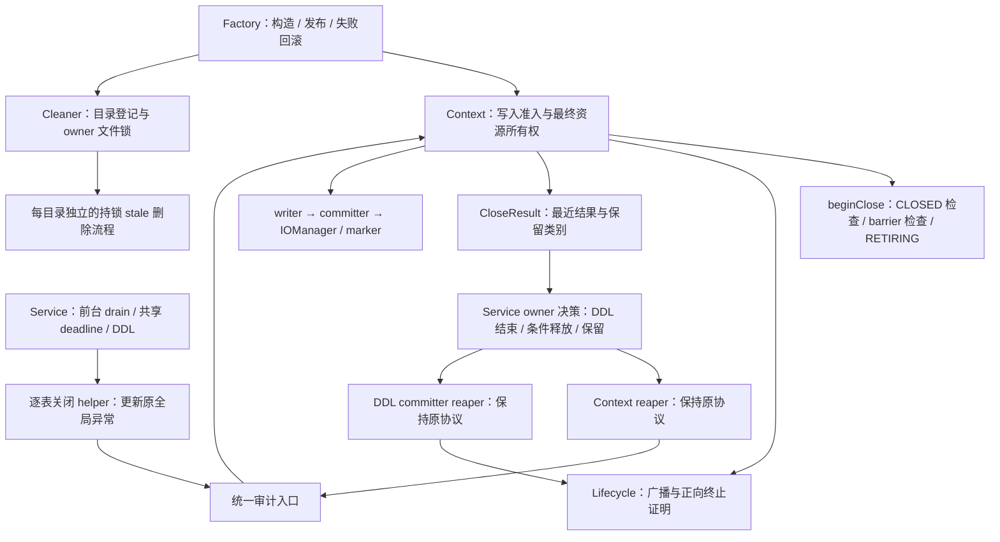
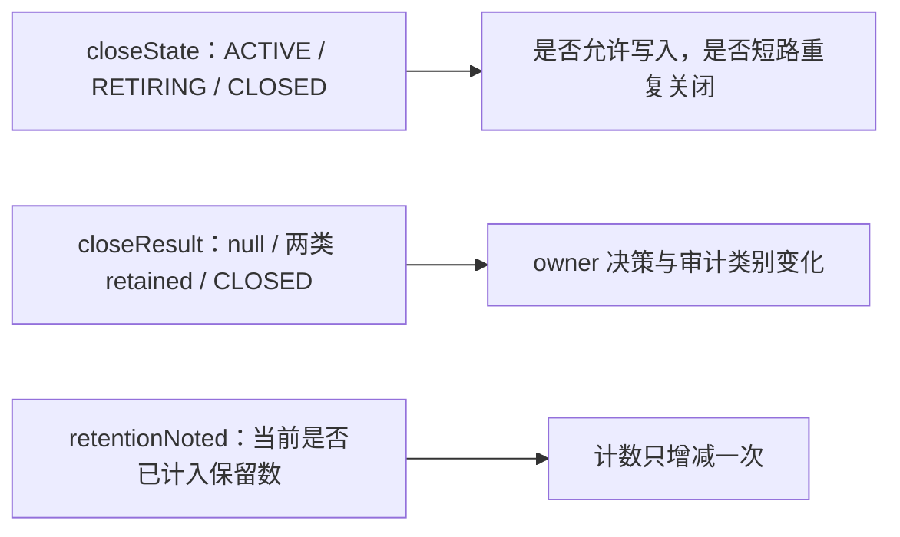

# Spec：Spill 生命周期代码简化（保持现有行为）

> **历史文档：停止与执行器生命周期现由[同步优雅停止主 Spec](/Users/SL/javaProject/tapdata-connectors/connectors/paimon-plus-connector/src/doc/specs/SPEC-paimon-spill-sync-graceful-stop.md)替代。** 下文的 deadline、retained/reaper、maintenance 捕获与阶段测试成绩仅供追溯，不作为新协议的实现或验收依据；目录保护、业务恢复与 FileIO 契约中未被替代的部分继续有效。

> Spec id：`paimon-spill-lifecycle-simplification`
> 当前协议以 [`SPEC-paimon-spill-lifecycle-current.md`](SPEC-paimon-spill-lifecycle-current.md) 为准。本文保留 S1–S8 的简化历史与候选；2026-09-05 的保留超时告警及 FileSystem 初始化修复属于单独获准的行为修正，不受本文“保持当时日志频率”等旧限制约束。
> 版本：**V1.2，2026-09-04 死代码与重复单测清理**；保留 V1.1 的续审方向。
> 状态：**S1、S1b、S1c 已提交。** S2–S8 尚未实施，本轮不扩大到结构重构。
> 当前对象：`hotfix-spill@a0c70798` 加 S1c 变更（本批提交）。
> 历史：H7=`4a3b2b7a`；V1.0 Spec=`14b9958b`；S1=`860083a2`；S1b=`89257fc2`。
> 依赖：Connector Paimon `1.3.2`；本地二次核对 `/Users/SL/javaProject/paimon@5c59e6cb01ed0b29563371f56e14fcade4597a2e`。源码证据索引见第 10 节。
> 行为门禁：现有成功、失败、等待、owner、审计、资源释放顺序保持一致；清理前基线 **519 项，518 通过**；本轮执行结果见 §9.2。

## 1. 目标、范围与这次修订的结论

简化对象覆盖 Spill 的创建、存活目录登记、Service/DDL 关闭、延迟回收和启动时残留目录清理。目标是减少读者需要同时掌握的状态、嵌套和重复流程，不以净减行数验收。

V1.0 只统计 Context、Lifecycle 和 RetentionException 三个文件，遗漏了 Service、Factory 和 Cleaner 中的重要编排。这次扩展审查范围，但仍不触及 DML 路由、commit/retry、offset callback、配置默认值或 Paimon 依赖实现。

| V1.0 结论 | 续审结论 |
|---|---|
| S1 待实施 | 已提交。`closeCommitterWithMaintenanceProof` 及其旧测试、无参 `retainAfterDeadline()` 已删除；`noAsyncProducers` 在 H7 时已不存在，不重复列入待办 |
| `close(long)` 改调 `closeUntil` 等价 | **不等价**。前者 retained 时抛异常且有重复关闭短路，后者返回结果并允许 reaper 持续尝试；S2 仅缩小可见性，保留方法体和原测试 |
| CloseResult 可直接合并为当前状态 | **不直接合并**。它保存上一次结果，当前 RETIRING 期间仍供审计去重/无阻塞读取；S3 只压缩私有关闭阶段的重复枚举值 |
| 删除公开 `retainAfterDeadline(audit)`，全部走 closeUntil | **不按原方案实施**。Service 在取得 Context monitor 之前就按 deadline 选择入口；等待、时钟读取和广播路径不同。S4 只提取两入口相同的开始关闭检查 |
| S5 提取每表 failure 后统一合并 | 必须传入并更新**原聚合异常**，否则可能把平级 suppressed 异常改成嵌套异常树 |
| 固定 520 项且测试零修改 | S1 删除一项旧测试后实测为 519。保留现有断言；允许先增加行为刻画测试，不能为了让重构通过而弱化/删除断言 |
| 净减 ≥120 行、零风险 | 删除该指标及“零风险”措辞。改为逐项收益、源码前提、回归门禁与回退边界 |
| 删 reaper、超时即关作为可选简化 | 从本 Spec 的候选中移除：它改变已批准的数据安全和恢复契约，需要独立行为变更设计 |

当前文件大小仅用于了解职责分布，**不等于这些行全部属于 Spill**：

| 文件 | 当前总行数 | 本次审查范围 |
|---|---:|---|
| `PaimonService` | 3964 | stale cleanup、DDL、关闭编排、owner、审计和 reaper |
| `PaimonTableWriteContext` | 614 | close 入口、状态、资源顺序、审计回调 |
| `PaimonCompactionLifecycle` | 236 | shutdown、deadline、终止证明、计数 |
| `PaimonTableWriteContextFactory` | 256 | IOManager/线程池构造、发布和回滚 |
| `PaimonSpillDirCleaner` | 447 | 存活登记、owner file lock、残留目录删除 |
| `PaimonSpillRetentionException` | 19 | 简单异常类型，保留 |

## 2. 必须保留的行为契约

### 2.1 创建与目录所有权

- Factory 在 writer 首次使用前注入 compaction executor，捕获 raw committer 的 maintenance executor；类型不符时保持 fail-closed（E13、E15）。
- `getSpillingDirectories()` 会触发 IOManager 懒初始化。注册阶段主动取得目录，是为了从开始使用前保护目录；关闭日志必须读取缓存目录，不能为日志再次调用懒初始化 getter（E16、E21）。
- 物理表 owner registry 与 spill owner 文件锁保护不同对象。前者约束同 JVM 的写入代次，后者保护本地目录不被 stale cleaner 删除，不能互相替代。
- Factory 构造失败保留现有回滚顺序：strategy 已存在时先关闭 strategy；随后 committer；strategy 尚未创建时 committer 后关闭 rawWriter；再 IOManager/marker，最后 shutdownQuietly。不能直接套用已发布 Context 的关闭协议（E15）。

### 2.2 关闭、接管和失败

| 情况 | writer/committer/IOManager | owner 与后续动作 |
|---|---|---|
| DDL drain 失败 | 原 Context 继续由 Service 管理；不提前 shutdown/reaper | 原 pending 与 owner 保留；后续正常 Service.close 负责收敛 |
| Context 完整终止证明且在 deadline 前开始收尾 | writer → committer → IOManager；保留原异常及 suppressed 链 | CLOSED 后可释放；DDL 必须等 action 结束阶段才释放 |
| 只有 compaction/延期收尾待完成 | 保留全部资源 | 允许释放物理 owner；reaper 继续收尾 |
| maintenance 未终止 | 保留全部资源和目录登记 | 保留物理 owner；maintenance 只能 graceful shutdown |
| detached Context 关闭抛错且结果未知 | 不遗失 Context | owner 保留，安排 reaper |
| 资源 close 抛异常但最终结果已是 CLOSED | 不重复关闭资源，不把 close-failed 写成 closed | 终止证明已取得，允许释放 owner；原错误仍返回 |

维护会经 `PartitionExpire → dropPartitions → tryOverwritePartition` 提交 OVERWRITE（E19、E20）。Paimon committer.close 又会对 maintenance 调用 shutdownNow（E22），因此不能通过删掉维护终止证明来简化。

Service 前台 ingress/scheduler/stop flush/callback drain 没有超时逃逸；之后 caller 与原 cleanup 共享唯一单调时钟绝对 deadline。保持先向全部 Context 广播，再优先处理已终止 Context、最后处理尚无证明 Context 的顺序。已经开始的 Java close 不会被硬中断（E06、E11）。

### 2.3 审计、并发可见性与等待

- `[paimon-spill] retained` 只在首次保留或类别变化时输出；`close-intent` 在真实收尾之前，结果为 `closed` 或 `close-failed`。字段、文案、source、异常链和调用顺序原样保持。
- reaper 常规重复等待不重复 retained；**现有异常重试诊断日志**仍按当前频率输出，不能借简化增加或删除限流策略。
- `closeResult()` 当前是无锁 volatile 读取。不能改为需要获取 Context monitor 的 getter，否则观察状态可能被正在阻塞的 close 卡住。
- `retentionNoted` 保留：Context 每轮尝试会进入 RETIRING，计数却需要从首次 retained 到 CLOSED 只增减一次。
- 保留中断处理差异：Context/lifecycle 证明等待、Service 前台等待、reaper 异常重试的退出/恢复策略不完全相同，不能统一成一个通用“等待并忽略中断”helper。

### 2.4 残留目录清理

保留全部删除前提：匹配前缀且是真目录、不跟随符号链接、当前 JVM 未登记、存在旧 owner marker、成功取得文件锁、达到 grace period、检查无异常。缺 marker 的旧版本目录继续跳过；失败或部分删除保留 marker，以便下次重试。完整成功后才通知 callback 并删除 marker（E17、E18）。

## 3. 已完成项与新增低风险清理

### S1 — 已完成，仅更新记录

`860083a2` 已删除生产无调用的 `closeCommitterWithMaintenanceProof`、对应旧测试和无参 `retainAfterDeadline()`。全仓复查三个被删除/已不存在的符号无 Java 引用。

保留下来的 Service 用例 `retainedDdlCommitterMustKeepPhysicalOwnerUntilMaintenanceTerminates` 验证 blocked → retain → worker 结束后 close 一次、owner 放行；公开 DDL 成功路径继续覆盖正常临时 committer close。不能把仅反射调用 helper 的用例当作完整 DDL drain/finally 覆盖。

### S1b — 未使用成员及无效 catch（已完成）

已完成清单（以下引用情况为删除前核查结果）：

1. `Context.CloseResult.requiresReaper()`：全仓 Java 仅声明，无调用。保留实际使用的 `allowsOwnerRelease()`、`retainsMaintenanceOwner()`，不为调用这个死方法而新增分支。
2. `CloseOperation.foregroundDrainedNanos`：仅字段、赋值和过时 Javadoc，无读取或反射使用；删除字段及写入，Javadoc 改为描述 `executorDeadlineNanos` 的发布。保留两个 latch、`finished` 与 deadline，不能按“看起来重复”继续删。
3. Lifecycle 未使用的 `StreamTableCommit` import，以及 S1 删除遗留的空行。
4. Factory 的 `shutdownQuietly` 外层 `catch (RuntimeException)`：该方法内部已吞掉 RuntimeException，且本地 lifecycle 已明确构造为非 null，外层 catch 不可达；仅去掉外层 try/catch。保留 shutdownQuietly 调用位置和吞异常行为，不改成 shutdownAndProve，不扩大到 Error（E14、E15）。

删除前已复查全仓符号和字符串引用，删除后 Java 源码中 `requiresReaper`、`foregroundDrainedNanos` 无残留。`shutdownQuietly` 本体与调用时序保留；两个 latch、共享 deadline 和 owner 逻辑未改变。

#### 重复单测清理（已完成）

删除 `PaimonCompactionLifecycleTest.withoutCompactionExecutorMustCloseInLegacyOrderForDirectConstruction`，将其 writer → committer → IOManager 的 InOrder 断言合入 `PaimonTableWriteContextTest.closeMustBeIdempotent`，保留后者原有三项 exactly-once 断言。

等价依据：旧用例显式传入 `withoutCompactionExecutor()`；保留用例的直接构造重载也委托同一工厂创建无 compaction executor 的 lifecycle，其余资源、空目录列表、commit identifier 和 NOOP store 设置一致。因此合并后的用例同时验证成功关闭顺序与重复关闭幂等性，没有移除行为断言。调用 `context.close()` 两次的原测试名称保持不变。

其他 Spill 单测均保留：真实 spill 目录与 marker、maintenance/compaction 终止、公开 DDL drain、owner 接管、共享 deadline、审计及失败传播分别覆盖不同条件，不因为名称相似或执行较慢就删除。此前随 S1 删除的旧 committer helper 测试不重复计算为本轮删除。

### S1c — 零引用死代码与未使用 import（已提交）

清理范围从 Spill 文件扩展到整个模块的零引用生产符号。删除前逐项复查全仓 Java 符号与字符串引用，以下各项均为零外部引用（含测试）：

1. `PaimonDataTypeConverter.getFieldLength(String)`：全仓仅声明。同名私有成员 `length(ParsedType)` 仍被类型映射使用，保留。
2. `PaimonMicroBatchCoordinator.consumerStarted(CallbackReservation)`：公开方法无调用者；内部字段 `lane.inFlight.consumerStarted` 仍被 `markConsumerStarted`、`reservedButNotStartedCallbacks` 使用，字段及其写入保留。
3. `PaimonMicroBatchCoordinator.CallbackReservation.version()`：访问器无调用者；`version` 字段仍参与 `matches()` 一致性检查，保留。
4. `PaimonTableWriteContext.create(…, PaimonBucketWriterRuntimeFactory)` 8 参重载：生产与测试均无调用；需要注入 runtimeFactory 的测试直接调用 `PaimonTableWriteContextFactory.create`。连带删除该文件中因此不再使用的 `PaimonBucketWriterRuntimeFactory` import。其余三个 `create` 重载各有真实调用者，不动。
5. `PaimonService` 3 个未使用 import：`TapPdkRetryableEx`、`ErrorKit`、`org.apache.paimon.disk.IOManager`。

行为变化：无（纯删除，不为死路径新增分支）。验证：focused 7 个测试类（Converter/Coordinator/OffsetBarrier/Scheduler/Context/Factory/ContextIntegration）117 项通过；完整模块 `mvn … test` **518 tests，0 failure，0 error，0 skipped**。§9.1/§9.2 记录的 `PaimonSpecTest` 默认值基线失败已由 `a0c70798` 修复（spec.json 与三语 placeholder 均为 default 4），本批之后的全量全绿为新基线。

## 4. 修订后的 S2–S5

### S2 — 缩小 API 可见性，保留两种关闭协议

固定方向：

- `Context.close(long)` 从 public 改为包可见，**不改方法体**。现有全部数值超时调用位于同包 write 测试，继续原样调用；`close()` 保留 public AutoCloseable 入口。
- `Lifecycle.proveTerminationUntil` 改为 private；全仓唯一调用是同类 `shutdownAndProveUntil`。更新“reaper 直接调用 prove”的过时注释，当前 reaper 实际通过 shutdownAndProveUntil 重新广播。
- 保留公开 `closeUntil` 两种重载和 `retainAfterDeadline(audit)`，Service 跨包使用。

`close(long)` 的首次 retained 会抛 PaimonSpillRetentionException；后台仍存活时重复 close 可直接返回；后台已结束后再关闭可最终收尾。`closeUntil` 则返回 CloseResult 并供 reaper 重试。这些区别由 E01–E03 和现有 lifecycle/真实 spill 测试明确表达，不能靠修改 assertThrows 来“适配”等价性。

可见性收缩针对连接器内部实现类及当前仓库消费者，不改变 Connector API。若实施前发现仓库外代码把这些内部类当作库 API 直接调用，则保留可见性，不能宣称二进制兼容。

### S3 — 压缩当前关闭阶段，保留上次结果

固定使用三段私有阶段：`ACTIVE / RETIRING / CLOSED`。删除 CloseState 中的两个 RETAINED 枚举值；`retain()` 将阶段置为 RETIRING，CloseResult 仍记录 maintenance/compaction 类别。

**保留** `volatile closeState`、`volatile closeResult` 与 `retentionNoted`；不向 CloseResult 添加 ACTIVE/RETIRING，也不把 getter 改成 switch 当前阶段。

源码等价依据：当前所有 closeState 读点只区分 `== CLOSED`、`!= ACTIVE`；没有读取两个 retained 阶段来决定其他行为。把这两个私有值映射到 RETIRING，所有现有谓词结果保持一致，字段写入位置和先后顺序也保持（E01–E05）。

必须保留上次 CloseResult 的反例：

| 时刻 | 当前阶段 | 最近关闭结果 | 对外含义 |
|---|---|---|---|
| 第一次 maintenance retained | RETIRING（简化后） | RETAINED_MAINTENANCE | 计数已增加，审计已输出 |
| reaper 再次尝试证明，尚未返回 | RETIRING | **仍是 RETAINED_MAINTENANCE** | 无锁观察不丢失最近结果 |
| 再次得到同一 retained 类别 | RETIRING | RETAINED_MAINTENANCE | 不重复计数、不重复 retained 日志 |

若将 RETIRING 派生为 null，第三行比较会错误地认为类别变化；若将 getter 加锁，会引入阻塞。这不是“两个字段表达同一事实”。

### S4 — 提取开始关闭的共同检查，保留 deadline 分流

仅提取 Context 私有 `beginClose()`：CLOSED 返回 false；存在 IOManager 但缺 lifecycle 时抛原异常；否则置 RETIRING 并返回 true。两个入口分别在原来的参数检查之后调用它。

保持以下细节：

- closeUntil 仍先校验 clock，再校验 audit；retainAfterDeadline 只校验 audit。CLOSED 情况的参数错误行为不变。
- Service 仍在调用 Context 前读取自己的 clock 并分流；过期入口不调用等待证明流程。
- closeUntil 仍在证明返回后复查 deadline，过期时走现有 retainAfterDeadline 路径；不删除这次复查。
- 广播次数、顺序及 compaction/maintenance 瞬时探测顺序保持。不能因“两种 shutdown 幂等”就自动减少重复广播；重复 shutdownNow 是否再次中断工作线程也是实际副作用。

收益：只消除两处相同的 fail-closed/阶段设置，不把有语义差异的入口强行合为一个。

### S5 — 提取逐表关闭流程，保留全局异常树

提取 Service 私有方法：

```java
Throwable closeDrainedContext(
        Throwable accumulatedFailure,
        String tableKey,
        PaimonTableWriteContext context,
        long executorDeadlineNanos)
```

方法按原顺序执行 closeContextWithSpillAudit、捕获 Throwable 并 appendFailure，finally 执行 handleContextCloseOutcome 并 appendFailure，返回更新后的**原聚合对象**。两遍循环都调用它；不改变遍历顺序、广播阶段、probe 异常归入第二遍及 deadline 判断（E06）。

不能采用“helper 从 null 开始聚合再整体附加”的版本：已有全局失败 F 时，当前是 `F.suppressed=[C,R]`；局部聚合可能变成 `F.suppressed=[C]` 且 `C.suppressed=[R]`。这会改变诊断链，违反零行为变化。需要在实施前补一个已有 F + 资源 close 错误 C + retention 结果 R 的刻画用例，断言对象身份、顺序及层级。

原 handleContextCloseOutcome 自身抛错时的传播边界也保留，不借提取新增吞异常或恢复策略。

## 5. 扩展范围后新增的结构简化

### S6 — 单独命名审计适配器的构造

把 E07 中匿名 CloseAudit 的构造提取为 Service 私有 `createSpillCloseAudit(tableKey, context, source)`。原 closeContextWithSpillAudit 只负责“获取本次审计适配器 + 按同一 clock/deadline 选择入口”。不新建日志框架或另一个状态对象。

约束：在每次关闭尝试的原位置读取缓存 dirs；identity 仍是原 table、Service owner、dirs、source；retainedContextCount 必须在输出日志时读取，不能在构造回调时提前缓存；不改变 null logger、日志异常、close-failed 与 suppressed 的处理。不要把一个 source 固定的回调永久复用于 Service、DDL 和 reaper。

收益是分开“关闭决策”和“日志格式”，不是改变已经收敛到 Context 真实边界的审计架构。

### S7 — reaper 只提取线程启动样板，保留两类回收流程

固定方向：为两个 retained reaper 提取私有 `startRetainedDaemon(threadNamePrefix, Runnable)`，保持同一 CLOSE_WORKER_THREAD_GROUP、原线程名前缀及 owner 后缀、daemon=true。Context 去重集合的 add 仍早于启动；结束时 remove 仍放在 Context reaper 的 finally。

本项保留两个循环的原位置及内容，只去除重复的线程构造；不同时搬移循环，也不合并为单个带多个布尔开关的任务模型。

必须保持的差异（E08、E09）：

| Context reaper | 临时 DDL committer reaper |
|---|---|
| 有 Context 去重集合，监视两类 executor，资源按序收尾 | 只有 committer 和 maintenance 证明 |
| maintenance 先结束但 compaction 未结束时可先释放 owner | maintenance 结束后尝试一次 committer.close，并在 finally 释放 owner |
| Context CLOSED 后即使 close 曾抛错也不能再次关闭 | 通过本轮流程结束保证不重复 close |
| Context 实际关闭统一 spill 审计 | 使用现有 DDL committer 专用日志 |

只复用线程构造，不更换共享线程池、不减少每个任务的等待预算、不新增定时任务。Service 主 close worker 需要先发布 operation.worker/closeOperation 再 start，不能一起套入“构造即启动”的 helper。S7 的收益只计算重复线程设置是否集中，不将“Service 行数减少”作为收益。若实施后阅读成本反而上升，仅回退 S7。

### S8 — 将 stale cleaner 的单目录决策移出根目录遍历

E17 的 roots/children 两重循环中包含一个完整的“可删证明 + 持锁删除 + 清理 marker”事务。提取私有 `tryDeleteStaleSpillDir(child, now, graceMs, onDeleted, deleteAction)`，外层仅遍历根和子项、累计成功删除数。

固定保持：

1. `now` 每轮 cleanup 只获取一次，仍传入每个目录；不变成逐目录重新取时间。
2. 先 NOFOLLOW_LINKS 判断，再 canonical/live 检查，再确认 marker 存在并试锁。canonical 路径和当前 normalized 锁路径的使用位置保持，不借机调整路径解析。
3. 锁从检查年龄之前一直持有到删除及成功 callback 之后；在 finally 释放锁，只有完整成功才删除 marker。
4. onDeleted 抛异常仍传播到调用方，finally 仍释放锁并按已成功删除状态清理 marker；不新增吞 callback 异常的 catch。
5. 保留 newestModified 仅看目录及直接子项、walkFileTree 不跟随链接、部分失败标记、仅统计成功删除的普通文件字节数。保留 DeleteAction 测试接缝。

收益是让每个目录的删除许可与锁作用域能单独阅读。**不删除** LIVE_DIRS、OWNER_LOCKS 或 DeletionResult，也不改成按 mtime 直接递归删除。

## 6. 不纳入本轮的“简化”

| 提议 | 不采用的原因 |
|---|---|
| 关闭阶段和最后关闭结果合成一个 enum | 会丢失 RETIRING 期间的历史结果或需要额外对象恢复同样信息，收益不成立 |
| 两个 reaper 改成单个共享单线程池 | 一个阻塞资源 close 会影响其他表，改变故障隔离和回收时序 |
| 维护强制中断、超时直接关资源、提前释放 owner | 破坏本轮确认的安全契约 |
| 只凭 Future.isDone/isCancelled/isShutdown 证明退出 | 不证明实际任务已经离开 Spill/维护路径 |
| 正常 Context 与 Factory 回滚统一 close helper | 未构造完成时存在 rawWriter/strategy 分支；已测试的 committer→rawWriter 顺序不同；不能套正常 writer→committer 顺序 |
| 将 Factory 的 IOManager 创建结果升级为自动关闭 lease | 容易改变部分构造失败、marker 释放及异常传播，需要单独失败路径设计；现有 BuildResult 保留 |
| Cleaner 的 LIVE_DIRS 与 OWNER_LOCKS 合成一个 map | 登记/注销窗口、试锁失败和 rollback 涉及并发证明；不是删除重复字段即可等价。本轮不改锁协议 |
| 去掉 DeleteAction/CloseAudit/注入 clock | 它们分别承载文件删除故障、审计真实边界、deadline 测试的必要接缝 |
| Service saturatingAdd 直接统一到 SpillDirCleaner | 算法相同，但数值饱和加法还被 MicroBatchCoordinator 使用；为了几行去扩大目录清理器职责或引入新通用工具，不足以改善本轮可读性 |
| 更改“可立即重启”提示、异常 reaper 日志限频 | 都是用户可见行为调整，单独设计；本 Spec 保持现有文案与频率 |
| 将所有等待 helper 合并 | 前台无逃逸、executor 有界证明和异常重试有不同中断契约 |

现有 cleaner 锁测试使用同 JVM 的独立 RandomAccessFile/FileLock，未启动第二 JVM；不能把方法名“AnotherProcessOwner”当成已完成跨进程竞争实测的证据。正因如此，本次只提取代码块，不扩展或改变锁算法。

## 7. 目标职责图（设计，尚未实现）



S3 的状态信息分工：



这三项信息有不同寿命和读者，简化是删去阶段中的冗余类别，不能删除仍承载事实的字段。

## 8. 实施顺序、验证与回退

| 顺序 | 条目 | 承重验证 | 状态 |
|---|---|---|---|
| 0 | S1 | 已删 API 无 Java 残留、Service DDL 覆盖 | 已提交 |
| 1 | S1b | 全仓符号/字符串检查、Factory/Close 回归、重复单测断言合并 | 已实施，未提交 |
| 2 | S2 | 原 close(long) 测试不改且编译通过；private prove 无跨类调用 | 待实施 |
| 3 | S5 | 两表共享 deadline、owner 结果矩阵、全局 suppressed 结构 | 待实施 |
| 4 | S4 | 缺 lifecycle、CLOSED/非法参数、过期入口不 await、证明后超时 | 待实施 |
| 5 | S3 | 写入拒绝、重试中最近结果、同类别审计去重、计数恰好一次 | 待实施 |
| 6 | S6 | service/ddl/reaper 字段和时序；close-failed 原异常链 | 待实施 |
| 7 | S7 | 线程组/名称/daemon/Context 去重；两种 reaper 的差异路径 | 待实施，低优先级 |
| 8 | S8 | Cleaner 全部用例、callback 失败时 marker/锁、真实 Spill | 待实施 |

先完成低风险及现有重复消除，再处理状态和目录块提取；不要一次混入多个尚未验证的简化。

必须先补齐的行为刻画：

- S5：已有全局失败再叠加资源关闭/retention，验证 suppressed 的顺序、层级和对象身份。
- S3：第二轮证明被 latch 卡住时，无锁 closeResult 仍返回上次 retained；放行后同类别日志/计数不增加。
- S4：CLOSED + null 参数、缺 barrier、已过期入口的零 await，以及原 clock 调用分流；保持原异常优先级。
- S8：删除成功后的 callback 抛异常，验证异常仍传播且 marker/锁按原 finally 行为处理。

这些测试在未重构基线上先通过，再保留断言重构。S1b 本轮**没有编写或执行上述 S3–S8 新增用例**。不要求现有测试文件永远字节不变，但不允许修改已有业务断言、删除故障场景或用 mock 绕过真实阻塞点来放行重构。

各项验证通过后再继续下一项；需要回退时仅回退本项，不覆盖用户其他改动。提交须遵循用户授权，简化与功能/缺陷修复分开，显式 pathspec。预计大于 500 行的机械搬移应使用可审查脚本，并按小项验证，不能将“自动化”当成语义正确的证明。

完成全部候选后的门禁是原基线测试零新增失败、生产编译无新增诊断、diff --check 干净、公开实现面符合 S2。由于已知 PaimonSpecTest 失败，完整 Maven/package 不能写成全部成功；以实际命令退出结果记录，默认值修正另行处理。

## 9. 执行证据与完成判定

### 9.1 V1.1 续审基线（历史记录）

已完成：Git 提交/工作区核对；全仓 Java 调用和字符串引用检索；相关生产与测试源码审查；本地 Paimon 调用链二次核对；JDK 17 完整模块基线重跑。

```bash
# 仓库根目录；使用 JDK 17
mvn -pl connectors/paimon-plus-connector test
```

本轮完成时间：**2026-09-04 16:10:11 +08:00**。Maven 实际结果：**519 tests，1 failure，0 errors，0 skipped**；失败仍为 `PaimonSpecTest.microBatchDefaultsAndPlaceholdersMustStayAligned:35`，期望 `asyncCommitConcurrency.default=4`，Spec 配置为 `1`。Surefire XML 汇总一致，未修改 Spec 默认值。

S1 删除一项旧 Lifecycle 测试，因此不能继续复制此前 520 的数字。519 是当前基线快照，不是未来新增刻画测试后的固定总数。

V1.1 续审时未做生产重构或测试修改，也未运行 package、大规模 retained 表压测或独立双 JVM 文件锁验证。S2–S8 候选方案的最终等价性仍以实施后的上述门禁为准。

### 9.2 V1.2 S1b 与重复单测清理（本轮）

| 验证阶段 | 实际结果 |
|---|---|
| 死代码删除后、单测合并前：Lifecycle / Context / Factory / ServiceClose / PhysicalOwner | 77 项通过，0 failure、0 error、0 skipped |
| 单测合并后：Lifecycle / Context | 25 项通过，0 failure、0 error、0 skipped |
| 完整模块 | 518 项：517 通过，1 个既有默认值 failure，0 error、0 skipped；Maven 因该基线失败返回非零（2026-09-04 16:22:32 +08:00） |
| 删除符号检查与 `git diff --check` | 通过 |

均使用 JDK 17。完整执行命令仍为 `mvn -pl connectors/paimon-plus-connector test`。测试总数从清理前 519 减少一项，来自上面明确列出的断言合并；没有修改已知默认值失败的测试或 `spec.json`。本轮未运行 package，未提交或推送。

### 9.3 后续结构简化的完成标准


- 读者能分别说明“现在是否可写”“上次关闭结果”“谁在何时释放 owner”“谁最终删除目录”。
- 每表关闭异常只在一个 helper 编排，仍使用原聚合异常；审计仍位于 Context 的资源边界。
- 重复检查、无用成员和线程构造样板减少；原安全判断、测试接缝和故障恢复能力完整保留。
- 不设净减行数或新增类数量的硬指标；没有明确可读性收益的条目不实施。

## 10. 源码证据索引

下列链接指向本轮实际核对的本地文件；后续重构后行号可能变化，方法名与基线 SHA 是定位依据。

| 编号 | 证据 |
|---|---|
| E01 | [Context 关闭入口](/Users/SL/javaProject/tapdata-connectors/connectors/paimon-plus-connector/src/main/java/io/tapdata/connector/paimon/write/PaimonTableWriteContext.java:377) |
| E02 | [Context deadline 与终止证明](/Users/SL/javaProject/tapdata-connectors/connectors/paimon-plus-connector/src/main/java/io/tapdata/connector/paimon/write/PaimonTableWriteContext.java:400) |
| E03 | [Context 无等待保留入口](/Users/SL/javaProject/tapdata-connectors/connectors/paimon-plus-connector/src/main/java/io/tapdata/connector/paimon/write/PaimonTableWriteContext.java:467) |
| E04 | [Context 保留去重与计数](/Users/SL/javaProject/tapdata-connectors/connectors/paimon-plus-connector/src/main/java/io/tapdata/connector/paimon/write/PaimonTableWriteContext.java:505) |
| E05 | [Context 资源关闭与结果发布](/Users/SL/javaProject/tapdata-connectors/connectors/paimon-plus-connector/src/main/java/io/tapdata/connector/paimon/write/PaimonTableWriteContext.java:521) |
| E06 | [Service 两遍关闭](/Users/SL/javaProject/tapdata-connectors/connectors/paimon-plus-connector/src/main/java/io/tapdata/connector/paimon/service/PaimonService.java:1638) |
| E07 | [Service 统一审计适配器](/Users/SL/javaProject/tapdata-connectors/connectors/paimon-plus-connector/src/main/java/io/tapdata/connector/paimon/service/PaimonService.java:1765) |
| E08 | [Service Context reaper](/Users/SL/javaProject/tapdata-connectors/connectors/paimon-plus-connector/src/main/java/io/tapdata/connector/paimon/service/PaimonService.java:1859) |
| E09 | [Service 临时 committer reaper](/Users/SL/javaProject/tapdata-connectors/connectors/paimon-plus-connector/src/main/java/io/tapdata/connector/paimon/service/PaimonService.java:1962) |
| E10 | [Service DDL owner 决策](/Users/SL/javaProject/tapdata-connectors/connectors/paimon-plus-connector/src/main/java/io/tapdata/connector/paimon/service/PaimonService.java:955) |
| E11 | [Service 两阶段 caller close](/Users/SL/javaProject/tapdata-connectors/connectors/paimon-plus-connector/src/main/java/io/tapdata/connector/paimon/service/PaimonService.java:3638) |
| E12 | [Service 关闭状态发布](/Users/SL/javaProject/tapdata-connectors/connectors/paimon-plus-connector/src/main/java/io/tapdata/connector/paimon/service/PaimonService.java:3908) |
| E13 | [Lifecycle 终止证明](/Users/SL/javaProject/tapdata-connectors/connectors/paimon-plus-connector/src/main/java/io/tapdata/connector/paimon/write/PaimonCompactionLifecycle.java:165) |
| E14 | [Lifecycle 工厂回滚关闭](/Users/SL/javaProject/tapdata-connectors/connectors/paimon-plus-connector/src/main/java/io/tapdata/connector/paimon/write/PaimonCompactionLifecycle.java:181) |
| E15 | [Factory 构造与回滚](/Users/SL/javaProject/tapdata-connectors/connectors/paimon-plus-connector/src/main/java/io/tapdata/connector/paimon/write/PaimonTableWriteContextFactory.java:142) |
| E16 | [Cleaner 注册与 owner 锁](/Users/SL/javaProject/tapdata-connectors/connectors/paimon-plus-connector/src/main/java/io/tapdata/connector/paimon/util/PaimonSpillDirCleaner.java:131) |
| E17 | [Cleaner 扫描与删除条件](/Users/SL/javaProject/tapdata-connectors/connectors/paimon-plus-connector/src/main/java/io/tapdata/connector/paimon/util/PaimonSpillDirCleaner.java:196) |
| E18 | [Cleaner 删除结果与遍历](/Users/SL/javaProject/tapdata-connectors/connectors/paimon-plus-connector/src/main/java/io/tapdata/connector/paimon/util/PaimonSpillDirCleaner.java:293) |
| E19 | [维护过期分区提交](/Users/SL/javaProject/paimon/paimon-core/src/main/java/org/apache/paimon/operation/PartitionExpire.java:170) |
| E20 | [OVERWRITE 基于最新 snapshot](/Users/SL/javaProject/paimon/paimon-core/src/main/java/org/apache/paimon/operation/FileStoreCommitImpl.java:881) |
| E21 | [Paimon IOManager 懒初始化及关闭](/Users/SL/javaProject/paimon/paimon-core/src/main/java/org/apache/paimon/disk/IOManagerImpl.java:60) |
| E22 | [Paimon maintenance close](/Users/SL/javaProject/paimon/paimon-core/src/main/java/org/apache/paimon/table/sink/TableCommitImpl.java:400) |

相关测试索引：

- [保留类别变化与最终关闭一次](/Users/SL/javaProject/tapdata-connectors/connectors/paimon-plus-connector/src/test/java/io/tapdata/connector/paimon/write/PaimonCompactionLifecycleTest.java:241)
- [DDL drain 失败及后续正常关闭](/Users/SL/javaProject/tapdata-connectors/connectors/paimon-plus-connector/src/test/java/io/tapdata/connector/paimon/service/PaimonServicePhysicalTableOwnerTest.java:288)
- [DDL 三种关闭结果矩阵](/Users/SL/javaProject/tapdata-connectors/connectors/paimon-plus-connector/src/test/java/io/tapdata/connector/paimon/service/PaimonServicePhysicalTableOwnerTest.java:425)
- [共享 deadline 与 reaper 审计](/Users/SL/javaProject/tapdata-connectors/connectors/paimon-plus-connector/src/test/java/io/tapdata/connector/paimon/service/PaimonServiceCloseTest.java:826)
- [reaper 去重和资源关闭异常](/Users/SL/javaProject/tapdata-connectors/connectors/paimon-plus-connector/src/test/java/io/tapdata/connector/paimon/service/PaimonServiceCloseTest.java:1006)
- [Factory 回滚顺序](/Users/SL/javaProject/tapdata-connectors/connectors/paimon-plus-connector/src/test/java/io/tapdata/connector/paimon/write/PaimonTableWriteContextFactoryTest.java:95)
- [Cleaner 部分删除失败](/Users/SL/javaProject/tapdata-connectors/connectors/paimon-plus-connector/src/test/java/io/tapdata/connector/paimon/util/PaimonSpillDirCleanerTest.java:95)
- [真实 spill 生命周期](/Users/SL/javaProject/tapdata-connectors/connectors/paimon-plus-connector/src/test/java/io/tapdata/connector/paimon/write/PaimonCompactionSpillLifecycleIntegrationTest.java:197)
