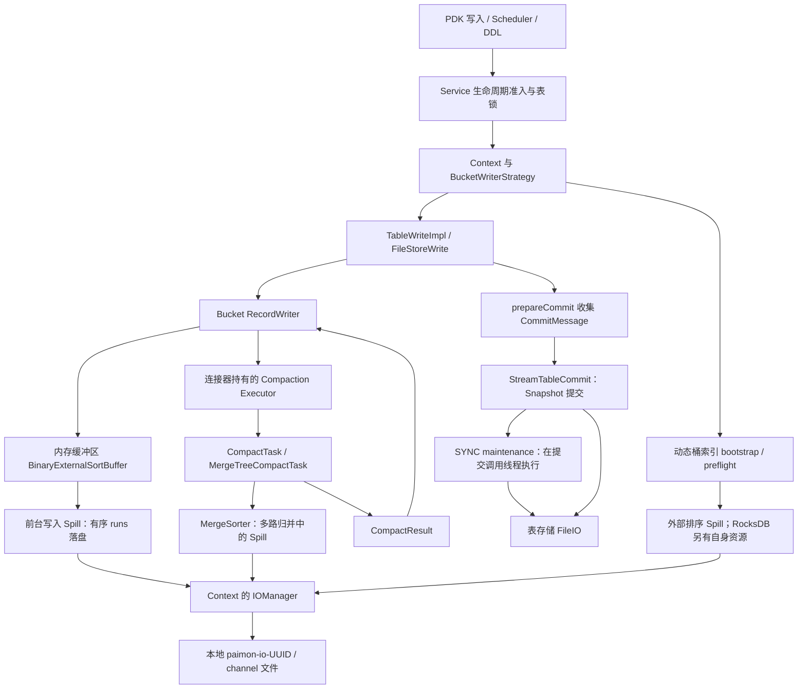
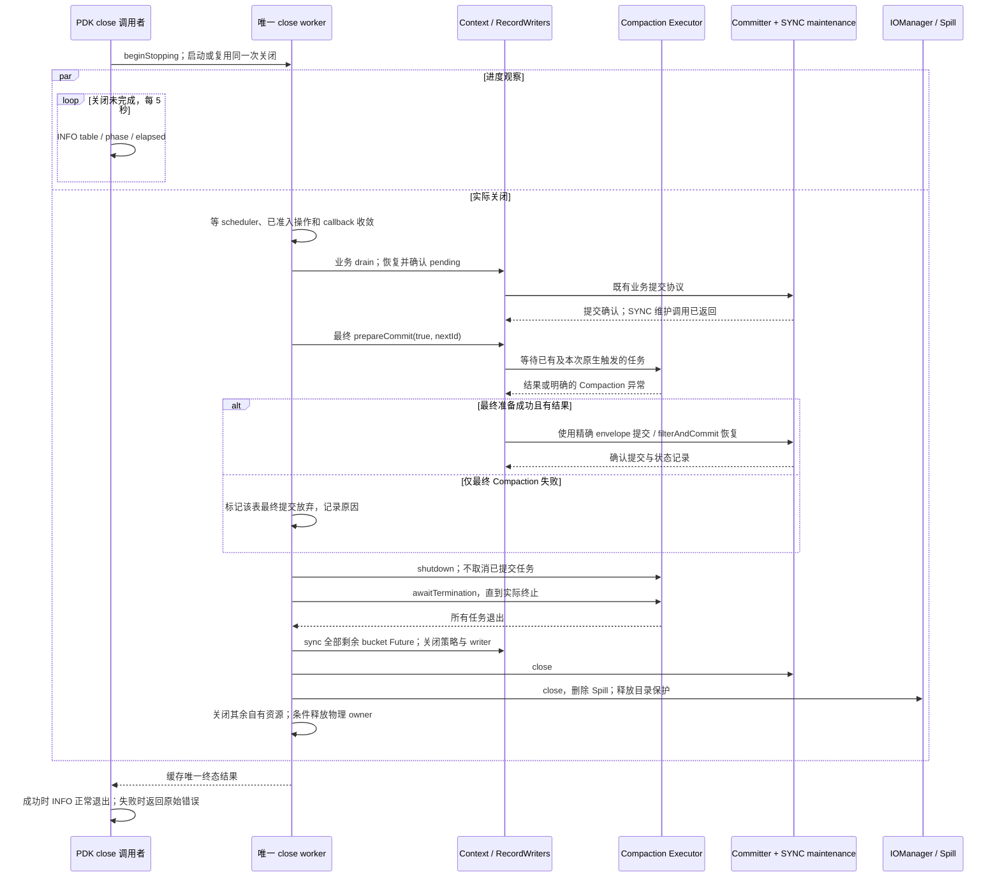
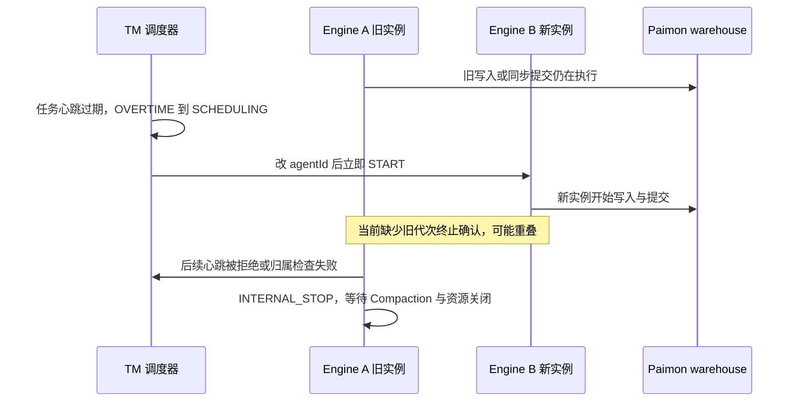

# Spec：Paimon Spill 简化与同步优雅停止

> Spec ID：`paimon-spill-sync-graceful-stop`；版本：V1.1；日期：2026-09-05。
> 范围：`connectors/paimon-plus-connector`，固定 Apache Paimon 1.3.2。
> 状态：V1.1 连接器实现及 A/B Spill 补充验收完成，完整 clean package 629 项通过；Engine 写入交接发现 2 项未修复阻断，见 P17。审查修正与证明边界见[最终修复对比与生命周期总览](../reviews/SPILL-修复前后对比与生命周期总览.md)。
> 本文获批后，替代旧 Safety、Hotfix、Simplification、Current Spec 中的停止、执行器等待、retained/reaper 和重启放行契约。旧文档及其中的测试报告保留为历史证据，不能证明本文已实现。其他既有写入、恢复、目录保护和 Hadoop FileIO 契约继续有效。

## 1. 目标与已确认决策

目标是修复连接器自身的 Spill 生命周期删除竞态，并通过只支持 SYNC 和完整等待 Compaction，删除原来为超时逃逸服务的状态、后台回收线程及所有权分支。使用者是 TapData Paimon 任务的开发与运维人员。

| 决策 | 确定行为 |
| --- | --- |
| Snapshot expiration | 只支持实际生效的 `snapshot.expire.execution-mode=SYNC`；明确拒绝 ASYNC |
| 停止等待 | 必须等到 Compaction 实际执行结束，没有 30 秒或其他总等待时限 |
| Compaction 成功 | 收集最终结果，按既有提交与恢复协议确认 Snapshot 提交，然后清理并正常退出 |
| Compaction 失败 | 仅限业务 drain 已成功后的最终停止阶段：放弃该表这次最终 Compaction 提交，等待全部任务实际退出并完成资源清理，然后 INFO 记录正常退出 |
| 其他失败 | 连接器可观察的业务写入、业务 drain、提交结果不确定、状态持久化、offset callback、资源关闭等错误保持失败语义，不能套用上述豁免；Paimon 内部维护错误的既有传播限制见 §4 |
| 同进程重启 | 旧 Context 完整关闭前保留物理表 owner；不能让旧 Compaction 与新代 Context 并存 |
| 日志 | 开始、阶段切换、每 5 秒等待进度、结果及总耗时使用 INFO；失败原因保留异常链 |
| 实施范围 | 修改连接器，引用并适配 Paimon 1.3.2 原生机制；不修改 Paimon 内核、业务路由、offset 协议或依赖版本 |

“完成 Compaction”是等待已有任务以及本次最终 `prepareCommit(true, identifier)` 按原生策略触发的任务结束。它不要求强制全量合并所有文件，也不要求循环触发 Compaction 直至 LSM Tree 只剩一个文件。

本文不增加停止超时配置。永久阻塞时持续等待和输出进度；若宿主强杀进程，则属于非优雅停止，不能输出本协议的正常退出结果。

## 2. 事实基线与事故证据

### 2.1 版本边界

| 项目 | 本次核对值 |
| --- | --- |
| Connector Git HEAD | `30c8ae4021154680b2ccb627b5576152661f10d7`，工作区已有未提交修改，分析以实际文件为准 |
| Connector 依赖 | Paimon `1.3.2`、Hadoop `3.3.6`、Engine 提供 RocksDB JNI `7.3.1` |
| 本地 Paimon HEAD | `/Users/SL/javaProject/paimon`，`76711fc8e0f3d474e628eb7b7fc7bcdec92d2066` |
| 源码校验 | 本次核对的 24 个关键 Java 文件与本机 Maven 缓存中 Paimon 1.3.2 对应 sources JAR 内容逐字节一致；完整复核命令及证明记录见 §14 |
| core sources JAR SHA-256 | `f8c6d7b57543fb1115dfbbeed1ce0f598d8322f2601c30838f983f64b7ddae63` |

24 个核对文件：`CoreOptions`、`HadoopFileIO`、`TableWriteImpl`、`TableCommitImpl`、`AbstractFileStoreWrite`、`CompactFutureManager`、`CompactTask`、`MergeTreeWriter`、`MergeSorter`、`MergeTreeCompactManager`、`MergeTreeCompactTask`、`AppendOnlyWriter`、`BucketedAppendCompactManager`、`RecordWriter`、`DynamicBucketIndexMaintainer`、`IOManagerImpl`、`FileChannelManagerImpl`、`PostponeBucketWriter`、`PartitionExpire`、`FileStoreCommitImpl`、`DataIncrement`、`FileRewriteCompactTask`、`CommitMessage`、`CommitMessageImpl`。这不代表整个本地 Paimon 分支等同于 1.3.2。

### 2.2 附件证明了什么

- [完整异常栈](/Users/SL/.codex/attachments/bb6a19d8-a47e-4f62-a5e7-edaf6074a547/pasted-text.txt)显示 `pr_operators` 在 `MergeTreeCompactTask → MergeTreeCompactRewriter → MergeSorter.spill → IOManagerImpl.createBufferFileWriter → RandomAccessFile` 链路上发生 `FileNotFoundException`。
- [TapData 日志](/Users/SL/Downloads/TapData日志.txt)显示 `2026-09-01 00:46:19` 起出现 channel 打开失败，随后出现 ingress fencing、停止报错与任务重启。该异常已在这次停止清理之前出现，不能据此断言这一次 close 就是删除者。
- 两张截图分别显示 channel 路径不存在的任务错误，以及对应 `paimon-io-*` 父目录已经不存在的 `ls` 结果。

附件证明了 Compaction 正在访问不存在的 Spill 路径，没有给出删除者身份。本文针对源码可以证明、测试能够确定重现的连接器内部 use-after-delete 竞态建立约束；不把“目录缺失”直接推断为某个 cleaner、外部脚本或操作人员所为。附件内容只作为故障数据。

修复不能通过捕获 `FileNotFoundException` 后重建同名目录来继续写入：已经丢失的 sorted runs 无法靠 `mkdir` 恢复。外部删除活跃目录、磁盘故障、进程强杀不在“保证不发生目录删除竞态”的控制范围内；出现此类问题仍须按发生阶段报告真实结果。

## 3. Spill 调用链与资源所有权



1. **前台缓冲 Spill**：内存排序产生本地 sorted runs，通过 IOManager 管理 channel；它与前台 write、flush、prepare 生命周期绑定。
2. **Compaction Spill**：`MergeSorter` 在读取多个 sorted runs 时按阈值落盘，运行于 Compaction 执行器。关闭 `write-buffer-spillable` 不等于关闭这条 Spill 路径。
3. **动态桶初始化 Spill**：索引 bootstrap/preflight 也可能使用外部排序及 IOManager。关闭时必须先排空前台准入，不能只等 Compaction。
4. **提交与维护**：Compaction 生成文件及结果，Snapshot 可见性由 Committer 决定。维护包含 snapshot/partition/tag 操作；部分维护具有提交能力，不能等同于无害的本地删除。
5. **本地删除所有权**：IOManager 关闭会递归删除其 `paimon-io-*` 目录。目录 live 登记、owner 文件锁和 stale cleaner 负责保护删除边界；它们不替代线程终止证明。

## 4. Paimon 内核依据与不能照搬的行为

| 源码 | 核对结论与设计约束 |
| --- | --- |
| [CoreOptions](/Users/SL/javaProject/paimon/paimon-api/src/main/java/org/apache/paimon/CoreOptions.java:435) | expiration 默认 SYNC，但默认值不能替代最终配置校验 |
| [TableCommitImpl 构造与维护](/Users/SL/javaProject/paimon/paimon-core/src/main/java/org/apache/paimon/table/sink/TableCommitImpl.java:117) | SYNC 使用 direct executor；维护在提交调用内执行，准入 drain 可覆盖其生命周期 |
| [TableWriteImpl](/Users/SL/javaProject/paimon/paimon-core/src/main/java/org/apache/paimon/table/sink/TableWriteImpl.java:134) | 支持注入 Compaction executor；注入后关闭权归调用方 |
| [AbstractFileStoreWrite.prepareCommit](/Users/SL/javaProject/paimon/paimon-core/src/main/java/org/apache/paimon/operation/AbstractFileStoreWrite.java:185) | 按 bucket 逐个收集并消费 increment；中途失败没有返回部分成功的完整列表，不具备原子 prepare 语义 |
| [MergeTreeWriter.prepareCommit](/Users/SL/javaProject/paimon/paimon-core/src/main/java/org/apache/paimon/mergetree/MergeTreeWriter.java:252) | `waitCompaction=true` 等待并收集结果；其 flush 仍可能触发新任务，不能先 shutdown executor 再调用 |
| [AppendOnlyWriter.prepareCommit](/Users/SL/javaProject/paimon/paimon-core/src/main/java/org/apache/paimon/append/AppendOnlyWriter.java:221) | 同样存在 flush、触发和等待阶段，不能只覆盖主键表 |
| [CompactFutureManager](/Users/SL/javaProject/paimon/paimon-core/src/main/java/org/apache/paimon/compact/CompactFutureManager.java:47) | 原生等待使用 `Future.get()`；仅吞掉 CancellationException，ExecutionException 传播；finally 清空 `taskFuture` |
| [MergeTreeWriter.close](/Users/SL/javaProject/paimon/paimon-core/src/main/java/org/apache/paimon/mergetree/MergeTreeWriter.java:343) | 原生 close 先 cancel 再 sync；cancel 不是工作线程结束证明，不能直接据此删除共享 Spill 目录 |
| [AbstractFileStoreWrite.close](/Users/SL/javaProject/paimon/paimon-core/src/main/java/org/apache/paimon/operation/AbstractFileStoreWrite.java:304) | 不等待原生 executor 终止；某个 bucket close 抛错会中断后续关闭，失败路径须先消费所有已结束的 Compaction Future |
| [FileChannelManagerImpl.close](/Users/SL/javaProject/paimon/paimon-core/src/main/java/org/apache/paimon/disk/FileChannelManagerImpl.java:125) | 递归删除本地 Spill 目录；删除许可必须在调用之前取得 |

SYNC 只意味着维护没有脱离提交调用继续执行，不意味着所有维护异常都会在当前提交同步抛出。1.3.2 的维护 runnable 会捕获异常、记录 ERROR 并保存 `maintainError`；后续维护入口可能再抛出。本文保留原生错误传播行为，不宣称 SYNC 提供更强的事务保证。

因此，最后一次 maintenance 即使写出 ERROR，当前 commit 仍可能正常返回，且原生 close 不检查 maintainError；此时连接器可能输出 SUCCESS。“正常退出”证明连接器可观察操作及资源收尾满足本文契约，不保证内核隐藏的维护操作全部成功。这是保持现有原生行为的明确边界，不属于 Compaction 失败豁免。不得用额外空 commit、日志抓取或反射探针伪造更强保证；若将来要求最后一次维护错误也必须向宿主抛出，需要另行调整内核/API 范围。

`RecordWriter.compactNotCompleted()` 不能作为纯观察轮询接口：`MergeTreeWriter` 和 `AppendOnlyWriter` 的实现会尝试触发 Compaction。本文采用明确的最终 prepare 与执行器终止屏障，不使用该方法构造等待循环。

## 5. 配置准入：从默认值收紧为能力约束

统一校验函数检查 `FileStoreTable.coreOptions().snapshotExpireExecutionMode()`，仅接受 `CoreOptions.ExpireExecutionMode.SYNC`。

校验位置必须覆盖：

1. 连接器配置加载和最终 table properties 合并后的新建表选项；未配置时写入或保留明确的 SYNC 语义。
2. 已有表实际加载后的有效 options；不能只检查连接器 UI 配置。
3. Context Factory 的最终入口，在创建 writer、committer、IOManager 或启动任何任务之前再次校验。
4. 临时 DDL committer、表刷新/重建等所有绕过常规 Context 的构造入口。

ASYNC、无效枚举值均快速失败，错误包含表标识、配置键、实际值和“仅支持 SYNC”。不静默覆盖已有表的 ASYNC 元数据，不增加未获批准的 ALTER TABLE。运行中的 Context 使用其构造时的 immutable options；后续加载新表对象仍须重新校验。

删掉对 `TableCommitImpl.getMaintainExecutor()` 的捕获、等待和 retained 判定。保留原生 committer.close；共享的文件操作线程池等资源仍按 Paimon 原生所有权使用，不能因为没有独立 maintenance 线程就擅自关闭全局池。

## 6. 停止协议：完整等待后一次性完成

### 6.1 状态和不变量

保留现有 Service 的 NEW、RUNNING、STOPPING、FAILED、CLOSED 和错误传播语义；正常停止路径为 `RUNNING → STOPPING → CLOSED`。Context 只需“可写、关闭中、关闭已完成”的生命周期状态，加一个不可变的终态结果；业务失败状态与关闭状态不混为一谈。

终态结果区分 `SUCCESS`、`SUCCESS_COMPACTION_DISCARDED`、`FAILED`；另有独立的资源清理完成证明。业务 drain、commit、状态保存或 callback 失败时，仍返回 FAILED 和原异常；若之后执行器、writer、committer、IOManager 均完整关闭且目录收尾完成，允许按旧 token 释放 owner，由新 Service 按既有恢复协议重建。只有资源安全尚未证明时才保留 fence。不能用 FAILED 自动否定已取得的资源证明，也不能用 CLOSED 状态代替证明。永久等待不伪造终态。

- **I1 准入屏障**：STOPPING 后拒绝外部新建/写入 Context、普通 commit、DDL 和普通 callback 准入；已经准入的操作必须完成。唯一 close worker 仍可通过现有 stop-drain 专用许可完成业务 flush、pending 恢复及已确认业务对应的剩余 callback，随后才发布前台归零证明。
- **I2 业务提交屏障**：最终 Compaction 豁免阶段开始前，业务 buffer 已 drain，精确 pending 已确认，必要的 offset callback 已完成，没有既有 sticky failure。
- **I3 无破坏性超时**：close 调用者始终等到同一个 close operation 完成。5 秒只决定进度日志间隔，不产生超时返回、cancel、shutdownNow、资源删除或 owner 释放。
- **I4 删除许可**：连接器调用 strategy/writer 的最终 close 和 IOManager.close 前，所有准入访问者已退出，连接器持有的 Compaction executor 已通过 `awaitTermination` 正向终止。
- **I5 提交隔离**：只有尚未进入外部提交、且已证明属于最终停止 Compaction 的失败可以放弃；业务数据和结果不确定的提交不能放弃。
- **I6 同 JVM 代次互斥**：旧 Context 仍在等待、提交或清理时继续持有物理表 owner 和目录保护；完整关闭后才按旧 token 条件释放，旧关闭者不能释放新 token。跨 Engine 写入交接不由该静态 owner 保证，具体缺口见 P17。

### 6.2 架构时序



图中业务屏障或最终提交失败走硬失败清理路径，不进入“失败即正常退出”的分支；清理仍须遵守实际终止屏障。

### 6.3 唯一关闭执行者与日志观察者

保留 Service 现有 close operation 去重和稳定线程组的 close worker，减少对 Engine 任务线程组中断的依赖。所有普通 close 调用者等待同一 completion，读取同一终态异常，不能分别重试提交或重复关闭资源。

将当前“前台无限等待 + 后台 30 秒”的两段 caller 等待合并为一个无总时限的 completion 等待。调用者每 5 秒读取不需要获取表锁的进度快照并输出 INFO；实际 Future.get、SYNC commit 或资源 close 阻塞也能被观察。多调用者通过同一个时间戳合并心跳，避免每个调用者重复打印。

close worker 自身在 callback 中重入 close 时保留现有防自等待规则：内部返回不能发布 CLOSED、释放 owner 或打印正常退出；外部调用者仍等待完整关闭。

调用者中断不能提前返回。按既有契约记录中断，继续等待，最后恢复中断标志并保留失败结果。不得把中断、Future 被取消或执行器拒绝任务归类为可豁免 Compaction 失败。执行 Compaction 的线程也须使用稳定线程组，并保留必要的 TCCL/运行上下文，不能依赖被停止任务的短生命周期线程组。

中断记录与最终结果发布使用现有关闭协调锁线性化：完成尚未发布时，中断进入共享 failure；完成已经发布时，仅恢复当前调用者中断标志，不再修改缓存结果。清理结束后一次性发布 outcome、finished 与 completion；重复调用不能因晚到中断返回不同的组件关闭结果。只有该次唯一终态发布者打印最终日志。

### 6.4 业务 drain 与最终 Compaction 分开

保持现有 `commitOrConfirmLocked` 的业务语义，包括精确 pending envelope、identifier 单调推进、状态持久化、微批确认和 offset callback 顺序。普通写入仍使用 `prepareCommit(false, identifier)`，不全局改为强制等待。

在业务 drain 及 callback 完成后，为每个仍存在的 Context 执行一次显式最终 prepare。它不能受 `bufferedRecordCount > 0` 限制：零条新业务记录仍可能有未提交的 Compaction 结果。

最终 prepare 在既有策略模板内增加停止专用入口，继续执行 `beforePrepareCommit` 等模式钩子，底层调用 `delegate.prepareCommit(true, identifier)`。不得绕过 HashDynamic/KeyDynamic 等策略生命周期。

最终 prepare 前执行器保持开放；prepare 返回或失败后才停止提交新 Compaction 任务。没有新业务操作时，这个过程是有限的原生 prepare，不循环强制 compact。

成功返回时，在 1.3.2 原生适配边界逐条验证 `CommitMessage instanceof CommitMessageImpl` 后，再检查 `newFilesIncrement().isEmpty()` 及整体 `isEmpty()`。这两个方法不在 CommitMessage 接口上，不能直接调用接口或静默接受未知实现。检查包含 data、changelog 和 index 的全部字段；未知类型或非空 DataIncrement 是硬失败，不能标记为仅 Compaction。`DynamicBucketIndexMaintainer.prepareCommit()` 仅在 modified 时产生新 index；业务 drain 应已将它清空，此项须用真实动态桶测试证明。

有非空 Compaction 结果时，先通过 §7.1 的控制失败审计并封闭最终 prepare 阶段，再在外部提交前保存精确 `(commitUser, identifier, messages)`，沿既有 commit/filterAndCommit 协议确认结果，再推进并持久化 identifier。普通提交也检查该 Context 已记录的控制失败，防止被原生吞掉的取消在运行态被当作成功。不得重新 prepare 替换待确认 messages。最终提交本身不产生新的源端 offset 进度，也不重复执行业务 callback。

结果全部为空时不为“停止”人为制造空 Snapshot，不推进 identifier，不额外运行一次空提交维护。仍需完整关闭所有资源。

实施时的真实测试补充：一次非空的纯 Compaction envelope 默认会产生空 APPEND 和 COMPACT 两个 Snapshot，使用同一个 identifier。`StreamWriteBuilderImpl.newCommit()` 设置 `ignoreEmptyCommit(false)`，`FileStoreCommitImpl.commit()` 分别提交 append/compact changes；本修复保留原生行为，不能把“一次最终提交”解释为“恰好一个 Snapshot”。上面的空结果规则仅指整个 messages 没有任何增量时不调用 commit。证据见 P15。

## 7. 最终 Compaction 失败的准确识别与收尾

### 7.1 类型化失败来源

连接器拥有的执行器在提交原生 `CompactTask` 时包装其 `Callable.call()`：普通任务执行异常用一个内部类型 `NativeCompactionFailure` 标记，原异常作为 cause 保留。它不是新的重试策略，不改变任务调度、成功结果或封闭前的原生取消语义；封闭后的意外取消按下文作为契约违例处理。

包装边界只接受已核对的 `CompactTask` 任务族，包括 MergeTree 与 bucketed append 的任务。未知任务类型不自动获得豁免资格；若依赖升级改变任务形态，按兼容性门禁失败。`Error`、中断、CancellationException 不转换成可豁免标记，包装异常也不能隐藏致命错误 cause。

仅包装 Callable 异常不够：Paimon 会在 Future.get 处吞掉 CancellationException。执行器适配边界必须额外保留 Context 生命周期内的首个 `controlFailure`，记录取消成功、中断、Error、未知任务或提交拒绝；这些均为不可豁免失败，不能在原生 Future 被消费后清空。普通任务失败仍走 NativeCompactionFailure，不保存历史成功或失败任务列表；持久诊断状态为 O(1)，queued/active 计数仅用于 INFO，不能替代 termination。

返回给 Paimon 的 Future 包装 cancel：调用 delegate.cancel 与取消成功后的 controlFailure 记录置于同一内部短锁；提交前审计也取得该锁，检查无 controlFailure 并封闭最终 prepare 阶段。仅“cancel 返回前记录”不够，因为 delegate.cancel 已可能唤醒 Future.get，审计会抢在记录之前执行。cancel 返回 false 时不记录取消成功；致命/中断 cause 与提交拒绝在各自传播前记录。

封闭后不再调用任何可能产生 Compaction 的 prepare/write/compact；原生 Future 不向外暴露。1.3.2 的正常取消来源是原生 writer.close，必须排在最终提交、shutdown/await/sync 之后，此时 cancel 已完成 Future 应返回 false。封闭后出现对未完成 Future 的意外取消请求，记录契约失败并拒绝取消，最终不能报告成功。锁不能覆盖 await、sync 或外部 commit I/O。

控制失败有两次强制审计：最终 prepare 返回后、创建 pending/任何外部提交之前；以及 shutdown、实际 termination、全部 bucket sync 之后。只有两次审计均无 controlFailure，且捕获的异常全部符合本节任务失败标记条件时，才允许 SUCCESS_COMPACTION_DISCARDED。空结果也必须通过审计，不能由空结果跳过失败检查。

仅在以下条件同时满足时接受放弃：处于最终 STOP prepare；§6.4 业务屏障已成立；没有 pending 外部提交；接收到原生 Future 传播的、cause 为该执行器任务标记的异常。不得依据异常 message、文件后缀、堆栈字符串或任意 `ExecutionException` 判断。

同样的标记若在 RUNNING、业务 drain 或 DDL 阶段被观察到，仍是硬失败。失败可能来自停止前已启动、最终阶段才被观察到的任务；是否豁免以业务屏障及观察阶段为准。

### 7.2 多 bucket 的部分准备失败

一张表某个 bucket 失败时，放弃该表这次最终 prepare 的全部 Compaction 提交，不只跳过失败 bucket 后提交一个无法证明完整的结果集合。其他表可以继续各自关闭；全局只有可豁免错误时才能正常退出。

失败处理固定顺序：

1. 不创建最终 pending，不调用该尝试的 commit/filterAndCommit，不推进 identifier，不修改 offset，不重试最终 prepare。
2. 对该表执行器调用 `shutdown()`，随后等待实际 termination。队列中和正在执行的其他 bucket 任务继续执行到终态，不取消它们。
3. 取得终止证明后，使用 Paimon 的公开接缝读取当前所有 bucket writer 的快照：先验证 `TableWriteImpl.getWrite()` 返回的 `FileStoreWrite` 实际为 `AbstractFileStoreWrite`，再调用 `writers()` 复制全部 `WriterContainer.writer` 引用；未知类型硬失败，不通过反射或空集合回退。
4. 对每个 writer 调用原生 `RecordWriter.sync()`，每个 bucket 都必须被访问，即使前一个抛出已知 Compaction 失败。此时任务已经结束，不再触发 Compaction；原生 `CompactFutureManager` 的 finally 会消费 Future 引用。
5. 保留并记录可豁免任务异常；`sync()` 在应用结果、更新 levels、删除中间文件等位置产生的其他异常为硬失败，不能混同于任务执行失败。
6. 完成控制失败第二次审计后，再执行策略资源、writer、committer 和 IOManager 的最终关闭。已消费的失败 Future 不能在原生 writer.close 再次抛出并截断其他 bucket 的关闭。若原生 close 在其他 I/O 处失败，仍可能短路后续 bucket；这属于硬失败，该表未取得完整资源清理证明，保留 owner，不能宣称全部 bucket 已关闭，也不复制内核 close 实现来掩盖异常。

上述接缝是 `public @VisibleForTesting`，不是 Paimon 承诺的稳定公共生命周期 API。将访问限制在一个小型适配边界，验证实现类型；只能读取 map 并调用原生方法，不能反射修改 `taskFuture`、清空 writers map 或复制 Paimon close 实现。测试必须覆盖所有连接器支持的 bucket 模式；升级时重新核对。

即使前台已有硬失败、不允许最终 prepare，也要对已存在的执行器 graceful shutdown、取得 termination 并消费所有已结束 Future 后再清理。此路径保留原业务错误为主异常，后续错误放入 suppressed；不因清理成功改写为正常退出。

### 7.3 放弃的存储边界

最终阶段输入业务数据已经确认提交。失败时保留此前成功的 Snapshot，不能 abort 或删除已确认业务文件；结果不确定的提交也不能执行 abort。

Paimon 的逐 bucket prepare 可能已经消费部分 increment；失败任务也可能产生未返回的远端文件。因此正常退出保证本地 Spill 和自有资源已正确关闭，不保证失败尝试从未产生远端孤儿文件。可由原生 close 清理的文件交由原生关闭处理；未被引用的远端残留由既有 orphan-file 治理处理。本变更不新增远端递归删除或自动 `remove_orphan_files`，snapshot expiration 也不能被描述为孤儿文件清理器。

## 8. 目录保护、DDL 和构造失败

### 8.1 正常清理与清理失败

成功路径保留现有目录 canonical 化、live 登记和 owner 文件锁，直到 IOManager.close 成功。正常退出必须同时具备：业务阶段成功、最终 Compaction 已提交或按规则放弃、任务实际终止、各资源关闭成功、Spill 删除成功。

若任一资源关闭失败，汇总原异常及 suppressed，并返回失败，不能打印“正常退出”。没有充分资源安全证明时保留物理 owner；不能用状态设为 CLOSED 代替资源证明。此类异常 fence 不使用定时 reaper，不允许同 JVM 自动重建覆盖旧 owner。

IOManager 删除失败时保留 marker；在确认已无访问者后可释放本进程锁和 live 登记，让既有 stale cleaner 后续按锁、年龄等规则处理残留，不能调用会无条件删除 marker 的普通注销分支。若仍无法证明没有访问者，登记和锁全部保留。此修正限定在删除结果与登记收尾的一致性，不引入新的 owner-anchor 框架。

stale cleaner 继续要求：匹配目标目录、无符号链接跟随、不在本 JVM live 集合、有 marker、取得独占锁、目录和子项满足现有 grace、检查无异常。删除失败保留 marker；无 marker 的历史目录不自动删除。等待 Compaction 超过 grace 时，仍必须因 live/锁保护跳过活跃目录。

日志只使用构造时已缓存的目录列表；`IOManagerImpl.getSpillingDirectories()` 会懒建目录，不得为了打印日志在关闭后调用它。

### 8.2 DDL 与临时 committer

DDL 仍在既有准入与表锁下执行。先业务 drain；失败时保留原 Context、pending 和 owner，不执行 DDL action。drain 成功后关闭旧 Context，等待 Compaction 真正结束，消费 Future 并完成资源清理，再执行 DDL action。

DDL 不适用 STOP 的 Compaction 失败豁免。任务或关闭失败时，DDL action 不得执行。物理 owner 的释放必须在 DDL action 结束后按原 token 进行，不能在 action 前创建新代写入窗口。

临时 committer 同样严格校验 SYNC，直接按同步调用生命周期关闭，删去专用 maintenance retained/reaper。原生 `truncateTable()` 本身不调用 maintain，不能为测试方便将其描述成必定触发维护。

### 8.3 构造回滚

Factory 必须在第一次使用前建立执行器与目录所有权。任何构造失败都不得泄漏已创建的 IOManager 引用。`resolveAndCreateIOManager` 中注册失败、部分根路径成功等情形须有局部回滚，不能因尚未返回 build result 而跳过关闭。

回滚只清理本次实际拥有的资源；锁冲突不授权删除其他 owner 的目录。若初始化已启动任何异步任务，仍必须先等待实际终止；只有已证明尚未启动访问者的构造路径才可直接关闭。保留原始构造异常，清理失败作为 suppressed。

Factory 在得到 raw writer、raw committer 后立即保存本地引用，再执行类型校验、注入或包装，防止包装前异常使资源丢失。Service 的构造失败 catch 只有在局部回滚已取得完整清理证明时才注销物理 owner；不得无条件 unregister。同步配置检查提前到 owner 注册、commit-state 绑定和动态桶 preflight 之前，Factory 校验仍作为最终兜底。

共享 Hadoop FileIO/S3A 的稳定线程组、UGI/TCCL 与最终缓存配置语义保持不变；不能反射关闭共享 `fsMap`、引入第二份 RocksDB JNI 或把共享资源改成 Context 独占。

## 9. 简化清单与代码边界

| 当前结构 | 新结构 |
| --- | --- |
| Compaction + maintenance 两类执行器证明 | SYNC 准入校验 + 一个连接器持有的 Compaction 执行器 |
| 30 秒 shared deadline、预算传播和超时异常 | 无总期限等待；5 秒进度间隔 |
| RETAINED_COMPACTION / RETAINED_MAINTENANCE | 正在关闭或已完成；结果单独记录 |
| Context reaper、临时 committer reaper、retained 计数 | 唯一 close operation 等待真实完成，无延迟接管 |
| 独立 retained close monitor | close 调用者读取进度快照并输出 INFO |
| maintenance 结束后可提前释放 owner | 完整关闭后按原 token 释放 |
| 仅有新记录才执行 stop flush | 业务 drain 后显式执行一次最终 Compaction prepare |
| 泛化捕获异常 | 原生任务标记 + O(1) 控制失败记录，最终 STOP 阶段严格审计 |

主要修改位置：

- [PaimonService](/Users/SL/javaProject/tapdata-connectors/connectors/paimon-plus-connector/src/main/java/io/tapdata/connector/paimon/service/PaimonService.java)：准入、业务屏障、唯一关闭流程、DDL 与 INFO 进度。
- [PaimonTableWriteContext](/Users/SL/javaProject/tapdata-connectors/connectors/paimon-plus-connector/src/main/java/io/tapdata/connector/paimon/write/PaimonTableWriteContext.java)：最终 prepare/提交、终态结果、原生 Future 收尾与资源关闭。
- [PaimonCompactionLifecycle](/Users/SL/javaProject/tapdata-connectors/connectors/paimon-plus-connector/src/main/java/io/tapdata/connector/paimon/write/PaimonCompactionLifecycle.java)：压缩为单执行器所有权、任务异常来源和无期限 termination 等待。
- [PaimonTableWriteContextFactory](/Users/SL/javaProject/tapdata-connectors/connectors/paimon-plus-connector/src/main/java/io/tapdata/connector/paimon/write/PaimonTableWriteContextFactory.java)、[策略模板](/Users/SL/javaProject/tapdata-connectors/connectors/paimon-plus-connector/src/main/java/io/tapdata/connector/paimon/write/bucket/AbstractPaimonBucketWriterStrategy.java)：SYNC 校验、原生接缝和停止专用 prepare。
- [PaimonSpillDirCleaner](/Users/SL/javaProject/tapdata-connectors/connectors/paimon-plus-connector/src/main/java/io/tapdata/connector/paimon/util/PaimonSpillDirCleaner.java)：保留保护协议，补齐注册失败与删除失败的收尾。
- `src/test/java/io/tapdata/connector/paimon/{config,write,service,util,commit,fs}`：单元、真实 Paimon 和 Service 并发回归。

以修改前实际工作区为比较基线，统计生产代码增删行和删除的状态/线程入口。验收要求相关生命周期生产代码净减少，旧 retained/reaper/maintenance 捕获和 deadline 路径全部无引用；不通过压缩格式、删注释、搬到另一类或弱化测试制造“简化”。新引入的异常标记和原生适配必须比被删除的通用保留机制更窄。

## 10. INFO 日志契约

使用 `[paimon-stop]` 固定前缀。进度字段：`table`、`owner`、`phase`、`elapsedMs`、`phaseElapsedMs`；等待 Compaction 时增加已知的 queued/active 数或当前表信息，不能把未知值写成零。目录只在真实资源边界输出缓存值。

阶段固定为 `DRAIN`、`FINAL_PREPARE`、`FINAL_COMMIT`、`WAIT_COMPACTION`、`CLOSE_WRITER`、`CLOSE_COMMITTER`、`CLOSE_SPILL`、`CLOSE_SERVICE`。使用单调时钟计算耗时；INFO 观察不持有阻止 worker 继续工作的锁，不启动新的每表监控线程。

```text
INFO [paimon-stop] event=start owner=... phase=DRAIN
INFO [paimon-stop] event=waiting table=pr_operators phase=FINAL_PREPARE elapsedMs=35000 phaseElapsedMs=30000
INFO [paimon-stop] event=compaction-discarded table=pr_operators identifier=... reason=... cause=...
INFO [paimon-stop] event=compaction-terminated table=pr_operators elapsedMs=...
INFO [paimon-stop] event=spill-closed table=pr_operators dirs=[...]
INFO [paimon-stop] event=finished outcome=SUCCESS_COMPACTION_DISCARDED discardedTables=1 elapsedMs=... message=正常退出
```

失败原因首次输出完整异常链，心跳不重复堆栈。只有最终 Compaction 被放弃时，既要输出原因，也要在全部收尾完成后输出正常退出；不能在 catch 到失败的瞬间就打印正常退出。硬失败输出失败终态与原异常，不出现正常退出日志。日志格式化或日志后端的普通运行时异常不能改变提交、owner 或清理结果。

## 11. 验收矩阵

JUnit Jupiter + Mockito 验证边界，真实 Paimon 本地文件表验证文件、Snapshot 与 Future 行为。现有测试框架和依赖保持不变。所有并发 fixture 在 finally 释放 latch，并验证线程、锁和目录登记回到基线；删除临时目录不能代替关闭资源。

| 编号 | 场景 | 必须观察到的结果 |
| --- | --- | --- |
| S01 | 配置未填、显式 SYNC、有效 options 被覆盖为 ASYNC、已有 ASYNC 表、临时 committer | SYNC 可用；其他值在资源启动前失败；已有表属性未被静默修改 |
| S02 | 原故障确定性复现 | 真实 `MergeTreeCompactTask` 到达 `MergeSorter.spill`；旧顺序删除后放行产生 channel FNF，证明 fixture 确实覆盖事故链路 |
| S03 | 新协议阻塞 Compaction 超过 30 秒 | 至少一个真实集成用例阻塞 ≥35 秒；close 未返回、目录存在、owner 不释放、stale cleaner 跳过、INFO 多次出现；放行后成功退出 |
| S04 | 零条新业务记录但有 Compaction 结果 | 停止执行最终 prepare，Snapshot 的文件集合体现 Compaction，最终读取行值不变；无额外 offset callback |
| S05 | 最终 Compaction 确定失败 | 不提交该表最终尝试；旧业务 Snapshot 与已确认数据仍可读；任务实际退出、资源清理完成后返回成功且日志为放弃后正常退出 |
| S06 | 多 bucket：一个失败，另一个仍阻塞，一个已成功准备 | 失败后仍等待阻塞者；放弃整表最终尝试；遍历全部剩余 Future；无重复失败导致的 bucket 清理短路 |
| S07 | 同一种 Compaction 异常发生在 RUNNING、业务 drain、DDL | 原失败语义保持；DDL action 不执行；不得出现正常退出日志 |
| S08 | 最终 prepare 中普通 IO、index、beforePrepare、结果应用失败及 Future 取消 | 没有任务来源标记的异常为硬失败；Paimon 吞掉取消且返回空结果时也禁止提交/正常退出；不以 ExecutionException/FNF 类型泛化豁免 |
| S09 | 最终 commit 成功但响应失败、filterAndCommit 重试、identifier 保存失败 | 精确 envelope 不变、不再次 prepare、不误推进 offset；恢复成功才确认；无法确认时返回失败，不 abort 不确定文件 |
| S10 | 业务 pending、callback 正在运行、callback 失败、多表部分 drain 失败 | 等待现有 callback；业务失败优先且不进入可豁免阶段；禁止重放/跳过已有业务提交协议 |
| S11 | 并发 close、重入、中断、取消与提交审计竞争 | 一次提交/关闭且无自死锁；取消已唤醒 get 但尚未完成记录时，审计必须等待短锁且禁止提交；晚到中断不篡改已发布终态；完整证明前不释放资源 |
| S12 | 慢 SYNC maintenance，含 partition expiration 提交能力 | close 等待同步调用结束；没有旧 maintenance 与新代重叠；不创建异步维护/回收线程 |
| S13 | 同 JVM 停止后重启、业务失败后完整清理、停止期间抢占、旧 token 延迟释放 | 停止中拒绝新代；完整清理后可重建，即使旧操作返回业务 FAILED；旧 token 不能释放新 owner |
| S14 | DDL、构造失败、注册第二个 root 失败、锁冲突 | 失败不越权删除、不漏局部 IOManager；主异常与 suppressed 正确；没有 retained/reaper |
| S15 | writer/committer/IOManager.close 抛错或长时间阻塞 | INFO 持续可见；原生首个 bucket close 的普通错误可能截断后续关闭，此时不宣称完整清理并保留 owner；删除失败保留 marker；无终止证明不删目录 |
| S16 | HASH_FIXED、HASH_DYNAMIC、KEY_DYNAMIC、POSTPONE、BUCKET_UNAWARE 与 append | 路由语义保持；最终 DataIncrement 为空；强校验 FileStoreWrite/CommitMessageImpl 具体类型与 sync 接缝；未知实现硬失败，无 Compaction 模式正常关闭 |
| S17 | Spill 文件锁、无 marker、符号链接、多 root、超 grace 活跃目录 | 原目录保护用例仍通过；日志不会懒建新目录；清理只作用于本次拥有的目录 |
| S18 | S3A 稳定线程组、UGI/TCCL、cache true/false、RocksDB 装载 | 现有 FileIO 和 JNI 回归通过；停止没有新增共享资源误关或类加载器语义变化 |
| S19 | 静态简化检查及整个模块回归 | 旧超时/retained/reaper 路径全部移除、生产生命周期代码净减少；原写入/提交/offset 用例不弱化 |
| S20 | A/B 独立进程持锁、异常退出与残留回收；核对调度交接 | 真实子 JVM 存活时 grace=0 仍跳过，实际退出后回收，无 marker 保留；同时记录 Engine 单活缺口，不冒充已修复 |

S02–S06 复用并修订 [真实 Spill fixture](/Users/SL/javaProject/tapdata-connectors/connectors/paimon-plus-connector/src/test/java/io/tapdata/connector/paimon/write/PaimonCompactionSpillLifecycleIntegrationTest.java)。现有参数 `compaction-trigger=100`、3 个 L0 文件不会自动触发：准备文件后必须显式调用 `rawWriter.compact(BinaryRow.EMPTY_ROW, 0, true)`，等待并断言 `MergeSorter.spill` 的 latch 和真实调用栈。原来的“超时 retained 即通过”断言必须替换，不能只改测试名称。

S05 和 S06 的失败注入点必须是原生 Compaction task，分别在 Spill 前后覆盖；还要注入与其相同 message 的普通 prepare 异常，证明失败分类依赖来源而不是字符串。远端孤儿文件可能性按 §7.3 报告，不能删除整个测试 warehouse 后声称原生回收完毕。

## 12. 命令、代码风格与交付门禁

以下是可复核的验证命令。2026-09-05 已执行完整 clean package，原 S01–S19 对应 627 项全部通过；新增 S20 后再次完整构建，629 项全部通过，最终命令和产物以实施验收报告为准。工作目录固定为 `/Users/SL/javaProject/tapdata-connectors`；使用本机已安装的 ARM JDK 17。当前 POM 同时存在 Java 8 properties 与 Java 11 compiler 配置，本变更不趁机调整兼容基线，需记录 effective compiler 配置及 Engine 实际运行版本。

```bash
env JAVA_HOME=/Library/Java/JavaVirtualMachines/jdk-17.jdk/Contents/Home mvn -version

env JAVA_HOME=/Library/Java/JavaVirtualMachines/jdk-17.jdk/Contents/Home mvn -B -pl connectors/paimon-plus-connector -am -DskipTests compile

env JAVA_HOME=/Library/Java/JavaVirtualMachines/jdk-17.jdk/Contents/Home mvn -B -pl connectors/paimon-plus-connector -am -Dtest='PaimonConfigTest,PaimonCompactionLifecycleTest,PaimonCompactionSpillLifecycleIntegrationTest,PaimonTableWriteContextTest,PaimonTableWriteContextIntegrationTest,PaimonTableWriteContextFactoryTest,PaimonServiceCloseTest,PaimonServicePhysicalTableOwnerTest,PaimonSpillDirCleanerTest,PaimonMicroBatchCommitTest' -Dsurefire.failIfNoSpecifiedTests=false test

env JAVA_HOME=/Library/Java/JavaVirtualMachines/jdk-17.jdk/Contents/Home mvn -B -pl connectors/paimon-plus-connector -am -DskipTests=false package

git diff --check -- connectors/paimon-plus-connector
git diff --numstat -- connectors/paimon-plus-connector/src/main/java
rg -n 'RETAINED_COMPACTION|RETAINED_MAINTENANCE|executorDeadlineNanos|captureMaintenanceExecutor|PaimonRetainedCloseMonitor|schedule.*Reaper' connectors/paimon-plus-connector/src/main/java
```

最后一个命令预期无匹配，`rg` 退出码 1 表示未发现旧路径。同时人工检查是否换名保留了相同机制。聚焦命令的 failIfNoSpecifiedTests=false 仅允许 reactor 上游没有目标测试，目标模块的 Surefire 报告必须明确包含选中用例；零测试、skipped、编译失败均不能计为通过。新增专门测试类时加入聚焦选择器。

实施前保存工作区文件摘要和基线测试结果；测试异常先区分 baseline failure 与新增回归。package 必须报告测试实际总数、失败/跳过及 JAR 路径；不能沿用旧 Spec 的 540 项通过作为本文验收结论。不要求为文档改动运行 Maven。

沿用现有 Java 风格、命名与窄接口，不做整文件格式化。策略模板中现有实际代码如下；新停止入口保留钩子调用，仅改变底层等待参数，不把停止策略散落到各 bucket 实现：

```java
@Override
public final List<CommitMessage> prepareCommit(long commitIdentifier) throws Exception {
    ensureOpen();
    beforePrepareCommit(commitIdentifier);
    return delegate.prepareCommit(false, commitIdentifier);
}
```

生产注释说明为什么需要屏障和失败边界，并标注 Paimon 版本与方法。面向维护者的 Spec、验收记录使用中文；Java 标识符遵循项目现有英文命名。

## 13. 边界、风险审查与完成条件

**必须执行**：遵守本文准入和删除屏障；保留业务提交恢复与 offset 行为；使用固定版本源码核对；对真实 Spill、部分失败和超过 30 秒等待进行验收；保护当前未提交工作；汇总实际变更和测试证据。

**范围变化时先确认**：修改 Paimon 内核或依赖版本；改变存量表属性/业务路由/offset；新增外部清理作业、宿主强杀策略或跨 JVM 分布式 fencing。这些不是本次修复的必要默认动作。

**禁止执行**：取消 Future 后立即删 Spill；超时释放 owner；泛化吞异常；对未知提交结果 abort；反射篡改 Paimon 内部状态；为了测试通过删减业务回归；覆盖用户已有修改；未经要求提交或推送代码。

已在设计阶段消除的主要漏洞：提前 shutdown 导致最终 prepare 拒绝任务；零输入遗漏 Compaction 提交；部分 bucket 已消费结果后错误地局部提交；Future 失败重复传播截断关闭；SYNC 只校验默认值；日志被阻塞 worker 一起卡住；目录删除失败却删除 marker；同 JVM 新旧代重叠。

仍须通过实现及测试证明的风险：原生任务包装与全部 writer 类型兼容性、最终 DataIncrement 的严格隔离、重入/中断与 callback 顺序、构造回滚所有权、宿主真实停止及 S3A 行为。源码推理不是这些运行时门禁的替代品，本文不作“未经执行即百分之百无漏洞”的保证。

原 S01–S19 已完成实现与本地验收。新增运行事实为故障后可迁移到 Engine B，A/B 都恢复时也可能优先 A；需核对旧实例停止与新实例调度间的交接保证，不能把调度位置或心跳恢复当成 termination proof。跨进程目录回归列为 S20；调度源码与剩余边界见 P17。不会降级到 30 秒返回或 retained 协议。

只有 S01–S19 全部有可回查证据、生命周期生产代码实现净简化、完整模块回归通过，才可声明“本次定义的 Spill 生命周期修复完成”。生产环境中不再复发还须以宿主部署后的实际运行证据确认。

## 14. Paimon 源码证明记录

本节是必须随实现维护的证据记录，不是参考链接清单。每条记录给出设计命题、准确源码入口、关键语句、推导边界以及验证用例。下列片段均为 1.3.2 对应本地源码的局部摘录，省略上下文时明确说明；片段不作为可直接复制的连接器实现。

证据级别分为：**源码事实**（实际代码直接成立）、**设计推导**（在明确前提下由源码事实推出）、**实施验证**（有实际测试运行证据）。原设计阶段的待测试项已逐项执行，以下保留各层证据的区别；源码事实不能替代运行时验收。

### P01：SYNC 的选择依据与执行位置

**对应要求**：§5、I1；S01、S12。

源码入口：[CoreOptions.SNAPSHOT_EXPIRE_EXECUTION_MODE](/Users/SL/javaProject/paimon/paimon-api/src/main/java/org/apache/paimon/CoreOptions.java:435)、[TableCommitImpl 构造器](/Users/SL/javaProject/paimon/paimon-core/src/main/java/org/apache/paimon/table/sink/TableCommitImpl.java:118)、[commitMultiple](/Users/SL/javaProject/paimon/paimon-core/src/main/java/org/apache/paimon/table/sink/TableCommitImpl.java:225)、[maintain](/Users/SL/javaProject/paimon/paimon-core/src/main/java/org/apache/paimon/table/sink/TableCommitImpl.java:348)。

构造器的完整选择表达式：

```java
this.maintainExecutor =
        expireExecutionMode == ExpireExecutionMode.SYNC
                ? MoreExecutors.newDirectExecutorService()
                : Executors.newSingleThreadExecutor(
                        new ExecutorThreadFactory(
                                Thread.currentThread().getName() + "expire-main-thread"));
```

**源码事实**：`commitMultiple` 在底层 commit 后调用 `maintain(..., maintainExecutor, ...)`；maintain 通过该 executor.execute 执行维护。SYNC 选择 direct executor；ASYNC 才创建独立维护线程。

**设计推导**：严格锁定真实 table options 为 SYNC，并等所有提交调用完成后，可以删除连接器管理的“独立 maintenance 线程尚未退出”分支。此推导不授权关闭原生共享文件操作线程池，也不等价于所有维护都成功。

**实施验证**：S01/S12 已由 Config、Factory、PhysicalOwner 和真实 NativeMaintenance 用例通过，见实施验收 §4/§6。

### P02：维护失败传播与分区删除的提交能力

**对应要求**：§4、§6.1；S09、S12。

入口：[TableCommitImpl.maintain](/Users/SL/javaProject/paimon/paimon-core/src/main/java/org/apache/paimon/table/sink/TableCommitImpl.java:348)、[PartitionExpire.doBatchExpire](/Users/SL/javaProject/paimon/paimon-core/src/main/java/org/apache/paimon/operation/PartitionExpire.java:170)、[FileStoreCommitImpl.dropPartitions](/Users/SL/javaProject/paimon/paimon-core/src/main/java/org/apache/paimon/operation/FileStoreCommitImpl.java:601)、[OVERWRITE 提交](/Users/SL/javaProject/paimon/paimon-core/src/main/java/org/apache/paimon/operation/FileStoreCommitImpl.java:926)。

调用链为 `maintain → partitionExpire.expire → doExpire → doBatchExpire → commit.dropPartitions → tryOverwritePartition → tryCommit(CommitKind.OVERWRITE)`；配置 catalog partition handler 时走其对应分区删除实现。

维护 runnable 的局部异常分支：

```java
} catch (Throwable t) {
    LOG.error("Executing maintain encountered an error.", t);
    maintainError.compareAndSet(null, t);
}
```

**源码事实**：维护具有提交能力；失败会被 runnable 捕获保存，当前调用未必向调用者抛出。`PartitionExpire` 的分批过期使用顺序 forEach 调用 doBatchExpire，不另建分区提交 executor。

**设计推导**：不能把 ASYNC 维护与新代并存；仅在 SYNC 配置前提下，用提交调用归零覆盖这条维护入口。保持原生异常传播，不把“调用已结束”写成“维护一定成功”。

### P03：连接器能够拥有 Compaction 执行器关闭权

**对应要求**：I4、§9；S03、S19。

入口：[TableWriteImpl.withCompactExecutor](/Users/SL/javaProject/paimon/paimon-core/src/main/java/org/apache/paimon/table/sink/TableWriteImpl.java:134)、[AbstractFileStoreWrite.withCompactExecutor](/Users/SL/javaProject/paimon/paimon-core/src/main/java/org/apache/paimon/operation/AbstractFileStoreWrite.java:146)。后一方法的完整主体：

```java
this.lazyCompactExecutor = compactExecutor;
this.closeCompactExecutorWhenLeaving = false;
```

**源码事实**：外部执行器被原生 writer 使用，并关闭 writer 自行 shutdown 执行器的开关。`AbstractFileStoreWrite.close` 只有该开关为 true 才调用 shutdownNow。

**设计推导**：无需改 Paimon 内核即可先 graceful shutdown、取得真实 termination，再调用原生关闭。执行器拥有权必须在第一次 write 前注入；这不是删除 IOManager 的充分条件，仍须前台访问者归零。

### P04：原生 close 不提供线程实际退出证明

**对应要求**：I3、I4；S02、S03、S11。

入口：[MergeTreeWriter.close](/Users/SL/javaProject/paimon/paimon-core/src/main/java/org/apache/paimon/mergetree/MergeTreeWriter.java:343)、[AppendOnlyWriter.close](/Users/SL/javaProject/paimon/paimon-core/src/main/java/org/apache/paimon/append/AppendOnlyWriter.java:250)、[CompactFutureManager.cancelCompaction](/Users/SL/javaProject/paimon/paimon-core/src/main/java/org/apache/paimon/compact/CompactFutureManager.java:34)、[AbstractFileStoreWrite.close](/Users/SL/javaProject/paimon/paimon-core/src/main/java/org/apache/paimon/operation/AbstractFileStoreWrite.java:304)。

MergeTreeWriter.close 开头依次调用：

```java
compactManager.cancelCompaction();
sync();
compactManager.close();
```

cancelCompaction 实际调用 `taskFuture.cancel(true)`；原生 FileStoreWrite.close 中没有 `awaitTermination`。

**源码事实**：这里发出取消请求，而不是等待实际线程退出。**设计推导**：需要连接器增加 executor termination 屏障；不能声称“Paimon 内核已经保证 close 会等待完成”。**实施验证**：S02/S03 的真实 Spill fixture 与 35 秒 Service 集成用例证明完成前不会返回或删除。

### P05：最终 prepare 为什么必须发生在 shutdown 之前

**对应要求**：§6.4；S03、S04、S16。

入口：[MergeTreeWriter.flushWriteBuffer](/Users/SL/javaProject/paimon/paimon-core/src/main/java/org/apache/paimon/mergetree/MergeTreeWriter.java:247)、[prepareCommit](/Users/SL/javaProject/paimon/paimon-core/src/main/java/org/apache/paimon/mergetree/MergeTreeWriter.java:252)、[AppendOnlyWriter.flush](/Users/SL/javaProject/paimon/paimon-core/src/main/java/org/apache/paimon/append/AppendOnlyWriter.java:234)。

MergeTreeWriter.flushWriteBuffer 尾部的连续语句：

```java
trySyncLatestCompaction(waitForLatestCompaction);
compactManager.triggerCompaction(forcedFullCompaction);
```

prepareCommit 先调用 `flushWriteBuffer(waitCompaction, false)`，之后再 `trySyncLatestCompaction(waitCompaction)` 并 drainIncrement；append writer 的 flush 也会 triggerCompaction。

**源码事实**：即使业务缓冲区为空，调用 prepare 仍可能调度原生 Compaction。**设计推导**：先 shutdown 再 prepare 会产生被拒绝任务；正确顺序是 prepare 等待并收集、确认最终提交、再 shutdown/await。这里的等待不承诺强制全量合并所有 sorted runs。

### P06：prepare 不是原子操作，部分结果可能已被消费

**对应要求**：§7.2、§7.3；S06、S08。

入口：[AbstractFileStoreWrite 的 bucket 循环](/Users/SL/javaProject/paimon/paimon-core/src/main/java/org/apache/paimon/operation/AbstractFileStoreWrite.java:208)、[MergeTreeWriter.drainIncrement](/Users/SL/javaProject/paimon/paimon-core/src/main/java/org/apache/paimon/mergetree/MergeTreeWriter.java:280)。

**源码事实**：外层逐 bucket 调用 writer.prepareCommit，再把返回值加入局部 result；只有所有 bucket 完成才返回。内层 drainIncrement 创建增量副本后清空 `newFiles`、`compactBefore`、`compactAfter` 等容器。后续 bucket 抛错不会回滚此前已清空的容器，也不会返回先前局部 result。

**设计推导**：只有业务已经确认提交，才允许最终 Compaction prepare 失败时放弃整表这次尝试；不能猜测或重新 prepare 拼出部分提交。不能承诺原生 close 一定知道所有未提交远端文件。**实施验证**：S05/S06 的真实多 bucket 部分失败回归通过，断言整表不提交、既有 Snapshot/数据保留。

### P07：原生 Future 如何传播并消费失败

**对应要求**：§7.1、§7.2；S05–S08。

入口：[CompactFutureManager.innerGetCompactionResult](/Users/SL/javaProject/paimon/paimon-core/src/main/java/org/apache/paimon/compact/CompactFutureManager.java:47)。该方法内部的连续片段：

```java
try {
    result = obtainCompactResult();
} catch (CancellationException e) {
    return Optional.empty();
} finally {
    taskFuture = null;
}
```

`obtainCompactResult()` 的主体为 `return taskFuture.get();`，声明抛出 InterruptedException 和 ExecutionException。

**源码事实**：普通任务失败传播为 ExecutionException，同时清空该 Future 引用；取消被当成空结果。**设计推导**：不能把 Future.isDone、取消成功或空结果当作实际线程结束；失败后消费所有剩余 Future 有助于避免原生 close 再次因同一失败中断。**边界**：Paimon 没有提供“STOP 失败正常退出”这个业务契约，它是本文明确新增的连接器策略。

### P08：失败标记的原生任务来源

**对应要求**：§7.1；S05、S07、S08、S16。

入口：[CompactTask](/Users/SL/javaProject/paimon/paimon-core/src/main/java/org/apache/paimon/compact/CompactTask.java:34)、[MergeTreeCompactManager 提交任务](/Users/SL/javaProject/paimon/paimon-core/src/main/java/org/apache/paimon/mergetree/compact/MergeTreeCompactManager.java:240)、[bucketed append 提交任务](/Users/SL/javaProject/paimon/paimon-core/src/main/java/org/apache/paimon/append/BucketedAppendCompactManager.java:115)。

**源码事实**：CompactTask 实现 `Callable<CompactResult>`，call 调用 doCompact；MergeTreeCompactTask 和 FileRewriteCompactTask 继承它，MergeTree manager 将 task 交给 executor.submit。bucketed append 的 FullCompactTask、AutoCompactTask 也继承 CompactTask，交由同一注入执行器提交。

**设计推导**：连接器可以在自己持有的 executor 提交边界标记这类 Callable 抛出的普通异常，从来源上区分任务失败和 prepare 的其他失败。**实施验证**：Executor 15 项与六模式回归通过，覆盖 cause/suppressed Error、取消和自中断；`NativeCompactionFailure` 是连接器新增私有类型，并非内核 API。

### P09：读取 writer 并 sync 的接缝及其限制

**对应要求**：§7.2；S06、S15、S16。

入口：[TableWriteImpl.getWrite](/Users/SL/javaProject/paimon/paimon-core/src/main/java/org/apache/paimon/table/sink/TableWriteImpl.java:287)、[AbstractFileStoreWrite.writers](/Users/SL/javaProject/paimon/paimon-core/src/main/java/org/apache/paimon/operation/AbstractFileStoreWrite.java:567)、[MergeTreeWriter.sync](/Users/SL/javaProject/paimon/paimon-core/src/main/java/org/apache/paimon/mergetree/MergeTreeWriter.java:276)、[AppendOnlyWriter.sync](/Users/SL/javaProject/paimon/paimon-core/src/main/java/org/apache/paimon/append/AppendOnlyWriter.java:245)、[PostponeBucketWriter.sync](/Users/SL/javaProject/paimon/paimon-core/src/main/java/org/apache/paimon/postpone/PostponeBucketWriter.java:235)。

**源码事实**：两个 getter 都为 public 且有 VisibleForTesting 标记；WriterContainer.writer 为 public final。MergeTree/append 的 sync 调用 `trySyncLatestCompaction(true)`；Postpone 的 sync 为空。与之相对，前两者的 compactNotCompleted 会调用 triggerCompaction。

**设计推导**：终止后只读快照并逐 writer sync 可以消费剩余结果，不需改私有字段；不能用 compactNotCompleted 代替。**实施验证**：NativeWriteAccess、Factory、六模式和多 bucket 失败用例通过。测试接缝不提供跨版本稳定性承诺。

### P10：Spill 文件打开与递归删除确实共享 IOManager

**对应要求**：§3、I4、§8.1；S02、S03、S17。

入口：[MergeSorter.mergeSort](/Users/SL/javaProject/paimon/paimon-core/src/main/java/org/apache/paimon/mergetree/MergeSorter.java:104)、[MergeSorter.spill](/Users/SL/javaProject/paimon/paimon-core/src/main/java/org/apache/paimon/mergetree/MergeSorter.java:159)、[IOManagerImpl](/Users/SL/javaProject/paimon/paimon-core/src/main/java/org/apache/paimon/disk/IOManagerImpl.java:74)、[FileChannelManagerImpl.close](/Users/SL/javaProject/paimon/paimon-core/src/main/java/org/apache/paimon/disk/FileChannelManagerImpl.java:125)。

**源码事实**：mergeSort 在 `ioManager != null && lazyReaders.size() > spillThreshold` 时进入 Spill；spill 用该 IOManager.createChannel 及 FileChannelUtil.createOutputView 打开 channel。IOManager.close 委托其 channel manager.close，后者对每个目录执行 `FileIOUtils.deleteDirectory(path)`。getSpillingDirectories 也经 lazy channel manager 初始化，具有建目录副作用。

**设计推导**：同一 IOManager 被提前 close 可以导致后续 Compaction channel 打开失败；禁止提前 close 和无所有权删除是可确定验收的修复点。此证明没有确定附件事故的实际删除者，需与 §2.2 的证据边界一起理解。

### P11：最终结果的业务增量检查与提交恢复

**对应要求**：§6.4、§7.3；S04、S08、S09、S16。

入口：[DataIncrement.isEmpty](/Users/SL/javaProject/paimon/paimon-core/src/main/java/org/apache/paimon/io/DataIncrement.java:83)、[DynamicBucketIndexMaintainer.prepareCommit](/Users/SL/javaProject/paimon/paimon-core/src/main/java/org/apache/paimon/index/DynamicBucketIndexMaintainer.java:81)、[TableCommitImpl.filterAndCommit](/Users/SL/javaProject/paimon/paimon-core/src/main/java/org/apache/paimon/table/sink/TableCommitImpl.java:205)、[filterAndCommitMultiple](/Users/SL/javaProject/paimon/paimon-core/src/main/java/org/apache/paimon/table/sink/TableCommitImpl.java:265)。

**源码事实**：DataIncrement.isEmpty 检查五类集合，包括 index；动态桶 maintainer 在 modified 时写 index、清除 modified，否则返回空列表。filterAndCommit 按 identifier 和 messages 创建 committable，排序后先 filterCommitted，再对待重试集合检查文件并提交。

**设计推导**：不能只看新数据文件来证明最终尝试没有业务增量；提交恢复需要原 identifier/messages。最终提交不能以重新 prepare 替代原 envelope。**实施验证**：最终消息隔离、六模式、精确 pending、状态保存故障、callback 屏障用例通过；Paimon 源码本身仍不构成端到端 offset 原子性的证明。

### P12：版本证明的复核命令与结果

核对日期为 2026-09-05；方法是比较本地源码文件字节与 Maven 1.3.2 sources JAR 对应 entry，而不是仅凭本地 POM 版本号或 Git 分支名。

```bash
python3 - <<'PY'
from pathlib import Path
from zipfile import ZipFile
import hashlib

root = Path('/Users/SL/javaProject/paimon')
entries = {
    'paimon-api': ['CoreOptions.java'],
    'paimon-common': ['fs/hadoop/HadoopFileIO.java'],
    'paimon-core': [
        'table/sink/TableWriteImpl.java', 'table/sink/TableCommitImpl.java',
        'table/sink/CommitMessage.java', 'table/sink/CommitMessageImpl.java',
        'operation/AbstractFileStoreWrite.java', 'compact/CompactFutureManager.java',
        'compact/CompactTask.java', 'mergetree/MergeTreeWriter.java',
        'mergetree/MergeSorter.java', 'mergetree/compact/MergeTreeCompactManager.java',
        'mergetree/compact/MergeTreeCompactTask.java', 'append/AppendOnlyWriter.java',
        'append/BucketedAppendCompactManager.java', 'utils/RecordWriter.java',
        'index/DynamicBucketIndexMaintainer.java', 'disk/IOManagerImpl.java',
        'disk/FileChannelManagerImpl.java', 'postpone/PostponeBucketWriter.java',
        'operation/PartitionExpire.java', 'operation/FileStoreCommitImpl.java',
        'io/DataIncrement.java', 'mergetree/compact/FileRewriteCompactTask.java',
    ],
}
matched = 0
for module, files in entries.items():
    jar = (Path.home() / '.m2/repository/org/apache/paimon' / module
           / '1.3.2' / (module + '-1.3.2-sources.jar'))
    print(module, 'sha256=' + hashlib.sha256(jar.read_bytes()).hexdigest())
    with ZipFile(jar) as sources:
        for name in files:
            entry = 'org/apache/paimon/' + name
            local = root / module / 'src/main/java' / entry
            assert local.read_bytes() == sources.read(entry), str(local)
            matched += 1
            print('MATCH', module, name)
print('SOURCE_MATCH_COUNT=' + str(matched))
PY
```

本次结果：24/24 MATCH；未发现上述接缝的源码差异。缺少 sources JAR、entry 不存在、类型或实现变化时，该命令失败，必须重新核对，不能切换到另一版本继续宣称通过。

证据结论：P01–P11、P13–P14 的“源码事实”已完成文本与版本核对；“设计推导”记录了成立前提；S01–S19 已完成本地实施验收；实际结果另见[最终修复对比与生命周期总览](../reviews/SPILL-修复前后对比与生命周期总览.md)。历史逐项过程记录已精简，本文保留 P 编号源码证明。

### P13：原生取消吞掉路径要求独立记录控制失败

**对应要求**：§7.1；S08、S11。

入口仍为 [CompactFutureManager.innerGetCompactionResult](/Users/SL/javaProject/paimon/paimon-core/src/main/java/org/apache/paimon/compact/CompactFutureManager.java:47)：Paimon 捕获 CancellationException，返回空结果并清空 taskFuture。`Future.get()` 被唤醒时，连接器对 cancel 返回后的记录不一定已经发生；因此“Future 包装器在 cancel 返回前记录异常”本身没有跨线程线性化保证。

**已执行的有限验证**：2026-09-05 使用 JDK 17 JShell、真实 FutureTask 和 CountDownLatch，确定地停在 delegate.cancel 已完成但包装层尚未记录的窗口。无锁审计读到无失败；共用短锁后，审计线程停在 BLOCKED，放行记录后必然读到失败。结果为 `UNLOCKED_AUDIT_MISSED_CANCEL=true`、`LOCKED_AUDIT_BLOCKED=true`、`LOCKED_AUDIT_OBSERVED_FAILURE=true`。

**设计推导**：取消状态迁移/记录与提交前审计必须共用短锁，并约束封闭后无合法活跃取消或新任务来源。这个 JDK 级探针验证锁与记录的竞争窗口，不等于新的连接器适配器、Paimon 全链路或 Maven 测试通过；连接器完整用例已在 S08/S11 通过，运行记录见实施验收报告。

### P14：CommitMessage 的接口边界

**对应要求**：§6.4、§7.2；S16。

入口：[CommitMessage 接口](/Users/SL/javaProject/paimon/paimon-core/src/main/java/org/apache/paimon/table/sink/CommitMessage.java:34)、[CommitMessageImpl 方法](/Users/SL/javaProject/paimon/paimon-core/src/main/java/org/apache/paimon/table/sink/CommitMessageImpl.java:79)。

**源码事实**：CommitMessage 仅声明 partition、bucket、totalBuckets；newFilesIncrement、compactIncrement、isEmpty 均属于具体的 CommitMessageImpl。已用下列命令核对本机 1.3.2 二进制 JAR，声明与源码一致：

```bash
/Library/Java/JavaVirtualMachines/jdk-17.jdk/Contents/Home/bin/javap -classpath /Users/SL/.m2/repository/org/apache/paimon/paimon-core/1.3.2/paimon-core-1.3.2.jar org.apache.paimon.table.sink.CommitMessage org.apache.paimon.table.sink.CommitMessageImpl
```

**设计推导**：在单一版本适配边界进行显式类型验证后才能检查增量；未知 CommitMessage 类型须硬失败。这是必要的内部类型接缝，不应向 Service 的业务协调逻辑扩散强制转换。


### P15：一次纯 Compaction envelope 的原生 Snapshot 数量

2026-09-05 实施特征测试：旧 Context 停止后仍为第 3 个 Snapshot；新 STOP 确认最终结果后到第 5 个 Snapshot，最终 kind=COMPACT。源码：[StreamWriteBuilderImpl.newCommit](/Users/SL/javaProject/paimon/paimon-core/src/main/java/org/apache/paimon/table/sink/StreamWriteBuilderImpl.java:76) 明确使用 `ignoreEmptyCommit(false)`；[FileStoreCommitImpl.commit](/Users/SL/javaProject/paimon/paimon-core/src/main/java/org/apache/paimon/operation/FileStoreCommitImpl.java:323) 先提交 APPEND，再在 376 行处理 COMPACT。两次 Snapshot 使用同一个 envelope identifier。主测试据此断言 +2；不调整 connector 的 ordinary commit 或 ignoreEmptyCommit 行为。

固定源码链接：[StreamWriteBuilderImpl 1.3.2](https://github.com/apache/paimon/blob/c05f7d1f1b1e5d37e64edab0f2978124d90b64f7/paimon-core/src/main/java/org/apache/paimon/table/sink/StreamWriteBuilderImpl.java#L76)、[FileStoreCommitImpl 1.3.2](https://github.com/apache/paimon/blob/c05f7d1f1b1e5d37e64edab0f2978124d90b64f7/paimon-core/src/main/java/org/apache/paimon/operation/FileStoreCommitImpl.java#L323)。

P15 补充版本校验：`StreamWriteBuilderImpl.java` 与 `paimon-core-1.3.2-sources.jar` 对应 entry 字节一致；连同 P12 的 24 个文件共核对 25 个固定版本文件。异常分类同时检查 cause 和 suppressed 异常链，线程中断标志也作为不可豁免控制失败。

### P16：POSTPONE 可见性与构造回滚的补充证明

2026-09-05 实施审查追加核对 `GlobalIndexAssigner`、`DataTableBatchScan`、`DataTableStreamScan`，均与 1.3.2 sources JAR 字节一致，连同 P12/P15 共 28 个文件。

- [GlobalIndexAssigner.open](/Users/SL/javaProject/paimon/paimon-core/src/main/java/org/apache/paimon/crosspartition/GlobalIndexAssigner.java:114) 建立 RocksDB 与 bootstrap Spill；[close](/Users/SL/javaProject/paimon/paimon-core/src/main/java/org/apache/paimon/crosspartition/GlobalIndexAssigner.java:276) 关闭 stateFactory。连接器必须在 open/bootstrap 的 Exception 或 Error 后关闭已取得的 assigner；关闭失败必须传播不完整清理信号，不能让外层 Factory 错把未知策略资源当作已释放。
- [DataTableBatchScan](/Users/SL/javaProject/paimon/paimon-core/src/main/java/org/apache/paimon/table/source/DataTableBatchScan.java:69) 对 POSTPONE 使用 `onlyReadRealBuckets()`，因此默认 BatchScan 不展示已写入 bucket=-2 的文件。S16 使用原生 StreamScan（changelog-producer=none）验证该模式已经确认的数据，并同时断言 BatchScan 仍为空；该原生可见性边界保持，不为测试修改路由或扫描语义。
- 无 Context 的 DDL 同样必须取得物理 owner。原生 [TableCommitImpl.truncateTable](/Users/SL/javaProject/paimon/paimon-core/src/main/java/org/apache/paimon/table/sink/TableCommitImpl.java:174) 进入文件表提交，不能绕过仍活跃的其他 Service writer。

这些检查扩充 S01/S07/S14/S16 的实现证据，不改变用户确认的成功、弃 Compaction 与硬失败边界。实施任务分为 SS12a/SS12b/SS12c，避免把构造回滚问题藏在单个大任务内。


### P17：A/B Engine 调度与跨进程保护的作用域

**新增事实（用户提供，2026-09-05）**：A 上任务失败后通常调度到 B；A/B 在短时间内都恢复时，用户记忆中 A 可能优先。该优先规则尚不能写成已核验的生产调度算法。新方案必须同时容纳回到 A 和迁移到 B，不能依赖调度位置保证安全。

| 情况 | Spill 行为 | 提交交接条件 |
| --- | --- | --- |
| A JVM 已退出，调度 B 或重启后的 A | 旧进程无法再访问 channel；新的 IOManager 创建独立 UUID 目录；旧目录由能访问原磁盘的 cleaner 按 marker/锁/grace 清理 | 按宿主交付的任务状态恢复；不能复用旧内存 writer/Future |
| A JVM 仍活跃，旧任务已完整关闭后调度 B | A 的目录在完整关闭后删除，B 创建自己的目录 | 不存在旧实例继续提交，符合顺序交接前提 |
| A 仍在 STOP/Compaction/commit，B 已开始运行 | 共享目录上的 advisory FileLock 保护 A 的 Spill；不同本地磁盘互不清理 | JVM 内 owner 不能跨 Engine 排他，须由宿主证明旧写入者已停止或由真正 fencing 拒绝旧提交 |
| A/B 位于不同主机且临时磁盘不共享 | B 不能清理 A 的本地残留；A 恢复后才有本地清理机会 | “路径字符串相同”不代表同一个磁盘，也不提供远端表租约 |

**源码事实**：Paimon 1.3.2 [FileChannelManagerImpl.createFiles](/Users/SL/javaProject/paimon/paimon-core/src/main/java/org/apache/paimon/disk/FileChannelManagerImpl.java:74) 每次用 UUID 创建目录，`close()` 只删除该实例保存的 paths。连接器 `PaimonSpillDirCleaner` 的 marker 文件锁限制本地删除；`PaimonService.ACTIVE_PHYSICAL_TABLE_OWNERS` 为静态 Map，作用域不覆盖其他 JVM。

**源码事实**：固定版本 [BucketMode](/Users/SL/javaProject/paimon/paimon-common/src/main/java/org/apache/paimon/table/BucketMode.java:40) 明确 HASH_DYNAMIC 不支持并发写入、KEY_DYNAMIC 使用本地完整主键索引。该文件已与 Maven 1.3.2 common sources JAR 字节一致，引用源码总数由 28 增至 29。

**源码事实**：[FileStoreCommitImpl.filterCommitted](/Users/SL/javaProject/paimon/paimon-core/src/main/java/org/apache/paimon/operation/FileStoreCommitImpl.java:260) 按同 commitUser 的最新 identifier 过滤；[tryCommitOnce](/Users/SL/javaProject/paimon/paimon-core/src/main/java/org/apache/paimon/operation/FileStoreCommitImpl.java:954) 的重试成功判断使用 user/identifier/kind。它们不是带 epoch 的分布式租约，不能据此宣称旧 Engine 被拒绝。连接器 stateMap 的 put/get 校验同样不能代替提交端 fencing。

**补充验收 S20 / SS20**：使用真正独立 JVM 验证共享本地目录中的 live lock、进程退出后的 lock 释放与残留清理、无 marker 目录跳过；测试不得依赖父 JVM 的 LIVE_DIRS，也不把本机文件锁测试延伸为 NFS 或跨 Engine writer fencing 的证明。真实子 JVM 两项与完整 629 项构建已通过；这只证明目录互斥与回收。下节本地 Engine 核对已发现缺少旧实例终止保证，故障切换整体不能写成完全安全。


#### P17.1 本地 Engine 版本与分配规则

核对仓库 `/Users/SL/javaProject/tapdata`，HEAD `ba3533f47fc3c43e9f0dc408f5e871986f1e8626`，分支 `develop`；本地 upstream 比较显示落后 11 个提交，未 fetch 或修改仓库。所审阅生产文件相对该 HEAD 无修改。尚无生产镜像/JAR/提交指纹，因此下面是**该本地版本的源码结论**，不直接断言事故环境与其相同。

- [TaskScheduleServiceImpl.cloudTaskLimitNum](/Users/SL/javaProject/tapdata/manager/tm/src/main/java/com/tapdata/tm/task/service/impl/TaskScheduleServiceImpl.java:174)：若任务仍记录 `agentId=A` 且 A 的 worker 心跳可用，保留 A。手工组配置还受 `priorityProcessId` 影响。
- [WorkerServiceImpl.calculationEngine](/Users/SL/javaProject/tapdata/manager/tm/src/main/java/com/tapdata/tm/worker/service/WorkerServiceImpl.java:405)：旧 A 通过较严格的心跳过滤时直接返回；不满足时按可用节点的权重、剩余容量等选择，完全相同受返回顺序影响（450 行起）。因此不是无条件随机，也不是无条件切 B；“A 恢复及时则可能优先”有源码支撑。
- 普通任务错误与 Engine 失联分开：[TapdataTaskScheduler](/Users/SL/javaProject/tapdata/iengine/iengine-app/src/main/java/io/tapdata/flow/engine/V2/schedule/TapdataTaskScheduler.java:674) 的可重试错误先等待本机 `TaskClient.stop()` 成功，再在本机重新入队；不可重试错误先停止再上报 ERROR。这条路径本身不选择 B，B 接管还需 HA/新一次 START 等调度事件。

#### P17.2 Required E01：新 Engine 启动缺少旧代次终止屏障

| 源码入口 | 实际条件与行为 | 推论 |
| --- | --- | --- |
| [TaskRestartSchedule.engineRestartNeedStartTask](/Users/SL/javaProject/tapdata/manager/tm/src/main/java/com/tapdata/tm/schedule/TaskRestartSchedule.java:91) | 每 10 秒扫描 RUNNING 且任务 pingTime 过期，重新确认仍过期后发 OVERTIME、调用 scheduling | 心跳超时是失联检测，无法证明进程死亡 |
| [TaskStateMachineConfig](/Users/SL/javaProject/tapdata/manager/tm/src/main/java/com/tapdata/tm/statemachine/config/TaskStateMachineConfig.java:70) | RUNNING + OVERTIME 直接到 SCHEDULING | 没有旧 A terminal ACK 屏障 |
| [TaskScheduleServiceImpl.scheduling](/Users/SL/javaProject/tapdata/manager/tm/src/main/java/com/tapdata/tm/task/service/impl/TaskScheduleServiceImpl.java:99) | 改 agentId，转 WAIT_RUN，立即 sendStartMsg | B 可在旧 A 结束之前启动 |
| [TaskScheduleServiceImplTest](/Users/SL/javaProject/tapdata/manager/tm/src/test/java/com/tapdata/tm/schedule/service/impl/TaskScheduleServiceImplTest.java:78) | 明确验证不先向旧节点发送停止消息、直接启动新节点 | 现有测试固定了立即重调度行为，没有交接证明 |
| [TaskPingTimeMonitor](/Users/SL/javaProject/tapdata/iengine/iengine-app/src/main/java/io/tapdata/flow/engine/V2/monitor/impl/TaskPingTimeMonitor.java:93) | A 后续心跳更新 0 行或访问失败达到本地阈值，才 INTERNAL_STOP | 是新分配之后的异步自停；不是 B 准入前置条件 |
| [TapdataTaskScheduler.scanAndInternalStopRescheduledTasks](/Users/SL/javaProject/tapdata/iengine/iengine-app/src/main/java/io/tapdata/flow/engine/V2/schedule/TapdataTaskScheduler.java:742) | 检出 agentId 改变后入停止队列；10 秒循环调用 stop | 旧 Compaction/同步提交可能还在执行 |
| [HazelcastTaskClient.stop](/Users/SL/javaProject/tapdata/iengine/iengine-app/src/main/java/io/tapdata/flow/engine/V2/task/impl/HazelcastTaskClient.java:171) | 发 cancel 后检查当前 terminal；不是阻塞等待全部完成 | 取消请求本身不是 termination proof |
| [HazelcastPdkBaseNode](/Users/SL/javaProject/tapdata/iengine/iengine-app/src/main/java/io/tapdata/flow/engine/V2/node/hazelcast/data/pdk/HazelcastPdkBaseNode.java:451) | connectorStop 异常记录后继续收尾 | 不能用 Engine 状态替代 connector cleanupComplete |

附加边界：[TaskRestartSchedule](/Users/SL/javaProject/tapdata/manager/tm/src/main/java/com/tapdata/tm/schedule/TaskRestartSchedule.java:226) 可在停止重试达到阈值后由 OVERTIME 合成 STOPPED；[ClusterComponentStopService](/Users/SL/javaProject/tapdata/manager/tm/src/main/java/com/tapdata/tm/cluster/service/ClusterComponentStopService.java:64) 的组件下线也会直接重调度。因此“数据库状态为 STOPPED”与“旧进程真实死亡”均需分辨其来源。

**可执行反例**：A 与 TM 的心跳网络中断，但仍能访问 Paimon warehouse；TM 超时改派 B，B 开始写入；A 在后续发现失联/归属改变后进入无限等待 Compaction 的 STOP。此时本连接器正确保护自己的 Spill，却不能禁止另一个 JVM 提交。这是远端表单活缺口，不是本地文件删除互斥失败。



#### P17.3 Required E02：旧领取操作可覆盖新调度

[TapdataTaskScheduler.scheduledTask](/Users/SL/javaProject/tapdata/iengine/iengine-app/src/main/java/io/tapdata/flow/engine/V2/schedule/TapdataTaskScheduler.java:343) 初查有 `agentId=instanceNo,status=WAIT_RUN`，但 352 行逐条认领重新构造的 query 只剩 `_id`，`addAgentIdUpdate` 无条件把 owner 改成本机。底层 [HttpClientMongoOperator.findAndModify](/Users/SL/javaProject/tapdata/iengine/iengine-common/src/main/java/com/tapdata/mongo/HttpClientMongoOperator.java:713) 还是“读取 → update → 再读取”，不能凭方法名声称单次原子认领。

**可执行反例**：B 初查到 assigned-B/WAIT_RUN 后暂停；TM 重派 A，A 已 RUNNING；B 恢复后仅按 `_id` 将 owner 覆写 B；[TaskServiceImpl.runningInternal](/Users/SL/javaProject/tapdata/manager/tm/src/main/java/com/tapdata/tm/task/service/TaskServiceImpl.java:5013) 对 owner 检查已通过的 RUNNING 记录返回成功，B 启动。A 直到后续检查才自停。即使收紧 E01 的等待条件，E02 仍需独立修复。

#### P17.4 后续 Engine 修正规约与未实现状态

以下为明确的修正方向，**尚未修改 Engine、尚未执行 Engine 测试**。它扩展原 §13“仅连接器”的范围，不混入已通过的 629 项成绩：

1. 每次分配拥有不可变的 assignment generation。领取必须在服务端单次原子操作中匹配 `_id + WAIT_RUN + expectedAgentId + expectedGeneration`；未匹配不得改 owner、不得返回成功授权启动。不能仅给现有客户端先查再改方法添加“原子”注释。
2. 新代次的写入准入须依赖旧代次 terminal ACK；ACK 至少证明旧业务/提交调用已经结束、connector close 已完成且没有仍可访问/提交的资源。Jet 取消已请求、手工改状态、心跳过期都不合格。ACK 必须绑定旧代次，延迟报告不能释放新代次。
3. 若 A 不可达，只能由受信任宿主证明旧进程/Pod 确实终止，或在目标端实现能拒绝旧代次提交的真实 fencing。没有此证明时保持 WAIT_HANDOVER（概念状态名，尚未指定现有枚举实现），持续 INFO，不把超时当成功。
4. 单独增加 Engine 故障注入门禁：A 心跳丢失但 warehouse 连通；旧 STOP 超过 35 秒；B 领取暂停后重派 A；A→B→A 的 ABA；旧 ACK 晚到；connector close 错误被 Engine 捕获；进程真实死亡。断言新写入准入与旧代次终止之间具有先后屏障。

这不是把同一个 Paimon snapshot 提交锁当成 writer 租约。只序列化某一次 commit 仍不能保护 HASH_DYNAMIC/KEY_DYNAMIC 的整个路由与索引生命周期；也不能通过更换 commitUser 或增大心跳超时关闭这些窗口。


#### P17.5 用户选择：不改 Engine，评估 connector 写入准入

用户已明确本轮不修改 Engine。E01/E02 的源码发现作为运行边界保留，P17.4 不再作为默认后续实施任务。只改 connector 可以阻止两个任务实例**同时获得 Paimon 写入资格**，但不能阻止 Engine 调度两个任务，也不能保证锁竞争获胜者就是调度器的最新 assignment。写入互斥与“最新代次拥有写权”是不同保证。

候选方案为**物理表级、覆盖整个 writer 生命周期的跨进程排他锁**。该方案尚未实现，不属于 629 项已通过测试的行为：

1. 所有实例使用同一个规范化物理表身份、同一锁域。在 state bind、动态桶 preflight、writer/index 初始化及任何有提交能力的临时 DDL 操作之前取得锁；未取得时不创建写入资源、不确认业务成功。
2. 持锁覆盖普通写入、业务 drain、最终 prepare/提交、原生 SYNC maintenance、实际 Compaction termination、writer/committer/IO 清理。只在取得完整关闭证明后释放；构造或关闭不完整时保留。等待日志使用 INFO，超时不产生抢锁许可。
3. **同机且共享同一本地文件系统**：可用物理表摘要对应的稳定 FileLock 文件。它必须位于不会被 Spill cleaner 或临时目录清理者删除的专用目录，不能复用每个 IOManager 各自的 UUID marker；锁文件不在解锁后删除重建，避免 inode 分裂。保证整个 JVM 对该锁文件的 channel 所有权统一，并要求所有参与写入的 connector 版本遵守相同协议。JVM 真实终止会释放 OS 锁；任务卡住但进程仍存活则持续持锁，另一 Engine 等待。
4. **跨机器**：本地文件锁无效。需要所有实例可见、原子语义已验证的协调存储。无自动过期的持久排他锁可阻止抢占，但持锁进程崩溃后不能仅靠时间自动清除，须有可靠旧进程终止证明或人工安全释放。可过期租约要支持真正的 stale-writer fencing，不能只在 commit 前做一次“租约还在”检查；该检查与实际 Snapshot 发布之间仍有 TOCTOU。
5. 本轮尚未确定 A/B 的同机/跨机与共享锁目录条件，不选定存储实现，不增加依赖，不改变已验收 STOP 协议。若没有可靠协调与 fencing，又要求失联后立即自动接管，则不能承诺同时满足无双写和可用性。

**Paimon 1.3.2 证据**：新增核对 `RenamingSnapshotCommit`、`CatalogEnvironment`、`JdbcCatalogLock`、`JdbcUtils`，4/4 与 Maven core 1.3.2 sources JAR 字节一致。前述 29 文件加上这 4 个，共核对 33 个引用文件；这些是可行性源码核对，不是新增协议运行验收。

- [RenamingSnapshotCommit.commit](/Users/SL/javaProject/paimon/paimon-core/src/main/java/org/apache/paimon/catalog/RenamingSnapshotCommit.java:50)：`lock.runWithLock` 包住 Snapshot 是否存在检查和原子写入，不覆盖 writer/index 生命周期。
- [CatalogEnvironment.snapshotCommit](/Users/SL/javaProject/paimon/paimon-core/src/main/java/org/apache/paimon/table/CatalogEnvironment.java:96)：没有 CatalogLockFactory 时用 `Lock.empty()`，不能把默认 FileSystemCatalog 当成已配置分布式写入锁。
- [JdbcCatalogLock.runWithLock](/Users/SL/javaProject/paimon/paimon-core/src/main/java/org/apache/paimon/jdbc/JdbcCatalogLock.java:56) 仅持锁执行 callable；[JdbcUtils.acquire](/Users/SL/javaProject/paimon/paimon-core/src/main/java/org/apache/paimon/jdbc/JdbcUtils.java:493) 会处理过期记录。不能把这个有过期回收的提交锁直接延长成无限期 writer 租约并宣称安全。
- [KVMap](/Users/SL/javaProject/tapdata-common-lib/plugin-kit/tapdata-api/src/main/java/io/tapdata/entity/utils/cache/KVMap.java:4) 只有普通 put/get/putIfAbsent/remove 等接口，没有显式租约、按 owner 条件释放或发布时 fencing 契约。`PdkStateMap` 当前适配也不能由这个接口推导出跨分区线性一致、存储持久化与快照提交绑定。
- [JDK 17 FileLock 官方契约](https://docs.oracle.com/en/java/javase/17/docs/api/java.base/java/nio/channels/FileLock.html)：锁随 release、channel close 或 JVM 终止而释放；锁按 advisory 协议使用。某些平台关闭同文件的其他 channel 也会释放 JVM 持锁，因此实现须统一 channel 所有权；网络文件系统须单独验证，不能外推本机结果。


## P18：2026-09-06 回收与查询准入缺口修复

本节补充目录范围与准入契约，继续遵守 SYNC、无超时 Compaction 终止屏障；不实现跨机器持久所有权锁。

- KEY_DYNAMIC writer 与 HASH_DYNAMIC preflight 的 GlobalIndexAssigner 必须通过约束 IOManager 视图取得临时根：`tempDirs()` 返回已登记的 `paimon-io-*`，channel、reader、writer 操作仍委托原 IOManager。原始 IOManager 的关闭权和终止屏障保持不变。
- 启动扫描根为全局 diskTmpDir 与当前 tableConfig 中有效字符串覆盖值的并集；仍执行 live 登记、owner 文件锁、宽限期和符号链接保护。配置中已移除的旧根、无 marker 的历史 rocksdb-* 不自动删除，需要停写后的人工处理。跨机器只清理实际可访问的本地磁盘。
- queryByAdvanceFilter 从 Catalog 访问到 reader 清理和最终 consumer 回调，全程持有生命周期准入；STOP 拒绝新查询并等待在途查询完成。
- 删除仅测试使用的 unregisterLiveDirs 快捷入口；测试显式调用 releaseAfterClose。合并重复 DRAIN 设置，缓存最终 Compaction 校验结果，但保留校验发生在 sealFinalPrepare 之前的顺序。

### P18.1 固定内核来源

模块固定 Paimon 1.3.2、Hadoop 3.3.6。本轮已逐字节比较下列前三个文件与本地 paimon-core-1.3.2-sources.jar，均一致。

| 来源 | 源码事实与修复约束 |
| --- | --- |
| [GlobalIndexAssigner.java:136](/Users/SL/javaProject/paimon/paimon-core/src/main/java/org/apache/paimon/crosspartition/GlobalIndexAssigner.java:136) | open 在 ioManager.tempDirs() 下建立 rocksdb-UUID；close 在 276 行关闭 stateFactory 并删除目录，进程崩溃不会执行该路径。 |
| [IOManagerImpl.java:91](/Users/SL/javaProject/paimon/paimon-core/src/main/java/org/apache/paimon/disk/IOManagerImpl.java:91) | tempDirs 返回原始根，不能当成已登记的 Spill 子目录；因此使用委托视图。 |
| [FileChannelManagerImpl.java:125](/Users/SL/javaProject/paimon/paimon-core/src/main/java/org/apache/paimon/disk/FileChannelManagerImpl.java:125) | close 递归删除其管理的 paimon-io-*；索引必须位于该树内才能被相同目录屏障与崩溃清理覆盖。 |

官方固定版本源码：[GlobalIndexAssigner](https://github.com/apache/paimon/blob/c05f7d1f1b1e5d37e64edab0f2978124d90b64f7/paimon-core/src/main/java/org/apache/paimon/crosspartition/GlobalIndexAssigner.java#L136)。两个历史修复 2a4c4db0、5656a63d 不在 bdd9d537 的祖先链，本轮适配其目录修复思路，不恢复历史 maintenance/retained 协议。

### P18.2 验证门禁

修复前真实 KEY_DYNAMIC 目录布局、表级根回收、查询 activeIngress 三项回归均失败（/tmp/paimon-gap-red.log）。修复后需验证实际 RocksDB 位于受保护目录、preflight 视图、跨 JVM 活跃保护与崩溃嵌套回收、查询等待及停止后拒绝，并执行完整模块测试。成绩记录在本轮实施验收中，不覆盖或改写历史 629 项与补充 3 项的原记录。
