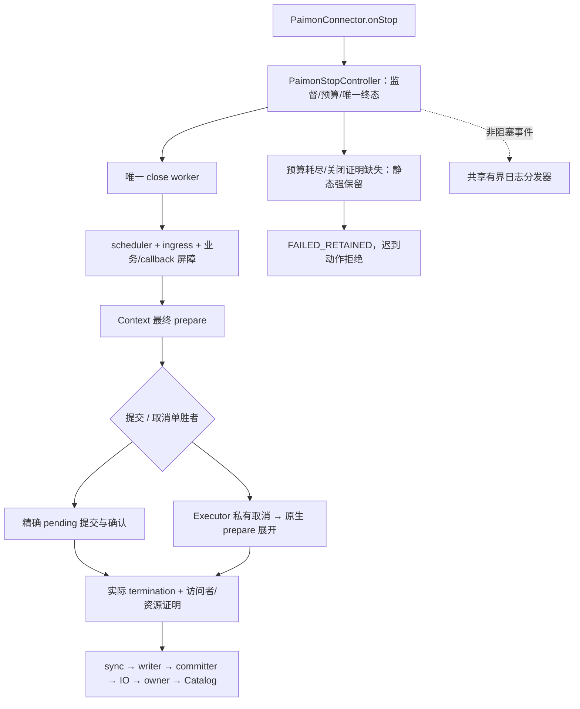
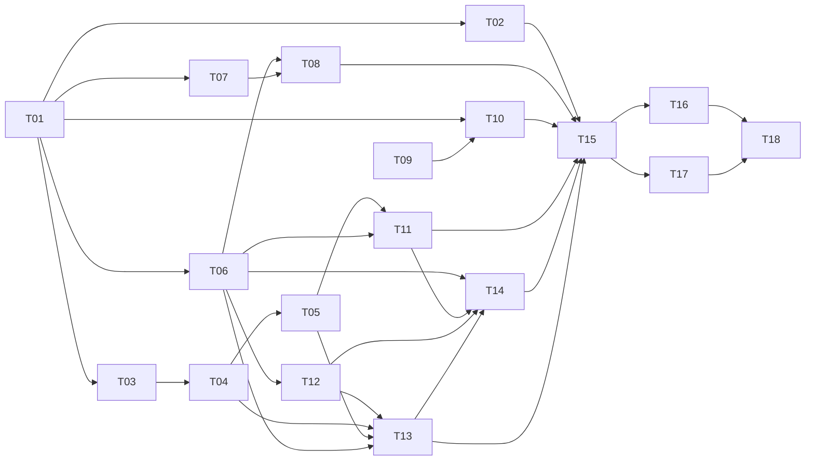

# 实施计划：Paimon Spill 有界停止与受控取消

> 日期：2026-09-07；状态：用户已授权开发，T01–T18 实现及交付核验完成：62 类、677 项通过，完整证据见 todo。
> 基线：`962083ff6ae2369a6d85ded223099d09b89bb3f7`；Paimon 1.3.2 / Hadoop 3.3.6；JDK 17 验证，模块编译目标 Java 11。
> 规范：[V1.2 Spec](../src/doc/specs/SPEC-paimon-spill-sync-graceful-stop.md) §1–15；历史 V1.1 折叠部分仅提供未被替代的基线。任务唯一事实源为 [todo.md](todo.md)。
> 保存位置由用户确认；根目录 tasks 下另一个 paimon-connector 微批计划不修改。

## 1. 目标与交付边界

STOP 在总预算内等待最终 Compaction，超时主动取消。只有实际任务终止、原生 prepare 已退出及全部相关访问者退出，才能清理 Spill。无法证明时返回失败并保留资源，阻止迟到线程启动新提交/清理；业务提交结果未知仍按原协议对账。

本次实现范围是 paimon-plus-connector 的写停止、有限读共享资源保护和停止日志。只支持有效 SYNC；不修改 Paimon 内核、Engine、PDK API、依赖版本、CDC 路由、微批阈值或 source offset 格式。不增加跨机器锁、TTL 接管、reaper、Thread.stop、进程强杀。长期 StreamRead 重写不在本计划验收范围。

不同机器的 Engine 仍必须等旧进程实际退出后接管；本地 owner 不是分布式 fencing。FAILED_RETAINED 不意味着停止线程已经死掉，更不意味着可以立刻在 B 机器启动同表 writer。

## 2. 已解决的审查问题与证据

| 问题 | 实现决定 | Spec 证据 / 验收 |
| --- | --- | --- |
| prepare 内联关闭可能早于外层 termination 屏障 | GuardedFuture 的受控取消转换成私有 ExecutionException，先展开原生 prepare | R01、PS05/PS08/PS09/PS10；B06/B19 |
| reader 调用结束不证明资源关闭 | ingress 与读资源账本分开；close 成功才注销 | R02；B17/B20 |
| 只保留 owner token 会丢掉失败资源 | 同一 Service 资源账本涵盖正常构造与半构造资源；失败时静态强引用 | R03；B10/B14/B22 |
| INFO / onStop WARN 可以卡住调用者 | 一个有界共享日志分发器；终态先发布，日志非阻塞交付 | R04；B16/B21 |
| final 提交和取消竞争、长锁阻塞监督 | 一个 StopController，单次 final decision 和动作门禁；无跨组件锁嵌套 | R05；B05/B07/B08/B12 |
| 内存 pending 被误称为跨进程恢复凭据 | 精确 envelope 仅进程内保留；重启按稳定用户与同用户 snapshot 对账 | R06；B08/B18 |
| 目录保护 helper 在 deleted=false 时仍释放锁 | 仅正向关闭后释放，失败保留未释放引用并报告证明结果 | R07；B13/B14/B22 |

源码的完整本地路径、方法、行范围、摘录和 SHA-256 在 Spec §9（PS01–PS18）。后续在关键代码注释中写出固定 `apache/paimon@c05f7d1f1b1e5d37e64edab0f2978124d90b64f7` URL、方法及适配理由；不得仅写“参考 Paimon”。

## 3. 架构与实现取舍



- `PaimonStopController` 替换当前 Service 内嵌 CloseOperation，集中预算、final attempt、动作许可、结果发布和进度快照；保持一个 close worker。禁止同时保留两套终态状态机。
- `PaimonServiceLifecycle` 保留现有 ingress/consumer 计数；不搬入 writer 或 IOManager，不将全 Service 的资源安全寄托于计数等于零。
- `PaimonCompactionExecutor` 保留已验证 CompactTask 类型边界与异常审计，新增未退场任务登记、受控取消和异常转换。完成历史不长期保留；普通/外部取消仍是硬失败。
- 新 `PaimonStopResources` 管理 Service 已分配资源和构造占位；活动时由 Service 持有，FAILED_RETAINED 时登记静态强引用。不可只保存字符串，也不可在失败后按时间释放。读资源关闭失败同样纳入。
- 新 `PaimonStopLog` 使用类加载器内共享的有界单 daemon 分发器；不按表建池，禁止 caller-runs、阻塞 put、停止时 join。后端阻塞时丢弃/合并进度，唯一终态仍保存在停止操作快照中。
- Context 的提交/确认与清理方法接受明确的停止控制上下文；复用原提交核心，不复制 pending 状态机。private StopCompactionCancelled 只表示受控停止，不冒充普通 NativeCompactionFailure。
- 这次为增加有界退出而恢复必要的资源保留模型；简化指标是唯一控制器、唯一取消来源、唯一资源账本，没有双模式长留、周期 reaper 或散落 timer。不能把代码行数一定减少作为未经证实的承诺。

### 3.1 锁与在途动作

控制门禁内不调用 Lifecycle、executor、logger、Paimon 或外部回调。先发布取消决定，释放控制门禁后再封闭 executor 并扫描任务；executor 的登记锁涵盖两步之间已接收的任务。submit 可按 executor controlLock → controller gate 检查；gate 内不得反向取得 executor/coordinator/Context/Lifecycle 锁。长 Service/Context/表锁不参与监督者的截止检查或终态发布。

每次提交、重试、状态保存、callback、新资源创建和破坏性清理取得动作许可。超时后禁止新许可；已经取得许可的外部调用可能迟到落地，按未知结果保留。终态及其主因发布后不再更改，迟到异常作为诊断保存。

### 3.2 预算

Service 级配置：`stopTimeoutSeconds=180`、`finalCompactionTimeoutSeconds=120`、`compactionCancelGraceSeconds=30` 为已实现的可配置默认值。正整数且纳秒换算不溢出；表级覆盖拒绝。配置参数化不影响协议，改变数值不改变失败保留规则。

按 Spec §2 计算 Dstop/Dfinal/Dcancel，采用单调时钟和可注入短测试预算。多表、并发 close、重复 close 都不重置总预算。总时间不足预留取消宽限时不开始新 final prepare；没有业务屏障就不能豁免为正常弃提交。

## 4. 依赖与任务顺序

任务拆分为可构建、可独立验证的内部切片，不代表每个中间切片都可上线。T15 是生产 STOP 启用有界等待的接线点，在它之前用显式注入的控制对象验证新组件，生产不得启用半套超时清理协议；不新增面向用户的双模式开关或永久兼容层。



执行索引（验收勾选只维护 todo.md）：

| 顺序 | 任务 | 关键产出 |
| --- | --- | --- |
| T01–T03 | 控制器、配置、任务登记 | 建立短控制门禁、不可重置预算和实际退场模型 |
| T04–T05 | 原生取消适配、最终提交竞争 | 提前展开 prepare，提交/取消只能一个胜者 |
| T06–T08 | 资源账本、有限读准入/关闭 | 强引用覆盖半构造资源与读资源 |
| T09–T10 | 日志分发、停止出口接线 | INFO/WARN 阻塞不影响 STOP 返回 |
| T11–T14 | 业务动作门禁、释放原语、分步清理、构造/DDL | 迟到线程不启动下一外部动作 |
| T15 | Service 总预算与终态接线 | 生产有界 STOP 协议完整闭环 |
| T16–T17 | 原生集成、进程退出/GC | 验证真实 Spill、跨 JVM 本地锁和恢复边界 |
| T18 | 全量验证与文档同步 | 完整门禁与最终证据；未完成项不伪装通过 |

可并行：T02 与 T03、T07 与执行器探针、T09 与资源账本；T16 与 T17 仅在测试临时目录及静态测试状态隔离后可并行。Service/Context 的接线任务必须顺序执行，避免共享文件与锁合同分叉。

## 5. 验证规则

**本轮证据**：当前源码、真实测试类和 B01–B22 映射见 Spec §14，生产 DDL 的三项回归及新增 PS16–PS18 见 §15。完整构建结果记录在 todo；636 项与 56 项仅为历史基线。

下列 `F` 为任务定向验证模板，从仓库根目录执行；将 TEST_CLASSES 替换为任务列出的测试类，不把模板字样传入 Maven：

```bash
env JAVA_HOME=/Library/Java/JavaVirtualMachines/jdk-17.jdk/Contents/Home \
  mvn -o -B -pl connectors/paimon-plus-connector -am -DskipTests=false \
  -Dtest=TEST_CLASSES -Dsurefire.failIfNoSpecifiedTests=false test
```

`failIfNoSpecifiedTests=false` 只用于不包含所选测试的上游 reactor 模块；必须核查 paimon-plus-connector surefire XML 确有列出的类、tests>0、无意外 skipped。编译成功但没有运行用例不算通过。依赖离线不足时先报告具体缺失，不能将跳过测试当作成功。

最终 `G`：

```bash
env JAVA_HOME=/Library/Java/JavaVirtualMachines/jdk-17.jdk/Contents/Home \
  mvn -o -B -pl connectors/paimon-plus-connector -am -DskipTests=false clean package
git diff --check
```

- 每项先加能捕捉缺口的断言，再实现；高风险并发用 latch/barrier 控制，所有 finally 放行任务并确认终止，避免测试自己泄漏。
- 已有错误分类、精确 pending、owner/marker、KEY_DYNAMIC 限定目录、全局/表级 stale 根测试继续通过；不能批量删除旧断言来迎合新实现。
- 每 2–3 项检查点核对接受标准、编译和相关回归；失败就回到对应小任务修复。全量通过后只因新改动或未解决风险重复运行。
- S3/MinIO 实机验收若缺少环境，标记未完成；本地 FileIO 用例不冒充对象存储故障语义通过。跨机器 fencing 不在验收承诺内。

## 6. 风险与收敛措施

| 风险 | 严重度 | 明确措施 |
| --- | --- | --- |
| 取消伪完成后内联 close | 高 | 私有 ExecutionException 展开，B06/B19 原生验证 |
| 原因不明的中断被白名单洗掉 | 高 | 精确 Future/attempt/实际取消结果，Error/独立IO/外部cancel仍失败 |
| commit RPC 已开始但超时 | 高 | 不打断整个 close worker；保留未知结果，禁止后续确认重试/offset |
| 构造失败局部资源不在 Context map | 高 | 分配前占位、逐项绑定，rollback 也通过门禁 |
| reader.close 仅告警后释放 Catalog | 高 | 关闭证明与 ingress 分离；关闭失败强引用并保留共享资源 |
| 日志后端永久阻塞 | 中 | 有界非阻塞交付，countDown 先于日志；无真实输出时保留终态快照 |
| 修改大 Service 造成重复状态 | 中 | 提取控制器替换 CloseOperation；资源账本和日志各只一个职责 |
| 失败资源占用内存/磁盘 | 中 | 保留必要资源并可诊断；不自动放行同代 owner，不以不安全清理缓解 |
| 重启恢复被理解成精确 envelope 重放 | 高 | 文档/测试明确仅 stable user 与 snapshot 对账；不升级 exactly-once 承诺 |

## 7. 实施前与交付条件

- 用户已明确授权按 Spec/Plan 开发；默认预算已参数化实现。
- 测试按实际职责合并，原计划类名不是执行证据；最终对应关系以 todo 和 Spec §14 为准。
- 完成 T18 才能报告“实现修复完成”。若真实对象存储或进程验证未执行，要清楚列出未验证边界。
- 本轮不提交、不 rebase、不 push；后续提交遵从用户指令并精确暂存，不包含已经 staged 的 StreamRead Spec。

## 审查修正补充（2026-09-07）

已完成：逐行重复 gate 移除、worker 中断恢复、suppressed identity 去重、canonical 清理根、裸 rocksdb 负例与缩进统一；同时完成 INFO 契约、专用超时原因、有限读双重异常修正。实际方案、源码证据和测试映射统一见 [Spec §16](../src/doc/specs/SPEC-paimon-spill-sync-graceful-stop.md#16-审查缺口修复2026-09-07)。

最新完整验证替代上文旧轮次成绩：2026-09-07 16:34:37 +08:00，clean package，5 个 reactor 项目成功，模块 62 类 / 688 项，0 失败、0 错误、0 跳过；日志 `/tmp/paimon-review-fixes-full.log`。本地未提交/推送；预先暂存的 StreamRead Spec 保持不变。
